# MATLAB大作业——图像处理实验报告
###### 无42 陈誉博 2014011058

## 一、基础知识

在 MATLAB 中，像素值用uint8类型表示，参与浮点数运算前需要转成 double 型。本章练习题中“测试图像”指的是 hall.mat 中的彩色图像。

##### 1. MATLAB 提供了图像处理工具箱，在命令行窗口输入 help images 可查看该工具箱内的所有函数。请阅读并大致了解这些函数的基本功能。

我使用的 MATLAB 版本是 R2014a ,在命令行输入 ```help images ``` 出现了以下函数：

```MATLAB
>> help images
  Image Processing Toolbox
  Version 9.0 (R2014a) 27-Dec-2013
 
  Image display and exploration.
    colorbar       - Display colorbar (MATLAB Toolbox).
    image          - Create and display image object (MATLAB Toolbox).
    imagesc        - Scale data and display as image (MATLAB Toolbox).
    immovie        - Make movie from multiframe image.
    implay         - Play movies, videos, or image sequences.
    imshow         - Display image in Handle Graphics figure.
    imtool         - Display image in the Image Tool.
    montage        - Display multiple image frames as rectangular montage.
    movie          - Play recorded movie frames (MATLAB Toolbox).
    subimage       - Display multiple images in single figure.
    warp           - Display image as texture-mapped surface.
 
  Image file I/O.
    analyze75info       - Read metadata from header file of Mayo Analyze 7.5 data set.
    analyze75read       - Read image file of Mayo Analyze 7.5 data set.
    dicomanon           - Anonymize DICOM file.
    dicomdict           - Get or set active DICOM data dictionary.
    dicominfo           - Read metadata from DICOM message.
    dicomlookup         - Find attribute in DICOM data dictionary.
    dicomread           - Read DICOM image.
    dicomuid            - Generate DICOM Unique Identifier.
    dicomwrite          - Write images as DICOM files.
    dicom-dict.txt      - Text file containing DICOM data dictionary (2007).
    dicom-dict-2005.txt - Text file containing DICOM data dictionary (2005).
    hdrread             - Read Radiance HDR image.
    hdrwrite            - Write Radiance HDR image.
    makehdr             - Create high dynamic range image.
    ImageAdapter        - Interface for image format I/O.
    imfinfo             - Information about image file (MATLAB Toolbox).
    imread              - Read image file (MATLAB Toolbox).
    imwrite             - Write image file (MATLAB Toolbox).
    interfileinfo       - Read metadata from Interfile files.
    interfileread       - Read images from Interfile files.
    isnitf              - Check if file is NITF.
    isrset              - Check if file is reduced-resolution dataset (R-Set).
    nitfinfo            - Read metadata from NITF file.
    nitfread            - Read NITF image.
    rsetwrite           - Create reduced-resolution dataset (R-Set) from image file.
 
  Image arithmetic.
    imabsdiff      - Absolute difference of two images.
    imadd          - Add two images or add constant to image.
    imapplymatrix  - Linear combination of color channels.
    imcomplement   - Complement image.
    imdivide       - Divide two images or divide image by constant.
    imlincomb      - Linear combination of images.
    immultiply     - Multiply two images or multiply image by constant.
    imsubtract     - Subtract two images or subtract constant from image.
 
  Geometric transformations.
    affine2d       - Create 2-D affine transformation.
    affine3d       - Create 3-D affine transformation.
    checkerboard   - Create checkerboard image.
    findbounds     - Find output bounds for geometric transformation.
    fliptform      - Flip input and output roles of TFORM structure.
    imcrop         - Crop image.
    impyramid      - Image pyramid reduction and expansion.
    imresize       - Resize image.
    imrotate       - Rotate image.
    imtransform    - Apply 2-D geometric transformation to image.
    imwarp         - Apply geometric transformation to image.
    makeresampler  - Create resampling structure.
    maketform      - Create geometric transformation structure (TFORM).
    projective2d   - Create 2-D projective transformation.
    tformarray     - Apply geometric transformation to N-D array.
    tformfwd       - Apply forward geometric transformation.
    tforminv       - Apply inverse geometric transformation.
 
  Image registration.
    cpstruct2pairs   - Convert CPSTRUCT to control point pairs.
    cp2tform         - Infer geometric transformation from control point pairs.
    cpcorr           - Tune control point locations using cross-correlation. 
    cpselect         - Control Point Selection Tool. 
    imfuse           - Composite of two images.
    imregister       - Spatially register two images using intensity metric 			                   		optimization.
    imregtform       - Estimate geometric transformation that registers two images using 						intensity metric optimization.
    imregconfig      - Configurations for intensity-based registration.
    imshowpair       - Compare differences between images.
    normxcorr2       - Normalized two-dimensional cross-correlation.
    registration.metric.MattesMutualInformation - Mattes mutual information 	configuration.
    registration.metric.MeanSquares - Mean squares error metric configuration.
    registration.optimizer.OnePlusOneEvolutionary - One plus one evolutionary configuration.
    registration.optimizer.RegularStepGradientDescent - Regular step gradient descent configuration.
 
  Pixel values and statistics.
    corr2          - 2-D correlation coefficient.
    imcontour      - Create contour plot of image data.
    imhist         - Display histogram of image data.
    impixel        - Pixel color values.
    improfile      - Pixel-value cross-sections along line segments.
    mean2          - Average or mean of matrix elements.
    regionprops    - Measure properties of image regions.
    std2           - Standard deviation of matrix elements.
 
  Image analysis.
    bwboundaries    - Trace region boundaries in binary image.
    bwtraceboundary - Trace object in binary image.
    corner          - Find corners in intensity image.
    cornermetric    - Create corner metric matrix from image.
    edge            - Find edges in intensity image.
    hough           - Hough transform.
    houghlines      - Extract line segments based on Hough transform.
    houghpeaks      - Identify peaks in Hough transform.
    imfindcircles   - Find circles using Circular Hough Transform.
    imgradient      - Find the gradient magnitude and direction of an image.
    imgradientxy    - Find the directional gradients of an image.
    psnr            - Peak Signal-To-Noise Ratio.
    qtdecomp        - Quadtree decomposition.
    qtgetblk        - Get block values in quadtree decomposition.
    qtsetblk        - Set block values in quadtree decomposition.
    ssim            - Structural Similarity Index for measuring image quality.
    viscircles      - Create circle.
 
  Image enhancement.
    adapthisteq    - Contrast-limited Adaptive Histogram Equalization (CLAHE).
    decorrstretch  - Apply decorrelation stretch to multichannel image.
    histeq         - Enhance contrast using histogram equalization.
    imadjust       - Adjust image intensity values or colormap.
    imguidedfilter - Guided filtering of images.
    imhistmatch    - Adjust image to match its histogram to that of another image.
    imnoise        - Add noise to image.
    imsharpen      - Sharpen image using unsharp masking.
    medfilt2       - 2-D median filtering.
    ordfilt2       - 2-D order-statistic filtering.
    stretchlim     - Find limits to contrast stretch an image.
    intlut         - Convert integer values using lookup table.
    wiener2        - 2-D adaptive noise-removal filtering.
 
  Linear filtering.
    convmtx2       - 2-D convolution matrix.
    fspecial       - Create predefined 2-D filters.
    imfilter       - N-D filtering of multidimensional images.
 
  Linear 2-D filter design.
    freqspace      - Determine 2-D frequency response spacing (MATLAB Toolbox).
    freqz2         - 2-D frequency response.
    fsamp2         - 2-D FIR filter using frequency sampling.
    ftrans2        - 2-D FIR filter using frequency transformation.
    fwind1         - 2-D FIR filter using 1-D window method.
    fwind2         - 2-D FIR filter using 2-D window method.
 
  Image deblurring.
    deconvblind    - Deblur image using blind deconvolution.
    deconvlucy     - Deblur image using Lucy-Richardson method.
    deconvreg      - Deblur image using regularized filter.
    deconvwnr      - Deblur image using Wiener filter.
    edgetaper      - Taper edges using point-spread function.
    otf2psf        - Convert optical transfer function to point-spread function.
    psf2otf        - Convert point-spread function to optical transfer function.
 
  Image segmentation.
    activecontour  - Segment image into foreground and background using active contour.
    graythresh     - Global image threshold using Otsu's method.
    multithresh    - Multi-level image thresholding using Otsu's method.
 
  Image transforms.
    dct2           - 2-D discrete cosine transform.
    dctmtx         - Discrete cosine transform matrix.
    fan2para       - Convert fan-beam projections to parallel-beam.
    fanbeam        - Fan-beam transform.
    fft2           - 2-D fast Fourier transform (MATLAB Toolbox).
    fftn           - N-D fast Fourier transform (MATLAB Toolbox).
    fftshift       - Reverse quadrants of output of FFT (MATLAB Toolbox).
    idct2          - 2-D inverse discrete cosine transform.
    ifft2          - 2-D inverse fast Fourier transform (MATLAB Toolbox).
    ifftn          - N-D inverse fast Fourier transform (MATLAB Toolbox).
    ifanbeam       - Inverse fan-beam transform.
    iradon         - Inverse Radon transform.
    para2fan       - Convert parallel-beam projections to fan-beam.
    phantom        - Create head phantom image.
    radon          - Radon transform.
 
  Neighborhood and block processing.
    bestblk        - Block size with minimum padding.
    blockproc      - Distinct block processing for image.
    col2im         - Rearrange matrix columns into blocks.
    colfilt        - Columnwise neighborhood operations.
    im2col         - Rearrange image blocks into columns.
    nlfilter       - General sliding-neighborhood operations.
 
  Morphological operations (intensity and binary images).
    conndef        - Default connectivity array.
    graydist       - Grey weighted distance transform.
    imbothat       - Bottom-hat filtering.
    imclearborder  - Suppress light structures connected to image border.
    imclose        - Morphologically close image.
    imdilate       - Dilate image.
    imerode        - Erode image.
    imextendedmax  - Extended-maxima transform.
    imextendedmin  - Extended-minima transform.
    imfill         - Fill image regions and holes.
    imhmax         - H-maxima transform.
    imhmin         - H-minima transform.
    imimposemin    - Impose minima.
    imopen         - Morphologically open image.
    imreconstruct  - Morphological reconstruction.
    imregionalmax  - Regional maxima.
    imregionalmin  - Regional minima.
    imtophat       - Top-hat filtering.
    watershed      - Watershed transform.
 
  Morphological operations (binary images).
    bwlookup       - Neighborhood operations using lookup tables.
    bwarea         - Area of objects in binary image.
    bwareaopen     - Remove small objects from binary image.
    bwconncomp     - Find connected components in binary image.
    bwdist         - Distance transform of binary image.
    bwdistgeodesic - Geodesic distance transform of binary image.
    bweuler        - Euler number of binary image.
    bwhitmiss      - Binary hit-miss operation.
    bwlabel        - Label connected components in 2-D binary image.
    bwlabeln       - Label connected components in binary image.
    bwmorph        - Morphological operations on binary image.
    bwpack         - Pack binary image.
    bwperim        - Find perimeter of objects in binary image.
    bwselect       - Select objects in binary image.
    bwulterode     - Ultimate erosion.
    bwunpack       - Unpack binary image.
    labelmatrix    - Create label matrix from BWCONNCOMP structure.
    makelut        - Create lookup table for use with APPLYLUT.
 
  Structuring element (STREL) creation and manipulation.
    getheight      - Get STREL height.
    getneighbors   - Get offset location and height of STREL neighbors
    getnhood       - Get STREL neighborhood.
    getSequence    - Get sequence of decomposed STRELs.
    isflat         - True for flat STRELs.
    reflect        - Reflect STREL about its center.
    strel          - Create morphological structuring element (STREL).
    translate      - Translate STREL.
 
  Texture analysis.
    entropy        - Entropy of intensity image.    
    entropyfilt    - Local entropy of intensity image.
    graycomatrix   - Create gray-level co-occurrence matrix.
    graycoprops    - Properties of gray-level co-occurrence matrix.  
    rangefilt      - Local range of image.  
    stdfilt        - Local standard deviation of image.
 
  Region-based processing.
    poly2mask      - Convert region-of-interest polygon to mask.
    roicolor       - Select region of interest based on color.
    roifill        - Fill in specified polygon in grayscale image.
    roifilt2       - Filter region of interest.
    roipoly        - Select polygonal region of interest.
 
  Colormap manipulation.
    brighten       - Brighten or darken colormap (MATLAB Toolbox).
    cmpermute      - Rearrange colors in colormap (MATLAB Toolbox).
    cmunique       - Eliminate unneeded colors in colormap of indexed image (MATLAB toolbox).
    colormap       - Set or get color lookup table (MATLAB Toolbox).
    imapprox       - Approximate indexed image by one with fewer colors (MATLAB toolbox).
    rgbplot        - Plot RGB colormap components (MATLAB Toolbox).
 
  Color space conversions.
    applycform     - Apply device-independent color space transformation.
    hsv2rgb        - Convert HSV color values to RGB color space (MATLAB Toolbox).
    iccfind        - Search for ICC profiles by description.
    iccread        - Read ICC color profile.
    iccroot        - Find system ICC profile repository.
    iccwrite       - Write ICC color profile.
    isicc          - True for complete profile structure
    lab2double     - Convert L*a*b* color values to double.
    lab2uint16     - Convert L*a*b* color values to uint16.
    lab2uint8      - Convert L*a*b* color values to uint8.
    makecform      - Create device-independent color space transformation structure 						(CFORM).
    ntsc2rgb       - Convert NTSC color values to RGB color space.
    rgb2hsv        - Convert RGB color values to HSV color space (MATLAB Toolbox).
    rgb2ntsc       - Convert RGB color values to NTSC color space.
    rgb2ycbcr      - Convert RGB color values to YCbCr color space.
    whitepoint     - XYZ color values of standard illuminants.
    xyz2double     - Convert XYZ color values to double.
    xyz2uint16     - Convert XYZ color values to uint16.
    ycbcr2rgb      - Convert YCbCr color values to RGB color space.
 
  ICC color profiles.
    lab8.icm       - 8-bit Lab profile.
    monitor.icm    - Typical monitor profile.
                     Sequel Imaging, Inc., used with permission.
    sRGB.icm       - sRGB profile.
                     Hewlett-Packard, used with permission.
    swopcmyk.icm   - CMYK input profile.
                     Eastman Kodak, used with permission.
 
  Array operations.
    circshift      - Shift array circularly (MATLAB Toolbox).
    padarray       - Pad array.
 
  Image types and type conversions.
    demosaic       - Convert Bayer pattern encoded image to a truecolor image.
    dither         - Convert image using dithering (MATLAB toolbox).
    gray2ind       - Convert intensity image to indexed image.
    grayslice      - Create indexed image from intensity image by thresholding.
    im2bw          - Convert image to binary image by thresholding.
    im2double      - Convert image to double precision.  
    im2int16       - Convert image to 16-bit signed integers.    
    im2java        - Convert image to Java image (MATLAB Toolbox).
    im2java2d      - Convert image to Java BufferedImage.
    im2single      - Convert image to single precision.     
    im2uint8       - Convert image to 8-bit unsigned integers.
    im2uint16      - Convert image to 16-bit unsigned integers.  
    imquantize     - Quantize image using specified quantization levels and output 							 values.
    ind2gray       - Convert indexed image to intensity image.
    ind2rgb        - Convert indexed image to RGB image (MATLAB Toolbox).
    label2rgb      - Convert label matrix to RGB image.
    mat2gray       - Convert matrix to intensity image.
    rgb2gray       - Convert RGB image or colormap to grayscale.
    rgb2ind        - Convert RGB image to indexed image (MATLAB Toolbox).
    tonemap        - Render high dynamic range image for viewing.
 
  Toolbox preferences.
    iptgetpref     - Get value of Image Processing Toolbox preference.
    iptprefs       - Display Image Processing Toolbox preferences dialog.
    iptsetpref     - Set value of Image Processing Toolbox preference.
 
  Toolbox utility functions.
    getrangefromclass - Get dynamic range of image based on its class.
    iptcheckconn      - Check validity of connectivity argument.
    iptcheckinput     - Check validity of array.
    iptcheckmap       - Check validity of colormap.
    iptchecknargin    - Check number of input arguments.
    iptcheckstrs      - Check validity of text string.
    iptnum2ordinal    - Convert positive integer to ordinal string.
 
  Modular interactive tools.
    imageinfo           - Image Information tool.
    imcolormaptool      - Choose Colormap tool.
    imcontrast          - Adjust Contrast tool.
    imdisplayrange      - Display Range tool.
    imdistline          - Draggable Distance tool.
    imgetfile           - Open Image dialog box.
    impixelinfo         - Pixel Information tool.
    impixelinfoval      - Pixel Information tool without text label.
    impixelregion       - Pixel Region tool.
    impixelregionpanel  - Pixel Region tool panel.
    imputfile           - Save Image dialog box.
    imsave              - Save Image tool.
 
  Navigational tools for image scroll panel.
    imscrollpanel       - Scroll panel for interactive image navigation.
    immagbox            - Magnification box for scroll panel.
    imoverview          - Overview tool for image displayed in scroll panel.
    imoverviewpanel     - Overview tool panel for image displayed in scroll panel.
 
  Utility functions for interactive tools.
    axes2pix                  - Convert axes coordinate to pixel coordinate.  
    getimage                  - Get image data from axes.
    getimagemodel             - Get image model object from image object.
    imagemodel                - Image model object.
    imattributes              - Information about image attributes.
    imhandles                 - Get all image handles.  
    imgca                     - Get handle to current axes containing image.
    imgcf                     - Get handle to current figure containing image.
    imellipse                 - Create draggable, resizable ellipse.
    imfreehand                - Create draggable freehand region.
    imline                    - Create draggable, resizable line.
    impoint                   - Create draggable point.
    impoly                    - Create draggable, resizable polygon.
    imrect                    - Create draggable, resizable rectangle.
    iptaddcallback            - Add function handle to callback list.
    iptcheckhandle            - Check validity of handle.
    iptgetapi                 - Get Application Programmer Interface (API) for handle.
    iptGetPointerBehavior     - Retrieve pointer behavior from HG object.
    ipticondir                - Directories containing IPT and MATLAB icons.
    iptPointerManager         - Install mouse pointer manager in figure.
    iptremovecallback         - Delete function handle from callback list.
    iptSetPointerBehavior     - Store pointer behavior in HG object.
    iptwindowalign            - Align figure windows.
    makeConstrainToRectFcn    - Create rectangularly bounded position constraint 										function.
    truesize                  - Adjust display size of image.
 
  Interactive mouse utility functions.
    getline        - Select polyline with mouse.
    getpts         - Select points with mouse.
    getrect        - Select rectangle with mouse.
 
  Demos.
    iptdemos       - Index of Image Processing Toolbox demos.
 
  See also colorspaces, imageslib, imdemos, imuitools, iptformats, iptutils.
```

  其中比较基础的又比较重要的有以下几个：

- image                - 创建并显示图像.
- imagesc            - 缩放图像数据并显示为图像.
- imread              - 从图像文件中读取图像数据.
- imwrite             - 将图像数据写入图像文件.
- imabsdiff          - 两幅图像的绝对差分.
- imadd               - 两幅图像的和或图像与常数的和.
- imsubtract       - 两幅图像的差或图像与常数的差.
- imresize           - 改变图像的尺寸
- psnr                  - 峰值信噪比.
- viscircles          - 创建圆.
- imsharpen      - 锐化图像. 
- dct2                  - 二维离散余弦变换.
- dctmtx             - 离散余弦变换矩阵.
- idct2                - 二维离散余弦逆变换.
- fft2                   - 二维快速傅里叶变换.
- ifft2                  - 二维快速傅里叶逆变换.
- rgb2hsv           - RGB图像变为HSV图像.
- rgb2gray         - RGB图像变为灰度图像.

##### 2. 利用MATLAB提供的 Image file I/O 函数分别完成以下处理：

##### （a）以测试图像的中心为圆心，图像的长和宽中较小值的一半为半径画一个红颜色的圆。

##### （b）将测试图像涂成国际象棋状的“黑白格”的样子，其中“黑”即黑色，“白”则意味着保留原图。

##### 用一种看图软件浏览上述两个图，看是否达到了目标。

（a）这一问我采用了循环赋值的方法画圆，源代码如下：

```MATLAB
%ex_1_2_a.m
close all;clear all;clc;
load hall.mat;
Image=double(hall_color);
[height,width,channel]=size(Image);
R=min([height,width])/2;
center=[height,width]/2;
temp=zeros(height,width,channel);
D1=0;
for i=2*pi/100000:2*pi/100000:2*pi
    if ceil(R*cos(i))+center(1)==0
        D1=1;
    else 
        D1=ceil(R*cos(i))+center(1);
    end
    Image(D1,ceil(R*sin(i))+center(2),1)=255;
    Image(D1,ceil(R*sin(i))+center(2),2)=0;
    Image(D1,ceil(R*sin(i))+center(2),3)=0;
end
tempImage=uint8(Image);
image(tempImage);
imwrite(tempImage,'ex_1_2_a.jpg');
```

得到的图像用 image 函数在 MATLAB 里直接浏览的效果如下：

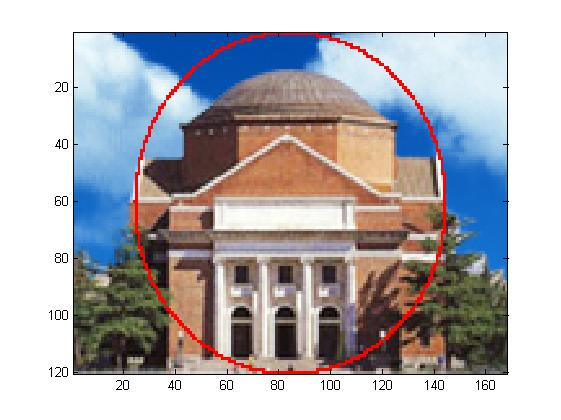

在看图软件中的效果如下：

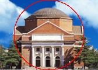

（b）本问的思路与上一问相似，源代码如下：

```MATLAB
%ex_1_2_b.m
close all;clear all;clc;
load hall.mat;
[height,width,channel]=size(hall_color);
Image=double(hall_color);
for i=1:height/8
    if mod(i,2)==1
        for j=1:2:width/8
            Image((i-1)*8+1:(i)*8,(j-1)*8+1:(j)*8,1:3)=0;
        end
    else
        for j=1:2:width/8-1
            Image((i-1)*8+1:(i)*8,j*8+1:(j+1)*8,1:3)=0;
        end
    end
end
tempImage=uint8(Image);
image(tempImage);
imwrite(tempImage,'ex_1_2_b.jpg');
```

得到的图像用 image 函数在 MATLAB 里直接浏览的效果如下：

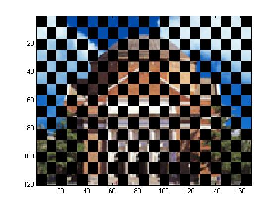

在看图软件中的效果如下：

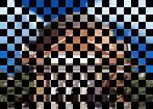

## 二、图像压缩编码

本章练习题中所用数据均可由“ JpegCoeff.mat ”导入。本章练习题中“测试图像”指的是 hall.mat 中的灰度图像。

##### 1. 图像的预处理是将每个像素灰度值减去 128 ，这个步骤是否可以在变换域进行？请在测试图像中截取一块验证你的结论。

选取灰度图像右下角16*16大小的区域，截取区域效果如下：

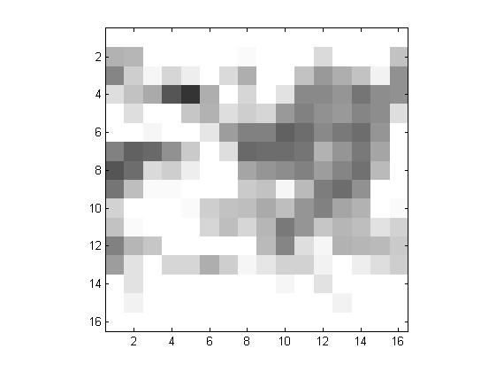

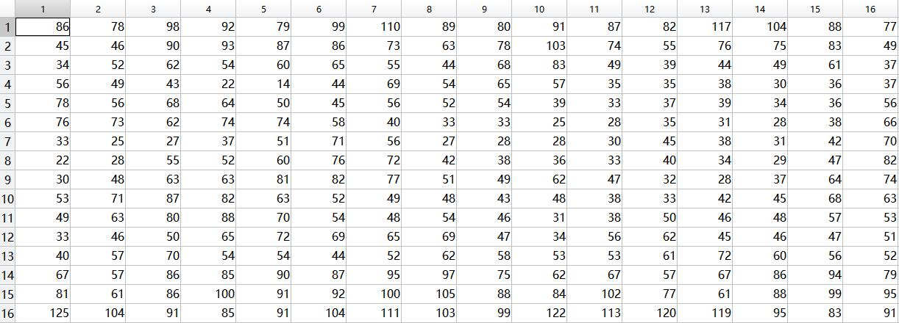

灰度值减128后：

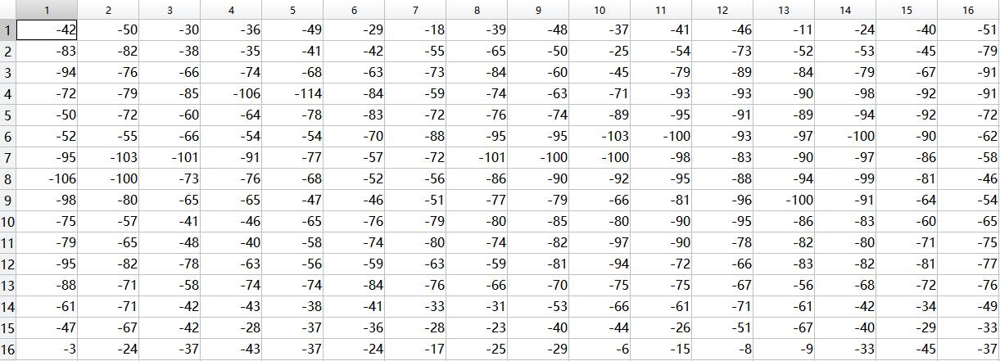

在变换域进行灰度值减128源代码：

```MATLAB
%ex_2_1.m
close all;clear all;clc;
load hall.mat;
load JpegCoeff.mat;
test=double(hall_gray(105:120,153:168));
temp=test-128;
trans=dct2(test);
minus=128*dct2(ones(16,16));
final=idct2(trans-minus);
```

效果如下：

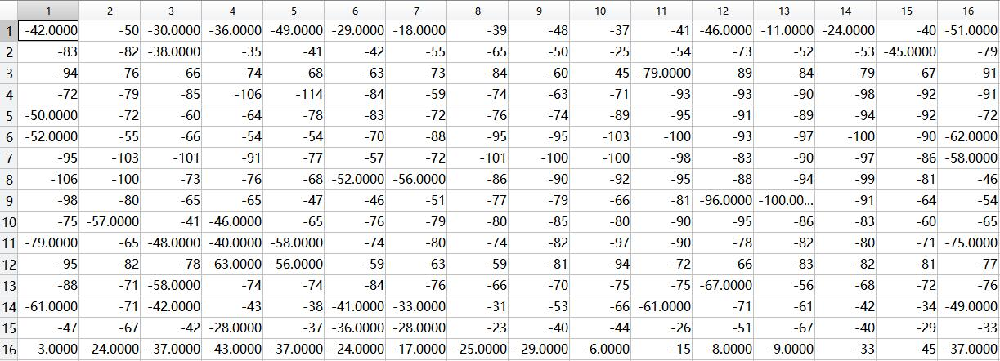

容易看出，用普通的方法和用变换域的方法实现对灰度值减128的操作几乎没有差别。这是因为离散余弦变换是一种线性变换，dct(A-B)=dct(A)-dct(B) 。

##### 2. 请编程实现二维 DCT ，并和 MATLAB 自带的库函数 dct2 比较是否一致。

函数源代码：

```MATLAB
%my_dct2.m
function C=my_dct2(P)
%row must equals column
[row,column]=size(P);
N=row;
D=zeros(row,column);
D(1,:)=sqrt(1/2);
for i=2:N
    for j=1:N
      D(i,j)=cos(pi*(i-1)*(2*j-1)/(2*N));  
    end
end
D=D*sqrt(2/N);
C=D*P*D';
end
```

检测代码：

```MATLAB
%ex_2_2.m
close all;clear all;clc;
a=1:8;
b=8:-1:1;
P=[a;b;a;b;a;b;a;b];
C1=dct2(P);
C2=my_dct2(P);
fprintf('自带库函数结果：\n');
disp(C1);
fprintf('编程实现的函数结果：\n');
disp(C2);
fprintf('最大误差为：\n');
disp(max(max(C1-C2)));
```

最后的输出结果为：

```
自带库函数结果：
   36.0000         0         0         0         0         0         0         0
         0   -3.2843         0   -0.3433         0   -0.1024         0   -0.0258
         0         0         0         0         0         0         0         0
         0   -3.8741         0   -0.4050         0   -0.1208         0   -0.0305
         0         0         0         0         0         0         0         0
         0   -5.7979         0   -0.6061         0   -0.1808         0   -0.0456
         0         0         0         0         0         0         0         0
         0  -16.5111         0   -1.7260         0   -0.5149         0   -0.1299

编程实现的函数结果：
   36.0000    0.0000   -0.0000    0.0000    0.0000    0.0000   -0.0000   -0.0000
    0.0000   -3.2843   -0.0000   -0.3433   -0.0000   -0.1024    0.0000   -0.0258
   -0.0000   -0.0000    0.0000   -0.0000   -0.0000   -0.0000   -0.0000    0.0000
    0.0000   -3.8741   -0.0000   -0.4050    0.0000   -0.1208   -0.0000   -0.0305
    0.0000   -0.0000    0.0000   -0.0000   -0.0000   -0.0000   -0.0000   -0.0000
    0.0000   -5.7979         0   -0.6061   -0.0000   -0.1808   -0.0000   -0.0456
   -0.0000    0.0000   -0.0000    0.0000   -0.0000    0.0000   -0.0000    0.0000
   -0.0000  -16.5111   -0.0000   -1.7260   -0.0000   -0.5149         0   -0.1299

最大误差为：
   6.9869e-15
```

从输出结果可以看出，自己编程实现的函数和dct2库函数的结果之间的误差完全可以忽略。

##### 3. 如果将 DCT 系数矩阵中右侧四列的系数全部置零，逆变换后的图像会发生什么变化？选取一块图验证你的结论。如果左侧四列置零呢？

如果将右侧四列全部置零，则图像的交流分量会有一定的损失，逆变换之后的图像会变得模糊；如果将左侧四列全部置零，则图像的直流分量全部损失，交流分量损失一部分，逆变换之后的图像会变成几乎只有一种颜色，只有在原图像的边缘处有一定的颜色变化。为了验证这个结论，我编写了如下代码：

```MATLAB
%ex_2_3.m
close all;clear all;clc;
load hall.mat;
[row,column]=size(hall_gray);
Image1=double(hall_gray);
Image2=double(hall_gray);
for i=1:(row/8)
    for j=1:(column/8)
        Image=double(hall_gray((i-1)*8+1:i*8,(j-1)*8+1:j*8));
        trans=dct2(Image-128*ones(8,8));
        trans1=trans;
        trans1(:,5:8)=0;
        trans2=trans;
        trans2(:,1:4)=0;
        Image1((i-1)*8+1:i*8,(j-1)*8+1:j*8)=idct2(trans1)+128*ones(8,8);
        Image2((i-1)*8+1:i*8,(j-1)*8+1:j*8)=idct2(trans2)+128*ones(8,8);
    end
end
figure;
subplot(1,2,1);
imshow(hall_gray);
axis square;
subplot(1,2,2);
imshow(uint8(Image1));
axis square;
figure;
subplot(1,2,1);
imshow(hall_gray);
axis square;
subplot(1,2,2);
imshow(uint8(Image2));
axis square;
```

结果如下：

- 右侧四列置零：

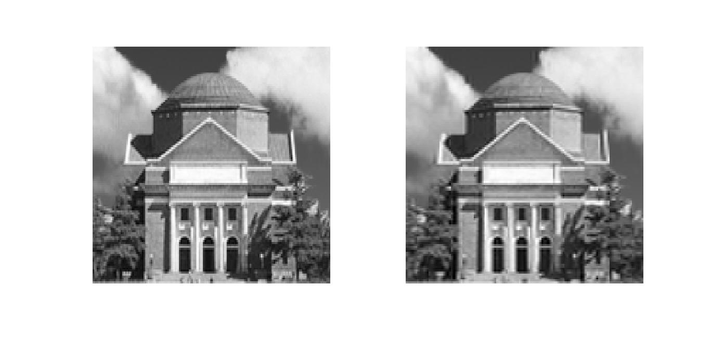

- 左侧四列置零：


##### 4. 若对 DCT 系数分别做转置、旋转90度和旋转180度操作，逆变换后恢复的图像有何变化？选取一块图验证你的结论。

对于一幅图像来说，进行 DCT 变换之后得到的矩阵的四个角上的元素都有其对应的特殊含义。左上角系数为直流分量，右上角系数反映了图像块中横向变化的纹理（即纵向的纹理）的强度，左下角系数反映了图像块中纵向变化的纹理（即横向的纹理）的强度，右下角系数反映了图像块中横竖两个方向都迅速变化的强度。由于常见的图像以缓慢变化为主，所以 DCT 系数的左上角系数较大，右上和左下较小，右下角系数更小。

- 如果将 DCT 系数**旋转90度** ，则左下角系数较大，右下和左上系数较小，右上系数更小，意味着恢复成的 8 * 8 图像块的**主要颜色很深，而且横向的纹理较强** 。
- 如果将 DCT 系数**旋转 180 度** ，则右下角系数较大，右上和左下系数较小，左上系数更小，意味着恢复成的 8 * 8 图像块主要颜色很深，而且横竖两个方向迅速变化的强度很大，也就是**每个图像块中都像国际象棋棋盘一样黑白交叉变化** 。
- 如果将 DCT 系数**转置**，对二维 DCT 变换表达式的左右两端同时取转置可以知道，**恢复得到的图像块就是原图像块的转置** 。为了验证以上三个结论，我编写了如下代码：

```MATLAB
% ex_2_4.m
close all;clear all;clc;
load hall.mat;
[row,column]=size(hall_gray);
Image1=zeros(row,column);
Image2=zeros(row,column);
Image3=zeros(row,column);
for i=1:(row/8)
    for j=1:(column/8)
        Image=double(hall_gray((i-1)*8+1:i*8,(j-1)*8+1:j*8));
        trans=dct2(Image-128*ones(8,8));
        trans1=rot90(trans);
        trans2=rot90(trans,2);
        trans3=trans';
        Image1((i-1)*8+1:i*8,(j-1)*8+1:j*8)=idct2(trans1)+128*ones(8,8);
        Image2((i-1)*8+1:i*8,(j-1)*8+1:j*8)=idct2(trans2)+128*ones(8,8);
        Image3((i-1)*8+1:i*8,(j-1)*8+1:j*8)=idct2(trans3)+128*ones(8,8);
    end
end
figure;
subplot(1,2,1);
imshow(hall_gray);
subplot(1,2,2);
imshow(uint8(Image1));
figure;
subplot(1,2,1);
imshow(hall_gray);
subplot(1,2,2);
imshow(uint8(Image2));
figure;
subplot(1,2,1);
imshow(hall_gray);
subplot(1,2,2);
imshow(uint8(Image3));
```

得到的结果如下：

- 旋转90度：


- 旋转180度：

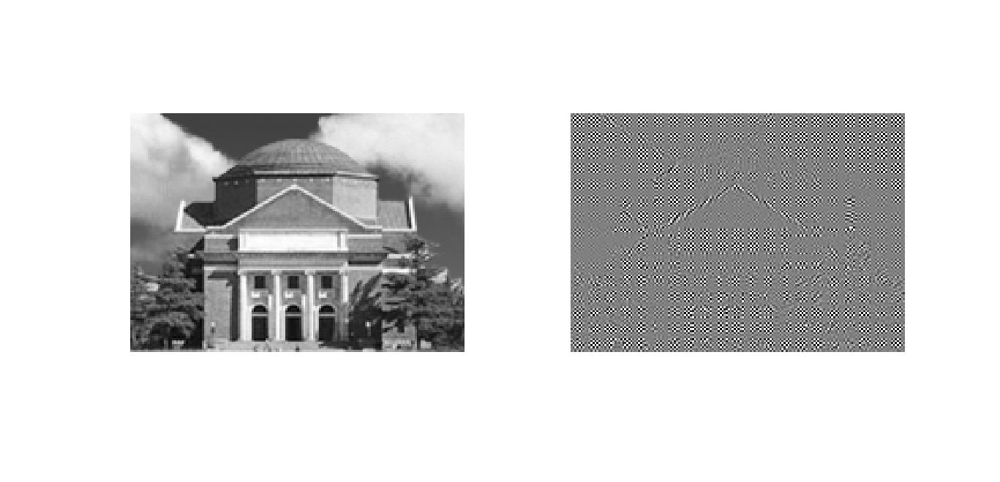

- 转置：

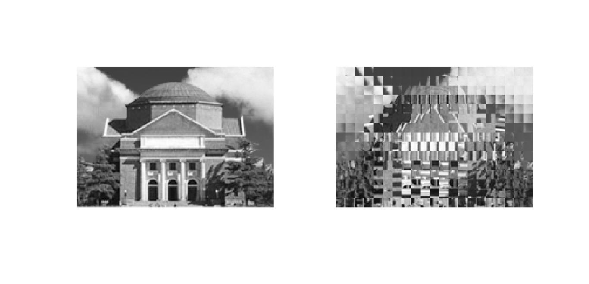

可以看出，结果基本符合之前的分析。

##### 5. 如果认为差分编码是一个系统，请绘出这个系统的频率响应，说明它是一个(低通、高通、带通、带阻)滤波器。 DC 系数先进行差分编码再进行熵编码，说明 DC 系数的（）频率分量更多。

源代码如下：

```MATLAB
% ex_2_5.m
close all;clear all;clc;
a=1;
b=[-1,1];
figure;
freqz(b,a);
```

结果如下：
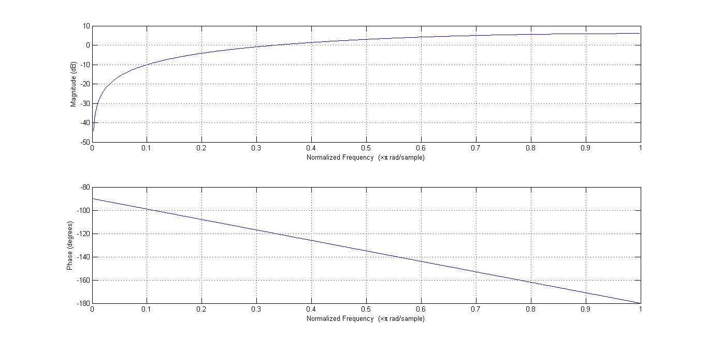

从幅频特性可以看出，这是一个高通系统， DC 系数先进行差分编码再进行熵编码说明 DC 系数中高频分量更多。

##### 6. DC预测误差的取值和 Category 值有何关系？如何利用预测误差计算出其 Category ？

DC预测误差的取值范围 = [1 - 2 ^ (Category) , - 2 ^ (Category - 1)] + [2 ^ (Category - 1) , 2 ^ (Category) - 1]。Category 的计算方法是对预测误差取对数，向下取整后+1（预测误差为0时除外）。

##### 7. 你知道哪些实现 Zig-Zag 扫描的方法？请利用 MATLAB 的强大功能设计一种最佳方法。

根据实验指导书上的描述，我编写了如下函数实现 Zig-Zag 扫描：

```MATLAB
% ZigZag.m
function result = ZigZag(input)
% input为输入的待扫描矩阵
result=zeros(1,64);
maxrow=8;
maxcolumn=8;
present=input(1,1);
count=0;
addrow=0;
addcolumn=0;
flag=0;
row=1;column=1;
for i=1:64
    if (row==1||row==maxrow)&&(flag==0)
        addrow=0;
        addcolumn=1;
        count=count+1;
        flag=1;
    else
        if (column==1||column==maxcolumn)&&(flag==0)
            addrow=1;
            addcolumn=0;
            count=count+1;
            flag=1;
        else
            if mod(count,2)==1
                addrow=1;
                addcolumn=-1;
                flag=0;
            else
                addrow=-1;
                addcolumn=1;
                flag=0;
            end
        end
    end
    result(i)=present;
    if ~(row==maxrow&&column==maxcolumn)
    present=input(row+addrow,column+addcolumn);
    end
    row=row+addrow;
    column=column+addcolumn;
end
result(1)=[];
end
```

由于 Zig-Zag 扫描和拼接的思路基本相同，所以我还编写了如下函数来实现对 Zig-Zag 序列拼接成原矩阵的操作：

```MATLAB
% iZigZag.m
function result=iZigZag(inputDC,inputAC)
% inputDC是输入的直流分量，inputAC是输入的待拼接交流分量
% inputDC是double，inputAC必须是行向量
maxrow=8;
maxcolumn=8;
result=zeros(maxrow,maxcolumn);
tempinput=[inputDC,inputAC];
count=0;
addrow=0;
addcolumn=0;
flag=0;
row=1;column=1;
for i=1:64
    if (row==1||row==maxrow)&&(flag==0)
        addrow=0;
        addcolumn=1;
        count=count+1;
        flag=1;
    else
        if (column==1||column==maxcolumn)&&(flag==0)
            addrow=1;
            addcolumn=0;
            count=count+1;
            flag=1;
        else
            if mod(count,2)==1
                addrow=1;
                addcolumn=-1;
                flag=0;
            else
                addrow=-1;
                addcolumn=1;
                flag=0;
            end
        end
    end
    result(row,column)=tempinput(i);
    row=row+addrow;
    column=column+addcolumn;
end
end
```

为了测试代码的正确性，我采用了如下的两组测试样例：

```
a1 =

     1     2     3     4     5     6     7     8
     9    10    11    12    13    14    15    16
    17    18    19    20    21    22    23    24
    25    26    27    28    29    30    31    32
    33    34    35    36    37    38    39    40
    41    42    43    44    45    46    47    48
    49    50    51    52    53    54    55    56
    57    58    59    60    61    62    63    64

a2 =

     1    10     2     0     0     0     0     0
     3     0     0     0     0     1     0     0
     0     0     0     0     0     0     0     0
     0     0     0     0     0     0     0     0
     0     0     0     0     0     0     0     0
     0     0     0     0     0     0     0     0
     0     0     0     0     0     0     0     0
     0     0     0     0     0     0     0     0
     
```

以 a1 和 a2 为输入运行ZigZag函数后得到如下结果：

```
>> b1=ZigZag(a1)

b1 =

  Columns 1 through 16

     2     9    17    10     3     4    11    18    25    33    26    19    12     5     6    13

  Columns 17 through 32

    20    27    34    41    49    42    35    28    21    14     7     8    15    22    29    36

  Columns 33 through 48

    43    50    57    58    51    44    37    30    23    16    24    31    38    45    52    59

  Columns 49 through 63

    60    53    46    39    32    40    47    54    61    62    55    48    56    63    64
    
>> b2=ZigZag(a2)

b2 =

  Columns 1 through 16

    10     3     0     0     2     0     0     0     0     0     0     0     0     0     0     0

  Columns 17 through 32

     0     0     0     0     0     0     0     0     0     1     0     0     0     0     0     0

  Columns 33 through 48

     0     0     0     0     0     0     0     0     0     0     0     0     0     0     0     0

  Columns 49 through 63

     0     0     0     0     0     0     0     0     0     0     0     0     0     0     0
```

以直流分量为1，输入为 b1 和 b2 两个行向量运行 iZigZag 函数得到如下结果：

```
>> iZigZag(1,b1)

ans =

     1     2     3     4     5     6     7     8
     9    10    11    12    13    14    15    16
    17    18    19    20    21    22    23    24
    25    26    27    28    29    30    31    32
    33    34    35    36    37    38    39    40
    41    42    43    44    45    46    47    48
    49    50    51    52    53    54    55    56
    57    58    59    60    61    62    63    64

>> iZigZag(1,b2)

ans =

     1    10     2     0     0     0     0     0
     3     0     0     0     0     1     0     0
     0     0     0     0     0     0     0     0
     0     0     0     0     0     0     0     0
     0     0     0     0     0     0     0     0
     0     0     0     0     0     0     0     0
     0     0     0     0     0     0     0     0
     0     0     0     0     0     0     0     0
```

从运行结果可以看出，Zig-Zag 扫描和拼接的结果完全正确，证明代码可以实现这两项功能。当然，这并不是最优的方法，还有很多可以优化的地方。

##### 8. 对测试图像分块、 DCT 和量化，将量化后的系数写成矩阵的形式，其中每一列为一个块的 DCT 系数 Zig-Zag 扫描后形成的列矢量，第一行为各个块的 DC 系数。

源代码如下：

```MATLAB
% ex_2_8.m
close all;clear all;clc;
load hall.mat;
load JpegCoeff.mat;
[row,column]=size(hall_gray);
image=zeros(8,8);
trans=zeros(8,8);
value=zeros(8,8);
result=zeros(64,row/8*column/8);
for i=1:row/8
    for j=1:column/8
        image=double(hall_gray((i-1)*8+1:i*8,(j-1)*8+1:j*8))-128;
        trans=dct2(image);
        value=round(trans./QTAB);
        result(1,(i-1)*column/8+j)=value(1,1);
        result(2:64,(i-1)*column/8+j)=ZigZag(value);
    end
end
disp(result);
```

由于篇幅限制，运行结果不在报告中给出。

##### 9. 请实现本章介绍的 JPEG 编码（不包括写 JFIF 文件），输出为 DC 系数的码流、 AC 系数的码流、图像高度和图像宽度，将这四个变量写入 jpegcodes.mat 文件。

源代码如下：

``` MATLAB
% ex_2_9.m
close all;clear all;clc;
load hall.mat;
load JpegCoeff.mat;
load result.mat;
[row,column]=size(hall_gray);
% 差分
DC=result(1,:);
DCtemp=[0,DC];
DCtemp(end)=[];
DC_diff=DCtemp-DC;
DC_diff(1)=-DC_diff(1);
% disp([DC;DC_diff]);

% Huffman编码+熵编码
Category=floor(log2(abs(DC_diff)))+1;
Category(DC_diff==0)=0;
% disp([DC_diff;Category]);
% DCcode是DC输出码流，ACcode是AC输出码流
DCcode=[];ACcode=[];
for i=1:length(Category)
    Length=DCTAB(Category(i)+1,1);
    part1=DCTAB(Category(i)+1,2:Length+1);
    if DC_diff(i)>0
        part2=double(dec2bin(DC_diff(i)))-48;
    else
        if DC_diff(i)<0
            part2=double(double(dec2bin(abs(DC_diff(i))))-48==0);
        else
            part2=[];
        end
    end
    code=[part1,part2];
    DCcode=[DCcode,code];
end
EOB=[1,0,1,0];
ZRL=[ones(1,8),0,0,1];
for i=1:length(Category)
    AC=(result(2:64,i))';
    pos=find(AC~=0);
    if isempty(pos) % AC分量中没有非零值，直接编码为EOB
        ACcode=[ACcode,EOB];
    else
        pos=[0,pos];
        for j=2:length(pos)
            Run=pos(j)-pos(j-1)-1;
            part1=[];part2=[];
            for k=1:floor(Run/16)
                part1=[part1,ZRL];
            end
            if Run>15
                Run=Run-floor(Run/16)*16;
            end
            Size=floor(log2(abs(AC(pos(j)))))+1;
            [Lia,Loc]=ismember([Run,Size],ACTAB(:,1:2),'rows');
            Length=ACTAB(Loc,3);
            part1=[part1,ACTAB(Loc,4:Length+3)];
            if AC(pos(j))>0
                part2=double(dec2bin(AC(pos(j))))-48;
            else
                if AC(pos(j))<0
                    part2=double(double(dec2bin(abs(AC(pos(j)))))-48==0);
                else
                    part2=[];
                end
            end
            code=[part1,part2];
            ACcode=[ACcode,code];
        end
        ACcode=[ACcode,EOB];
    end
end
save jpegcodes.mat DCcode ACcode row column;
```

代码中的核心计算部分已经用实验指导书中给出的例子验证过，运行结果和实验指导书中给出的码流完全相同。

##### 10. 计算压缩比（输入文件长度/输出码流长度），注意转换为相同进制。

题目中要求比较输入文件的长度和输出码流的长度，所以需要先将输入文件的所有数据转换为二进制之后拼接成二进制码流，再和输出码流比较长度。需要注意的是，由于输入文件是未经压缩的图片文件，为了能够解码，应该将每个像素值的二进制编码都补全为8位。计算压缩比的源代码如下：

```MATLAB
% ex_2_10.m
close all;clear all;clc;
load hall.mat;
load jpegcodes.mat;
code_original=[];
code_compressed=[];
for i=1:row
    for j=1:column
        tempcode=double(dec2bin(hall_gray(i,j)))-48;
        code_original=[code_original,tempcode];
    end
end
code_compressed=[DCcode,ACcode];
compressed_ratio=length(code_original)/length(code_compressed)
```

输出结果为 6.4247 。

##### 11. 请实现本章介绍的 JPEG 解码，输入是你生成的 jpegcodes.mat 文件，分别用客观（PSNR）和主观方式评价编解码效果如何。

JPEG解码的源代码如下：

```MATLAB
% ex_2_11.m
close all;clear all;clc;
load jpegcodes.mat;
load JpegCoeff.mat;
load result.mat;
load hall.mat;
num_of_block=row/8*column/8;
code_mat=zeros(64,num_of_block);
% DC解码
for j=1:num_of_block
    for i=1:12
        Length=DCTAB(i,1);
        if (Length<=length(DCcode)) && (isequal(DCcode(1:Length),DCTAB(i,2:Length+1)))
            Category=i-1;
        end
    end
    Length1=DCTAB(Category+1,1);
    DCcode(1:Length1)=[];
    if Category~=0
        if DCcode(1)==1
            code_mat(1,j)=bin2dec(char(DCcode(1:Category)+48));
        else
            code_mat(1,j)=-bin2dec(char(double(DCcode(1:Category)==0)+48));
        end
        DCcode(1:Category)=[];
    else
        code_mat(1,j)=0;
    end
end
for i=2:num_of_block
    code_mat(1,i)=code_mat(1,i-1)-code_mat(1,i);
end
test1=isequal(code_mat(1,:),result(1,:))
EOB=[1,0,1,0];
ZRL=[ones(1,8),0,0,1];
j=1;
for i=1:num_of_block
    code_decode=[];
    while ~isequal(ACcode(1:length(EOB)),EOB)
        if (length(ZRL)<=length(ACcode))&&(isequal(ACcode(1:length(ZRL)),ZRL))
            code_decode=[code_decode;zeros(16,1)];
            ACcode(1:length(ZRL))=[];
        else
            for j=1:160
                Length=ACTAB(j,3);
                if (Length<=length(ACcode))&&(isequal(ACTAB(j,4:Length+3),ACcode(1:Length)))
                    Loc=j;
                    break;
                end
            end
            Run=ACTAB(Loc,1);
            Size=ACTAB(Loc,2);
            H_Length=ACTAB(Loc,3);
            Huffman=ACTAB(Loc,4:H_Length+3);
            ACcode(1:H_Length)=[];
            Amplitude=ACcode(1:Size);
            ACcode(1:Size)=[];
            code_decode=[code_decode;zeros(Run,1)];
            if Amplitude(1)==1
                code_decode=[code_decode;bin2dec(char(Amplitude+48))];
            else
                code_decode=[code_decode;-bin2dec(char(double(Amplitude==0)+48))];
            end
        end
    end
    ACcode(1:length(EOB))=[];
    code_mat(2:length(code_decode)+1,i)=code_decode;
end
test2=isequal(code_mat,result)
image_compressed=zeros(row,column);
for i=1:row/8
    for j=1:column/8
      temp_mat=iZigZag(code_mat(1,(i-1)*column/8+j),(code_mat(2:64,(i-1)*column/8+j))');
      temp_mat=temp_mat.*QTAB;
      temp_mat=idct2(temp_mat)+128*ones(8,8);
      image_compressed((i-1)*8+1:i*8,(j-1)*8+1:j*8)=temp_mat;
    end
end
subplot(1,2,1);
imshow(hall_gray);
subplot(1,2,2);
imshow(uint8(image_compressed));
psnr(uint8(image_compressed),hall_gray)
```

得到的两张图片的显示结果如下：


为了求得压缩后图像的 PSNR ，我使用了 MATLAB 中自带的 psnr 函数，得到的 PSNR = 31.1874dB。从主观来看，得到的图像质量较原图像有一定的下降，但是这种质量的改变并不明显。如果直接以图像的原尺寸查看两张图片，几乎看不出来有什么区别。

##### 12. 将量化步长减小为原来的一半，重做编解码。同标准量化步长的情况比较压缩比和图像质量。

此问源代码（ex\_2\_12\_1.m 和 ex\_2\_12\_2.m）和之前几问的源代码几乎完全相同，此处只给出运行结果：


此时得到的 PSNR 为 34.2067 。从客观上来看，峰值信噪比提高了，说明图像质量得到了一定的提升。从主观上来看，此时得到的图片与原图更加接近，也说明图像质量得到了一定的提升。这是因为量化步长减小了一半，原来没有被保留的交流分量有一部分被保留了下来。这一点也体现在压缩比（计算压缩比的代码）上面。标准量化步长的条件下，压缩比为 6.4247 ，而一半量化步长的条件下压缩比变为 4.4097 ，这说明在一半量化步长的条件下，有更多的交流分量被保留了下来。

##### 13. 看电视时偶尔能看到美丽的雪花图像（见 snow.mat ），请对其编解码。和测试图像的压缩比和图像质量进行比较，并解释比较结果。

此问源代码和之前几问几乎相同，所以此处只给出运行结果：

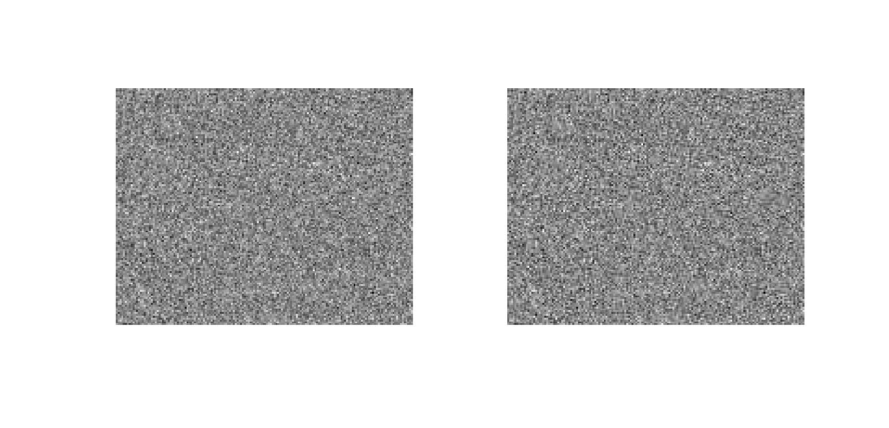

PSNR = 22.9244 ，压缩比 = 3.6450 。从各个方面都可以看出，当测试图像从自然图片变成雪花时，图像质量明显下降（PSNR 和压缩比降低）。这是因为在自然图片中几乎不存在快速变化的图像，多数都是缓慢变化的图像，所以 DCT 后交流分量很小，采用这种方法时数据不会有太多丢失。但是雪花图片中充满了白噪声，每个点的值都是随机的，这就导致了 DCT 后交流分量可能很大，如果还采用一样的办法的话会有很多数据丢失，导致图像质量下降。如果想要对雪花图片进行更高质量的压缩，需要调整量化步长的值，降低交流分量的量化步长。

## 三、信息隐藏

本章练习题所用测试图像同上一章，本章练习题所指待隐藏信息可自由选择。

##### 1. 实现本章介绍的空域隐藏方法和提取方法。验证其抗 JPEG 编码能力。

空域隐藏方法：

```MATLAB
% ex_3_1_1.m
close all;clear all;clc;
load hall.mat;
information=double('signal and system');
% ASCII码中一共只有128种字符
% 所以对隐藏信息进行编码的时候将每个数字编码为7位
% 在隐藏信息之前添加一位表示隐藏信息的长度
information_code=[];
tempcode=double(dec2bin(length(information)))-48;
tempcode=[zeros(1,7-length(tempcode)),tempcode];
information_code=[information_code,tempcode];
for i=1:length(information)
    tempcode=double(dec2bin(information(i)))-48;
    tempcode=[zeros(1,7-length(tempcode)),tempcode];
    information_code=[information_code,tempcode];
end
[row,column]=size(hall_gray);
code_hidden=[];
image_hidden=zeros(row,column);
for i=1:row
    for j=1:column
        tempcode=double(dec2bin(hall_gray(i,j)))-48;
        tempcode=[zeros(1,8-length(tempcode)),tempcode];
        if (i-1)*8+j<=length(information_code)
            tempcode(8)=information_code((i-1)*8+j);
        end
        code_hidden=[code_hidden,tempcode];
        image_hidden(i,j)=bin2dec(char(tempcode+48));
    end
end
image_hidden=uint8(image_hidden);
save hidden.mat code_hidden image_hidden;
subplot(1,2,1);imshow(hall_gray);
subplot(1,2,2);imshow(image_hidden);
```

空域提取方法：

```MATLAB
% ex_3_1_2.m
close all;clear all;clc;
load hidden.mat;
a=[zeros(1,7),1];
b=repmat(a,1,7);
tempcode=code_hidden(1:length(b));
tempcode=tempcode.*b;
tempcode=find(tempcode~=0)/8;
information_length=zeros(1,7);
information_length(tempcode)=1;
information_length=bin2dec(char(information_length+48));
code_hidden(1:length(b))=[];
information=zeros(1,information_length);
for i=1:information_length
    tempcode=code_hidden(1:length(b));
    tempcode=tempcode.*b;
    tempcode=find(tempcode~=0)/8;
    tempinfo=zeros(1,7);
    tempinfo(tempcode)=1;
    tempinfo=bin2dec(char(tempinfo+48));
    info(i)=tempinfo;
    code_hidden(1:length(b))=[];
end
information=char(info)
```

隐藏结果：


提取结果：

```
information =

signal and system
```

显然，在不采用JPEG压缩编码的情况下，信息能够被成功的隐藏和提取。

经过JPEG编码压缩之后的输出结果：

```
information =

/|8        /%$j&+"'~$(T(       h@Y\4R'$`
```

可见，在经过JPEG压缩编码之后，原来的信息已经完全丢失，说明这种方法的抗JPEG编码能力很弱。

##### 2. 依次实现本章介绍的三种变换域信息隐藏方法和提取方法，分析嵌密方法的隐蔽性及嵌密后 JPEG 图像的质量变化和压缩比变化。

- 第一种方法：用信息为逐一替换掉每个量化之后的 DCT 系数的最低位，再进行熵编码。

  将每一个块中的所有 DCT 系数转换成二进制，并将最低位替换成信息位，再转化成十进制。源代码如下：（由于篇幅限制，此处只给出隐藏信息和提取信息的代码，其余代码均和之前完全相同，下同）

  ```MATLAB
  % ex_3_2_1.m
  % 隐藏信息
  for i=1:row/8
      for j=1:column/8
          image=double(hall_gray((i-1)*8+1:i*8,(j-1)*8+1:j*8))-128*ones(8,8);
          trans=dct2(image);
          tempvalue=round(trans./QTAB);
          if (i-1)*column/8+j<=length(information_code)
              for i1=1:8
                  for j1=1:8
                      temp=double(dec2bin(abs(tempvalue(i1,j1))))-48;
                      temp(end)=information_code((i-1)*column/8+j);
                      if tempvalue(i1,j1)>=0
                          value(i1,j1)=bin2dec(char(temp+48));
                      else
                          value(i1,j1)=-bin2dec(char(temp+48));
                      end
                  end
              end
          else
              value=tempvalue;
          end
          result(1,(i-1)*column/8+j)=value(1,1);
          result(2:64,(i-1)*column/8+j)=ZigZag(value);
      end
  end
  ```

  ```MATLAB
  % ex_3_2_1.m
  % 提取信息
  info_length=zeros(1,7);
  information_length=row*column/8/8+1;
  for i=1:row/8
      for j=1:column/8
          temp_mat=iZigZag(result(1,(i-1)*column/8+j),(result(2:64,(i-1)*column/8+j))');
          if (i-1)*column/8+j<7
              temp=double(dec2bin(abs(temp_mat(1,1))))-48;
              info_length((i-1)*column/8+j)=temp(end);
          else
              if (i-1)*column/8+j==7
                  temp=double(dec2bin(abs(temp_mat(1,1))))-48;
                  info_length((i-1)*column/8+j)=temp(end);
                  information_length=bin2dec(char(info_length+48));
              else
                  if (i-1)*column/8+j-7<=information_length*7
                      temp=double(dec2bin(abs(temp_mat(1,1))))-48;
                      info((i-1)*column/8+j-7)=temp(end);
                  end
              end
          end
          temp_mat=temp_mat.*QTAB;
          temp_mat=idct2(temp_mat)+128*ones(8,8);
          image_compressed((i-1)*8+1:i*8,(j-1)*8+1:j*8)=temp_mat;
      end
  end

  % 结果输出+信息解码
  for i=1:length(info)/7
      temp=info((i-1)*7+1:i*7);
      information(i)=bin2dec(char(temp+48));
  end
  information=char(information)
  ```

  得到的隐藏图片如下：

  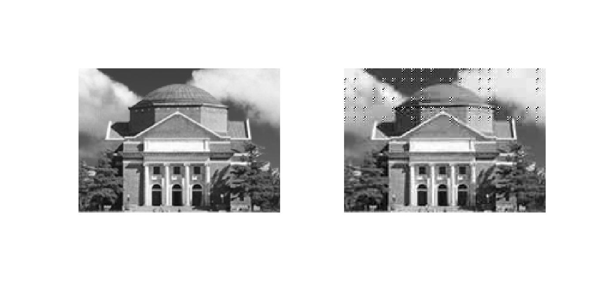

  提取出的信息为```signal and system```，与隐藏的信息完全相同。可以看出，隐藏效果并不是很好，因为这种隐藏方法改变了 DCT 系数中的交流分量，很有可能使得交流分量变大，使得图像块产生沿某一方向迅速变化的分量。这种方法的压缩比为 4.6084 ，峰值信噪比为 21.4227 。可以看出，由于隐藏了信息，压缩比和信噪比都有一定程度的下降，也就是说图片质量下降了。

- 第二种方法：用信息位逐一替换掉若干量化后的 DCT 系数的最低位，再进行熵编码。

  为了将隐藏信息带来的影响降低到最小，基本思路是选择替换 DCT 系数中最大的一个。而由自然图片的特性可以知道，一般图片的直流分量比较大，交流分量比较小，所以为了降低复杂度，最终选择替换直流分量的最低位，源代码如下：

  ```MATLAB
  % ex_3_2_2.m
  % 隐藏信息
  for i=1:row/8
      for j=1:column/8
          image=double(hall_gray((i-1)*8+1:i*8,(j-1)*8+1:j*8))-128*ones(8,8);
          trans=dct2(image);
          value=round(trans./QTAB);
          if (i-1)*column/8+j<=length(information_code)
              temp=double(dec2bin(abs(value(1,1))))-48;
              temp(end)=information_code((i-1)*column/8+j);
              if value(1,1)>0
                  value(1,1)=bin2dec(char(temp+48));
              else
                  value(1,1)=-bin2dec(char(temp+48));
              end
          end
          result(1,(i-1)*column/8+j)=value(1,1);
          result(2:64,(i-1)*column/8+j)=ZigZag(value);
      end
  end
  ```

  ```MATLAB
  % ex_3_2_2.m
  % 提取信息
  info_length=zeros(1,7);
  information_length=row*column/8/8+1;
  for i=1:row/8
      for j=1:column/8
          temp_mat=iZigZag(code_mat(1,(i-1)*column/8+j),(code_mat(2:64,(i-1)*column/8+j))');
          if (i-1)*column/8+j<7
              temp=double(dec2bin(abs(temp_mat(1,1))))-48;
              info_length((i-1)*column/8+j)=temp(end);
          else
              if (i-1)*column/8+j==7
                  temp=double(dec2bin(abs(temp_mat(1,1))))-48;
                  info_length((i-1)*column/8+j)=temp(end);
                  information_length=bin2dec(char(info_length+48));
              else
                  if (i-1)*column/8+j-7<=information_length*7
                      temp=double(dec2bin(abs(temp_mat(1,1))))-48;
                      info((i-1)*column/8+j-7)=temp(end);
                  end
              end
          end
          temp_mat=temp_mat.*QTAB;
          temp_mat=idct2(temp_mat)+128*ones(8,8);
          image_compressed((i-1)*8+1:i*8,(j-1)*8+1:j*8)=temp_mat;
      end
  end

  % 结果输出
  for i=1:length(info)/7
      temp=info((i-1)*7+1:i*7);
      information(i)=bin2dec(char(temp+48));
  end
  information=char(information)
  ```

  得到的隐藏图片如下：

  

  提取出的信息为``` signal and system``` 。可以看出，这次的隐藏效果比上一种方法要好得多，但是在左上角的区域还是有一部分区块因为直流分量的改变导致在边缘处出现了比较明显的边界线。这种方法的压缩比为 6.4235 ，峰值信噪比为 31.1172 。从这两个指标可以看出，图片质量有一定的下降，但是下降幅度非常小。

- 第三种方法：先将待隐藏信息用1，-1的序列表示，再逐一将信息位追加在每个块 Zig-Zag 顺序的最后一个非零 DCT 系数之后；如果原本该图像块的最后一个系数就不为零，那就用信息位替换该系数。

  源代码如下：

  ```MATLAB
  % ex_3_2_3.m
  % 隐藏信息
  information_code(find(information_code==0))=-1;

  % 分块+dct+量化+隐藏
  for i=1:row/8
      for j=1:column/8
          image=double(hall_gray((i-1)*8+1:i*8,(j-1)*8+1:j*8))-128*ones(8,8);
          trans=dct2(image);
          value=round(trans./QTAB);
          result(1,(i-1)*column/8+j)=value(1,1);
          result(2:64,(i-1)*column/8+j)=ZigZag(value);
          if (i-1)*column/8+j<=length(information_code)
              temp=find(ZigZag(value)~=0);
              if isempty(temp)
                  result(2,(i-1)*column/8+j)=information_code((i-1)*column/8+j);
              else
                  if temp(end)~=63
                      result(temp(end)+1+1,(i-1)*column/8+j)=information_code((i-1)*column/8+j);
                  else
                      result(temp(end)+1,(i-1)*column/8+j)=information_code((i-1)*column/8+j);
                  end
              end
          end
      end
  end
  ```

  ```MATLAB
  % ex_3_2_3.m
  % 提取信息
  info_length=zeros(1,7);
  information_length=row*column/8/8+1;
  for i=1:row/8
      for j=1:column/8
          if (i-1)*column/8+j<7
              temp=find(code_mat(2:64,(i-1)*column/8+j)~=0);
              info_length((i-1)*column/8+j)=code_mat(temp(end)+1,(i-1)*column/8+j);
          else
              if (i-1)*column/8+j==7
                  temp=find(code_mat(2:64,(i-1)*column/8+j)~=0);
                  info_length((i-1)*column/8+j)=code_mat(temp(end)+1,(i-1)*column/8+j);
                  info_length(find(info_length==-1))=0;
                  information_length=bin2dec(char(info_length+48));
              else
                  if (i-1)*column/8+j-7<=information_length*7
                      temp=find(code_mat(2:64,(i-1)*column/8+j)~=0);
                      info((i-1)*column/8+j)=code_mat(temp(end)+1,(i-1)*column/8+j);
                  end
              end
          end
          temp_mat=iZigZag(code_mat(1,(i-1)*column/8+j),(code_mat(2:64,(i-1)*column/8+j))');
          temp_mat=temp_mat.*QTAB;
          temp_mat=idct2(temp_mat)+128*ones(8,8);
          image_compressed((i-1)*8+1:i*8,(j-1)*8+1:j*8)=temp_mat;
      end
  end

  % 结果输出
  info(find(info==-1))=0;
  for i=1:length(info)/7
      temp=info((i-1)*7+1:i*7);
      information(i)=bin2dec(char(temp+48));
  end
  information=char(information)
  ```

  得到的隐藏图片如下：

  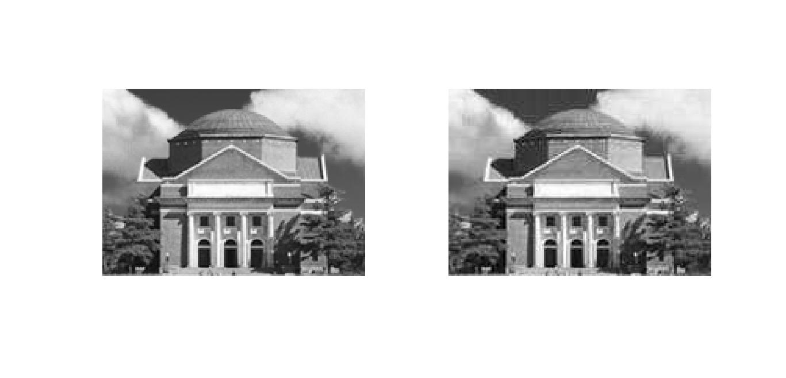

  提取出的信息为```signal and system``` 。从隐藏结果可以看出，隐藏信息后的图片质量下降比较明显，较原图片多出了很多波纹状的噪声。这种方法的压缩比为 6.3294 ，峰值信噪比为 30.6675 。从这两个指标也可以看出，这种方法的隐藏效果不如上一种好。

## 四、人脸检测

##### 1. 所给资料 Faces 目录下包含从网图中截取的28张人脸，试以其作为样本训练人脸标准 v 。

源代码如下：

```MATLAB
% ex_4_1.m
close all;clear all;clc;
L=3;
I=31;
u=zeros(2^(3*L),I);
% 每个列向量是一张图片的u
for i=1:I
    if i<10
        name=char(i+48);
    else
        name=[char(floor(i/10)+48),char(mod(i,10)+48)];
    end
    image_rgb=imread(['Faces/',name,'.bmp']);
    [row,column,channel]=size(image_rgb);
    image_convert=floor(double(image_rgb)/(2^(8-L)));
    image_num=image_convert(:,:,1)*2^(2*L)+image_convert(:,:,2)*2^(L)+image_convert(:,:,3);
    for j=1:2^(3*L)
        u(j,i)=length(find(image_num==j-1));
    end
    u(:,i)=u(:,i)/(row*column);
end
v=zeros(2^(3*L),1);
for i=1:2^(3*L);
    v(i)=sum(u(i,:))/I;
end
save train.mat v;
```

##### （a）样本人脸大小不一，是否需要首先将图像调整为相同大小？

不需要，因为这种训练方法统计的是各种颜色在人脸图像上出现的概率大小，与图片的大小没有关系。

##### （b）假设 L 分别取 3，4，5 ，所得三个 v 之间有什么关系？

L = m 时 v 的大小是 L = m - 1 时的 8 倍。

##### 2. 设计一种从任意大小的图片中检测任意多张人脸的算法并编程实现（输出图像在判定为人脸的位置加上红色的方框）。随意选取一张多人照片（比如支部活动或者足球比赛），对程序进行测试。尝试 L 分别不同的取值，评价检测结果有何区别。

根据实验指导书中给出的思路，最重要的一步是对图像进行分割，因为提取特征和判别在上一问都已经实现。对图像进行分割的质量直接决定了后面用来和标准进行判别的图像区域是否为严格的人脸。我选取的图像是一张与足球有关的图片：

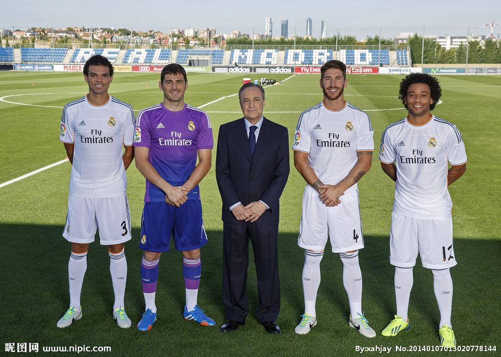

一开始我的思路是对图像进行二值化，然后提取二值化图像中的所有连通分量。因为人脸上多数为缓变的颜色，所以二值化之后很有可能一张人脸就是一个连通分量。但是对图像进行二值化（直接使用 MATLAB 中自带的库函数，先转化成灰度图然后二值化）之后的效果并不好：

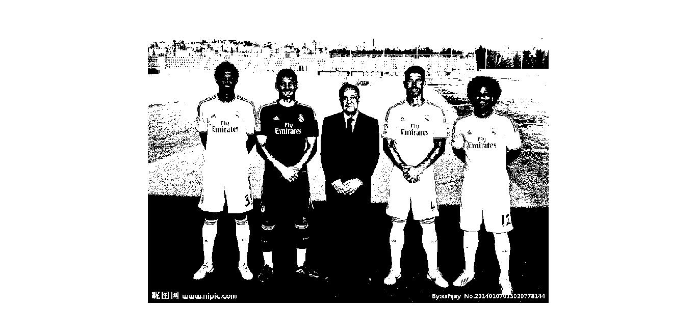

可以看出，由于肤色的不同，对整张图片二值化之后不同的人脸上保留的区域有很大差别，如左一的运动员，脸上的区域几乎没有保留。在查阅了各种文件和书籍资料之后，发现可以通过转换图片的色彩空间来识别肤色区域。对于识别肤色来说，采用 YCbCr 空间最为合适，因为在传统的 RGB 色彩空间中，图像的亮度对 RGB 的每一个通道的取值影响都很大，甚至会完全改变原有的颜色。但是在 YCbCr 空间中，Y通道对应亮度为一个单独的通道，剩下两个通道分别代表蓝色和红色的浓度偏移量，所以说在 YCbCr 空间中，对肤色的检测不受亮度的影响，准确率大大提升。因此，我采用的人脸识别策略是：先在 YCbCr 空间中找到肤色区域，然后对提取到的肤色区域进行处理得到待检测的区域，然后对每一个待检测的区域进行判别，符合人脸特征的区域则识别为人脸。

经查阅资料并对给出的 31 张人脸图片进行提取特征之后，发现肤色在 YCbCr 空间中对应的取值范围为 95 <= Cb <= 122 , 133 <= Cr <= 170 。沿着这个思路，我编写了如下代码：

```MATLAB
image_rgb=imread(image_name);
image_ycbcr=rgb2ycbcr(image_rgb);
cb=image_ycbcr(:,:,2);
cr=image_ycbcr(:,:,3);
image_bin=(cb>=95&cb<=122)&(cr>=133&cr<=170);
```

得到的效果如下：

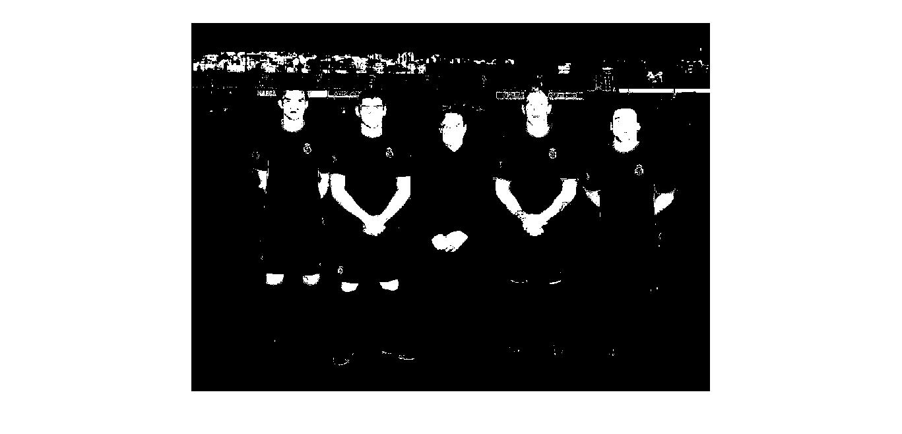

可以看出，这种方法可以非常准确的提取出图片中颜色与肤色相同的区域。但是提取结果中还是有很多不准确的地方，同时也存在一些噪声和小的噪点。为了消除这些噪声，我使用了 MATLAB 中自带的 imfill 函数和 imerode 函数，同时去掉图像中面积过小的部分。源代码如下：

```MATLAB
se=strel('square',3);
image_fill=imfill(image_bin,'holes');
image_fill=imerode(image_fill,se);
[L,num]=bwlabel(image_fill);
for i=1:num
    [r,c]=find(L==i);
    [row,column]=size(image_fill);
    area=length(r);
    if area<=row*column*0.001
        image_fill(L==i)=0;
    end
end
```

 得到的效果如下：

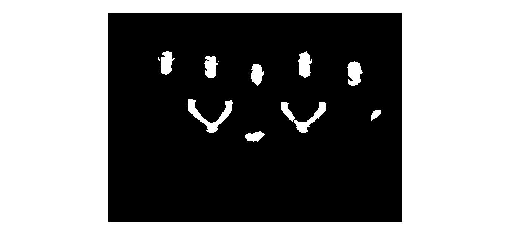

很明显，去噪效果非常好，有肤色的区域都已经被提取了出来，同时外界的干扰也几乎全被去掉。现在需要确定待识别的矩形区域。一开始我采用的策略是简单的取能够完全包含白色区域的最小矩形。但是在提取出所有的肤色区域并进行识别后发现有部分肤色区域也被误判成了人脸。仔细查找原因之后发现，由于上述策略将人脸上的耳朵也包含了进来，导致了在矩形区域的外围有很多背景的颜色，这就使得在调整阈值的时候需要将敏感值调到很大才能识别出所有人脸，此时就出现其他肤色区域同样被识别为人脸。为了解决这个问题，我采用了如下策略：以之前提取出来的矩形区域为基准，统计每一行第一个白色像素点出现最多的位置作为新的矩形区域的左侧边界。对于其他三个边界采用相同的策略。基于这个思路，我编写了如下代码：

```MATLAB
[r,c]=find(L==i);
top=min(r);bottom=max(r);
left=min(c);right=max(c);
row=bottom-top+1;column=right-left+1;
image_temp_bin=image_fill(top:bottom,left:right);
left_edge=zeros(row,1);right_edge=zeros(row,1);
top_edge=zeros(column,1);bottom_edge=zeros(column,1);
for j=1:row
    white=find(image_temp_bin(j,:)==1);
    left_edge(j)=white(1);
    right_edge(j)=white(end);
end
for j=1:column
    white=find(image_temp_bin(:,j)==1);
    top_edge(j)=white(1);
    bottom_edge(j)=white(end);
end
[Ele,Num]=ElementNumber(right_edge);
right=left+max(Ele(Num==max(Num)));
[Ele,Num]=ElementNumber(left_edge);
left=left+max(Ele(Num==max(Num)));
[Ele,Num]=ElementNumber(bottom_edge);
bottom=top+max(Ele(Num==max(Num)));
[Ele,Num]=ElementNumber(top_edge);
top=top+max(Ele(Num==max(Num)));
```

其中 ElementNumber 函数是自己编写的函数，作用是统计列向量中所有元素出现的次数，返回值是一个 N*2 的矩阵（ N 是输入列向量中出现的元素个数），第一列是输入列向量中所有出现过的元素，第二列是与第一列对应的每个元素出现的次数，函数的源代码如下：

```MATLAB
function [Element,Number]=ElementNumber(a)
% 输入必须为列向量
[row,column]=size(a);
x=sort(a);
d=diff([x;max(x)+1]);
count=diff(find([1;d]));
Element=x(find(d));
Number=count;
end
```

得到的划分区域如下：

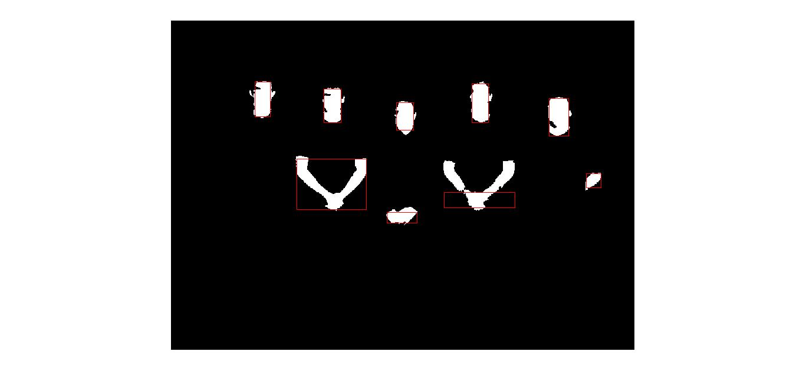

可以看出，这次划分区域的效果比较理想，对于人脸部分，能够取到大多数人脸的部分。至此，划分待提取的矩形区域的工作已经结束，下面要进行的就是提取所有区域的特征并和训练标准进行比对。此处，为了过滤掉某些容易受干扰的区域，我添加了对人脸区域长宽比的限制条件。源代码如下：

```MATLAB
row=bottom-top+1;column=right-left+1;
image_temp=image_rgb(top:bottom,left:right,:);
image_temp_convert=floor(double(image_temp)/(2^(8-L2)));
image_temp_num=image_temp_convert(:,:,1)*2^(2*L2)+
	image_temp_convert(:,:,2)*2^(L2)+image_temp_convert(:,:,3);
for j=1:2^(3*L2)
    u(j)=length(find(image_temp_num==j-1));
end
u=u/(row*column);
distance=1-sum(sqrt(u.*v));
if (distance<=epcilon)&&((row/column<=rate)&&(row/column>=1/rate))
    plot([left left],[top bottom],'r');
    plot([right right],[top bottom],'r');
    plot([left right],[top top],'r');
    plot([left right],[bottom bottom],'r');
end
```

为了方便使用，我将上述人脸识别的功能封装成了一个函数，输入参数为图片的文件名、敏感值和长宽比。完整源代码如下：

```MATLAB
% ex_4_2.m
function ex_4_2(image_name,epcilon,rate)
load train.mat;
image_rgb=imread(image_name);
image_ycbcr=rgb2ycbcr(image_rgb);
cb=image_ycbcr(:,:,2);
cr=image_ycbcr(:,:,3);
image_bin=(cb>=95&cb<=122)&(cr>=133&cr<=170);
se=strel('square',3);
image_fill=imfill(image_bin,'holes');
image_fill=imerode(image_fill,se);
[L,num]=bwlabel(image_fill);
for i=1:num
    [r,c]=find(L==i);
    [row,column]=size(image_fill);
    area=length(r);
    if area<=row*column*0.001
        image_fill(L==i)=0;
    end
end
figure;imshow(image_rgb);
[L,num]=bwlabel(image_fill);
hold on;
u=zeros(2^(3*L2),1);
for i=1:num
    [r,c]=find(L==i);
    top=min(r);bottom=max(r);
    left=min(c);right=max(c);
    row=bottom-top+1;column=right-left+1;
    image_temp_bin=image_fill(top:bottom,left:right);
    left_edge=zeros(row,1);right_edge=zeros(row,1);
    top_edge=zeros(column,1);bottom_edge=zeros(column,1);
    for j=1:row
        white=find(image_temp_bin(j,:)==1);
        left_edge(j)=white(1);
        right_edge(j)=white(end);
    end
    for j=1:column
        white=find(image_temp_bin(:,j)==1);
        top_edge(j)=white(1);
        bottom_edge(j)=white(end);
    end
    [Ele,Num]=ElementNumber(right_edge);
    right=left+max(Ele(Num==max(Num)));
    [Ele,Num]=ElementNumber(left_edge);
    left=left+max(Ele(Num==max(Num)));
    [Ele,Num]=ElementNumber(bottom_edge);
    bottom=top+max(Ele(Num==max(Num)));
    [Ele,Num]=ElementNumber(top_edge);
    top=top+max(Ele(Num==max(Num)));
    row=bottom-top+1;column=right-left+1;
    image_temp=image_rgb(top:bottom,left:right,:);
    image_temp_convert=floor(double(image_temp)/(2^(8-L2)));
    image_temp_num=image_temp_convert(:,:,1)*2^(2*L2)+
    	image_temp_convert(:,:,2)*2^(L2)+image_temp_convert(:,:,3);
    for j=1:2^(3*L2)
        u(j)=length(find(image_temp_num==j-1));
    end
    u=u/(row*column);
    distance=1-sum(sqrt(u.*v));
    if (distance<=epcilon)&&((row/column<=rate)&&(row/column>=1/rate))
        plot([left left],[top bottom],'r');
        plot([right right],[top bottom],'r');
        plot([left right],[top top],'r');
        plot([left right],[bottom bottom],'r');
    end
end
hold off;
```

运行函数 ``` ex_4_2('image/2.jpg',0.7,2.5)``` 得到的识别效果如下：

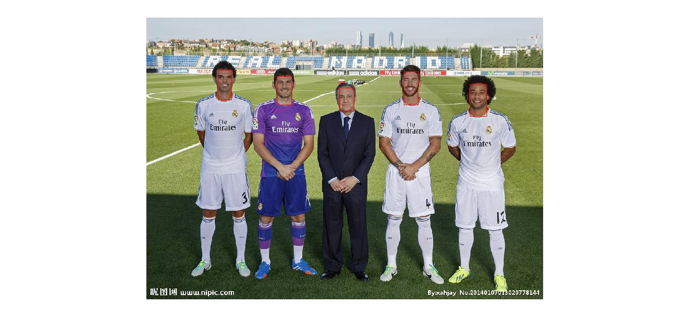

换一张图片之后重新调整参数，运行函数 ``` ex_4_2('image/1.jpg',0.61,2.5)``` 得到的识别效果如下：


可以看到，由于该图片中右二运动员脸比较长，导致了用长宽比也没能过滤掉右一运动员的胳膊。这也体现出了基于彩色直方图的人脸识别方法的一个缺点，就是容易受到颜色相近区域的干扰。

##### 3. 对上述图像分别进行如下处理后

##### （a）顺时针旋转90度（imrotate）；

##### （b）保持高度不变，宽度拉伸为原来的2倍（imresize）；

##### （c）适当改变颜色（imadjust）；

##### 再试试你的算法检测结果如何？并分析所得结果。

源代码如下：

```MATLAB
image=imread('image/2.jpg');
image_rotate=imrotate(image,90);
[row,column,channel]=size(image);
image_resize=imresize(image,[row,2*column]);
image_adjust=imadjust(image,[0 0 0.8;1 1 1]);
imwrite(image_rotate,'image/2_rotate.jpg');
imwrite(image_resize,'image/2_resize.jpg');
imwrite(image_adjust,'image/2_adjust.jpg');
ex_4_2('image/2_rotate.jpg',0.6,3);
ex_4_2('image/2_resize.jpg',0.6,2.5);
ex_4_2('image/2_adjust.jpg',0.7,2.5);
```

识别效果如下：

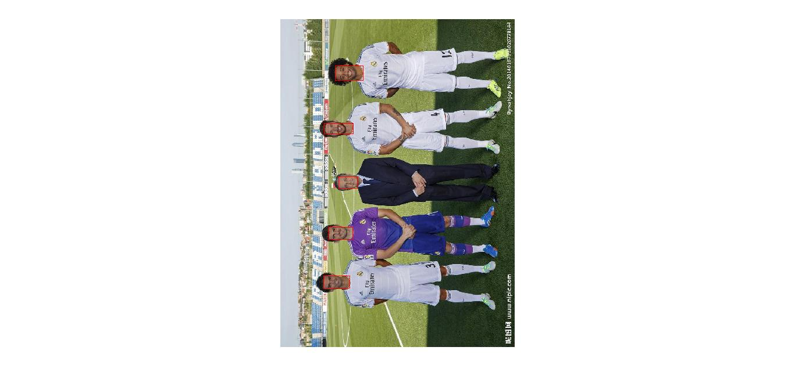

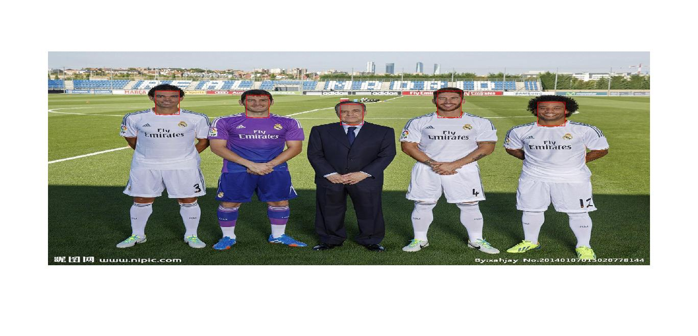

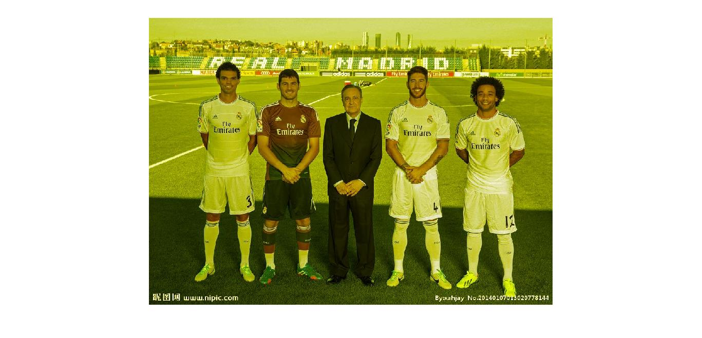
可以看出，由于采用的这种人脸识别的算法是基于色彩，所以抗旋转能力和拉伸能力都很强，但是对于调整颜色的图片完全无法识别，甚至检测不到有肤色的区域。

##### 4. 如果可以重新选择人脸样本训练标准，你觉得应该如何选取？

首先应该选取各种肤色的人脸样本，分开训练得到不同肤色的标准。其次应该避免选择侧脸的图片作为人脸样本，因为侧脸相对于正脸来说皮肤的颜色更多，五官的特征比较弱，所以为了提高标准的一般性，应该避免选择侧脸的图片。

## 实验感想

这次作业是和图像处理有关的大作业，而图像处理也是我最感兴趣的一个方向。本次作业最核心的部分是 JPEG 编码和人脸识别。JPEG 编码部分完成的比较顺利，因为在春季学期的《信号与系统》课程上谷老师讲过JPEG编码的相关内容，着重讲解了 DCT 变换的部分。这一部分令我收获最多的就是对 DCT 变化的深入讲解以及 DCT 系数各部分的具体含义，让我明白决定图片整体颜色和纵横两个方向变化速度的主要因素是什么。在这一部分中比较有挑战的部分是 Zig-Zag 扫描的实现和解码器的设计。 Zig-Zag 扫描中扫描方向变化的逻辑十分复杂，优先级关系需要想的非常清晰。解码器的设计的挑战在于完全正确的还原编码之前的 DCT 系数，需要中间环节的每一步都不能有 bug 。人脸识别部分在动手编写代码之前设计、试验算法用了比较长的时间，期间还查阅了各种资料，学习适用于肤色的颜色空间、图像的形态学运算、连通分量的提取等算法。最后得到的识别效果比较理想。但是由于基于颜色的人脸识别的方法本身无法避免的缺点，对于某些与人脸颜色分布相近但是不是人脸的区域还是无法识别。希望以后能够进一步学习实验指导书中提到的 Adaboost、PCA 等人脸识别的算法。总的来说，这一次大作业让我收获很大，也让我学习了图像处理的基础知识。由于兴趣比较大，所以做作业的时候也是乐在其中。