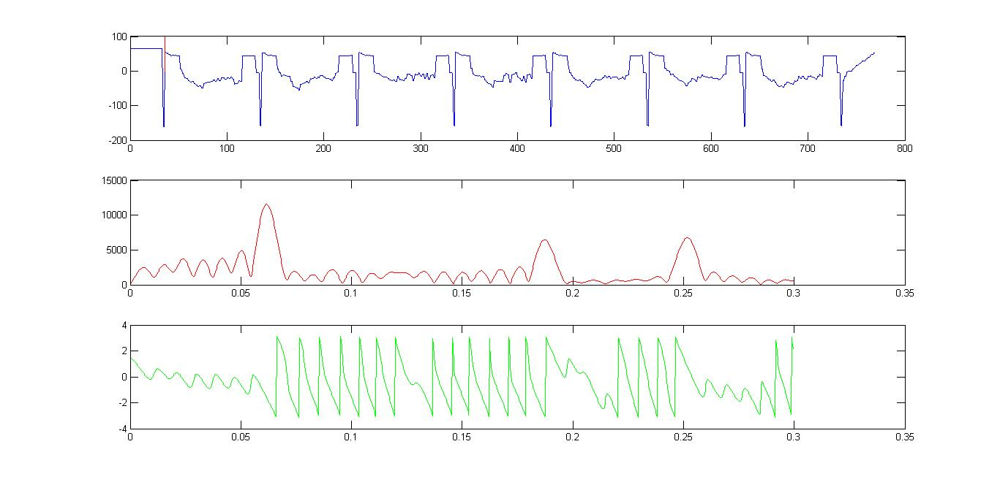
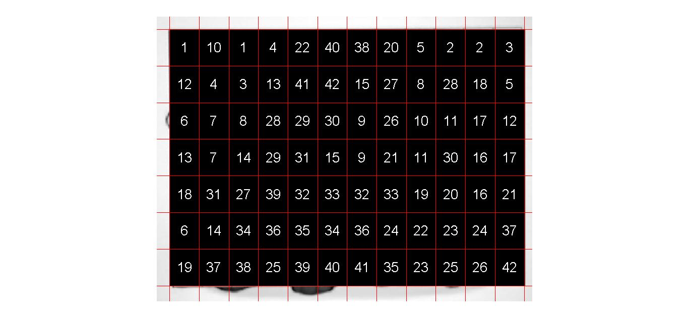

# MATLAB大作业——连连看实验报告

###### 无42 陈誉博 2014011058

## 一、制作自己的连连看

##### 1. 在 MATLAB 环境下，设置当前路径为 linkgame ，运行 linkgame （打开 linkgame.fig 或右键 linkgame.p 点“运行”），熟悉游戏。（上述程序已经过 MATLAB2010b 以上版本的测试 。）

游戏界面如下：


##### 2.  注意 linkgame 目录下有个 detect.p ，它的功能是检测块是否可以消除。现在请你把它移动到其他文件夹或删掉！然后把 linkgame\\reference 目录下的 detect.m 复制到 linkgame 目录下。detect.m 文件中是 detect 函数，函数以图像块的索引矩阵与要判断的两个块的下标为输入，如果两个块能消掉则输出 1 ，否则输出 0 。请根据文件中的注释提示，实习那判断块是否可以消除的功能。写完后再次运行 linkgame ，检验游戏是否仍然可以运行。当你的程序的判断结果有误时，在游戏界面右下角会有提示。（注意：当 detect.p 文件存在时， detect.m 文件将不会被执行，所以测试时一定要移走 detect.p 文件。） 

源代码如下：

```MATLAB
function bool = detect(mtx, x1, y1, x2, y2)
% ========================== 参数说明 ==========================

% 输入参数中，mtx为图像块的矩阵，类似这样的格式：
% [ 1 2 3;
%   0 2 1;
%   3 0 0 ]
% 相同的数字代表相同的图案，0代表此处没有块。
% 可以用[m, n] = size(mtx)获取行数和列数。
% (x1, y1)与（x2, y2）为需判断的两块的下标，即判断mtx(x1, y1)与mtx(x2, y2)
% 是否可以消去。

% 注意mtx矩阵与游戏区域的图像不是位置对应关系。下标(x1, y1)在连连看界面中
% 代表的是以左下角为原点建立坐标系，x轴方向第x1个，y轴方向第y1个

% 输出参数bool = 1表示可以消去，bool = 0表示不能消去。

%% 在下面添加你的代码O(∩_∩)O

[m, n] = size(mtx);

bool = 0;

if (x1>m||x2>m||y1>n||y2>n)||(mtx(x1,y1)~=mtx(x2,y2))||(mtx(x1,y1)==0||mtx(x2,y2)==0)
    bool=0;
else
    %% 两个被消块处在同一直线上
    if (x1==x2)||(y1==y2)
        if x1==x2 %水平直线
            if y1<y2
                temp=mtx(x1,y1+1:y2-1);
            else
                temp=mtx(x1,y2+1:y1-1);
            end
            if isempty(temp)||isequal(temp,zeros(1,length(temp)))
                bool=1;
            else
                if (x1==1||x1==m)||(isequal(mtx(1:x1-1,y1),zeros(x1-1,1))
					&&isequal(mtx(1:x1-1,y2),zeros(x1-1,1)))
					||(isequal(mtx(x1+1:m,y1),zeros(m-x1,1))
					&&isequal(mtx(x1+1:m,y2),zeros(m-x1,1)))
                    bool=1;
                else
                    [Lia,Loc]=ismember(zeros(1,max(y1,y2)-min(y1,y2)+1)
						,mtx(:,min(y1,y2):max(y1,y2)),'rows');
                    Loc=find(sum(abs(mtx(:,min(y1,y2):max(y1,y2))),2)==0);
                    if Lia==1
                        for i=1:length(Loc)
                            if Loc(i)<x1
                                if isequal(mtx(Loc(i):x1-1,y1),zeros(x1-Loc(i),1))
									&&isequal(mtx(Loc(i):x1-1,y2),zeros(x1-Loc(i),1))
                                    bool=1;
                                    break;
                                end
                            else
                                if isequal(mtx(x1+1:Loc(i),y1),zeros(1,Loc(i)-x1))
									&&isequal(mtx(x1+1:Loc(i),y2),zeros(1,Loc(i)-x1))
                                    bool=1;
                                    break;
                                end
                            end
                        end
                    end
                end
            end
        else %竖直直线
            if x1<x2
                temp=mtx(x1+1:x2-1,y1);
            else
                temp=mtx(x2+1:x1-1,y1);
            end
            if isempty(temp)||isequal(temp,zeros(length(temp),1))
                bool=1;
            else
                if (y1==1||y1==n)||(isequal(mtx(x1,1:y1-1),zeros(1,y1-1))
					&&isequal(mtx(x2,1:y1-1),zeros(1,y1-1)))
					||(isequal(mtx(x1,y1+1:n),zeros(1,n-y1))
					&&isequal(mtx(x2,y1+1:n),zeros(1,n-y1)))
                    bool=1;
                else
                    [Lia,Loc]=ismember(zeros(1,max(x1,x2)-min(x1,x2)+1)
						,(mtx(min(x1,x2):max(x1,x2),:))','rows');
                    Loc=find(sum(abs((mtx(min(x1,x2):max(x1,x2),:))'),2)==0);
                    if Lia==1
                        for i=1:length(Loc)
                            if Loc(i)<y1
                                if isequal(mtx(x1,Loc(i):y1-1),zeros(1,y1-Loc(i)))
									&&isequal(mtx(x2,Loc(i):y1-1),zeros(1,y1-Loc(i)))
                                    bool=1;
                                    break;
                                end
                            else
                                if isequal(mtx(x1,y1+1:Loc(i)),zeros(1,Loc(i)-y1))
									&&isequal(mtx(x2,y1+1:Loc(i)),zeros(1,Loc(i)-y1))
                                    bool=1;
                                    break;
                                end
                            end
                        end
                    end
                end
            end
        end
    else
        %% 不在同一直线上 拐一个弯
        if y1<y2
            temp_row1=mtx(x1,y1+1:y2);
            temp_row2=mtx(x2,y1:y2-1);
        else
            temp_row1=mtx(x1,y2:y1-1);
            temp_row2=mtx(x2,y2+1:y1);
        end
        if x1<x2
            temp_column2=mtx(x1+1:x2,y1);
            temp_column1=mtx(x1:x2-1,y2);
        else
            temp_column2=mtx(x2:x1-1,y1);
            temp_column1=mtx(x2+1:x1,y2);
        end
        if (isempty(find(temp_row1,1))
			&&isempty(find(temp_column1,1)))
			||(isempty(find(temp_row2,1))
			&&isempty(find(temp_column2,1)))
            bool=1;
        else
            %%  不在同一直线上 拐俩弯
            if (isequal(mtx(1:x1-1,y1),zeros(x1-1,1))
				&&isequal(mtx(1:x2-1,y2),zeros(x2-1,1)))
				||(isequal(mtx(x1+1:m,y1),zeros(m-x1,1))
				&&isequal(mtx(x2+1:m,y2),zeros(m-x2,1)))
                bool=1;
            else
                if (isequal(mtx(x1,1:y1-1),zeros(1,y1-1))
					&&isequal(mtx(x2,1:y2-1),zeros(1,y2-1)))
					||(isequal(mtx(x1,y1+1:n),zeros(1,n-y1))
					&&isequal(mtx(x2,y2+1:n),zeros(1,n-y2)))
                    bool=1;
                else
                    [LiaH,LocH]=ismember(zeros(1,max(y1,y2)-min(y1,y2)+1)
						,mtx(:,min(y1,y2):max(y1,y2)),'rows');
                    LocH=find(sum(abs(mtx(:,min(y1,y2):max(y1,y2))),2)==0);
                    if LiaH==1
                        for i=1:length(LocH)
                            if LocH(i)<min(x1,x2)
                                if isequal(mtx(LocH(i):x1-1,y1),zeros(x1-LocH(i),1))
									&&isequal(mtx(LocH(i):x2-1,y2),zeros(x2-LocH(i),1))
                                    bool=1;
                                    break;
                                end
                            else
                                if LocH(i)>max(x1,x2)
                                    if isequal(mtx(x1+1:LocH(i),y1),zeros(LocH(i)-x1,1))
										&&isequal(mtx(x2+1:LocH(i),y2),zeros(LocH(i)-x2,1))
                                        bool=1;
                                        break;
                                    end
                                else
                                    x=[x1,x2];y=[y1,y2];
                                    if isequal(mtx(min(x)+1:LocH(i)
										,y(x==min(x))),zeros(LocH(i)-min(x),1))
										&&isequal(mtx(LocH(i):max(x)-1
										,y(x==max(x))),zeros(max(x)-LocH(i),1))
                                        bool=1;
                                        break;
                                    end
                                end
                            end
                        end
                    end
                    [LiaV,LocV]=ismember(zeros(1,max(x1,x2)-min(x1,x2)+1)
						,(mtx(min(x1,x2):max(x1,x2),:))','rows');
                    LocV=find(sum(abs((mtx(min(x1,x2):max(x1,x2),:))'),2)==0);
                    if LiaV==1
                        for i=1:length(LocV)
                            if LocV(i)<min(y1,y2)
                                if isequal(mtx(x1,LocV(i):y1-1),zeros(1,y1-LocV(i)))
									&&isequal(mtx(x2,LocV(i):y2-1),zeros(1,y2-LocV(i)))
                                    bool=1;
                                    break;
                                end
                            else
                                if LocV(i)>max(y1,y2)
                                    if isequal(mtx(x1,y1+1:LocV(i)),zeros(1,LocV(i)-y1))
										&&isequal(mtx(x2,y2+1:LocV(i)),zeros(1,LocV(i)-y2))
                                        bool=1;break;
                                    end
                                else
                                    x=[x1,x2];y=[y1,y2];
                                    if isequal(mtx(x(y==min(y)),min(y)+1:LocV(i))
										,zeros(1,LocV(i)-min(y)))
										&&isequal(mtx(x(y==max(y)),LocV(i):max(y)-1),
										zeros(1,max(y)-LocV(i)))
                                        bool=1;break;
                                    end
                                end
                            end
                        end
                    end
                end
            end
        end
    end
end
end
```
在开外挂模式下运行 linkgame.fig ，所有图像块都能被正常消除，界面右下角没有报错，说明逻辑正确。经多次测试后都没有运行问题。

##### 3. 你一定发现了“外挂模式”，是不是很有趣？逐一自动消除所有块的功能是由 link 目录的 omg.p 实现的。现在请你把它也删掉！然后把 link\reference 目录下的 omg.m 复制到 link 目录下。 omg.m 文件的注释中对输入输出变量做了详细说明，请以这个文件为基础，实现逐一自动消除所有块的功能。（同上题要移走 omg.p 文件。）写完后再次运行 linkgame ，检验自动模式是否正确。（在自动点击过程中可按 F12 终止）。

源代码如下：
```
function steps = omg(mtx)
% -------------- 输入参数说明 --------------

%   输入参数中，mtx为图像块的矩阵，类似这样的格式：
%   [ 1 2 3;
%     0 2 1;
%     3 0 0 ]
%   相同的数字代表相同的图案，0代表此处没有块。
%   可以用[m, n] = size(mtx)获取行数和列数。

%   注意mtx矩阵与游戏区域的图像不是位置对应关系。下标(x1, y1)在连连看界面中
%   代表的是以左下角为原点建立坐标系，x轴方向第x1个，y轴方向第y1个

% --------------- 输出参数说明 --------------- %

%   要求最后得出的操作步骤放在steps数组里,格式如下：
%   steps(1)表示步骤数。
%   之后每四个数x1 y1 x2 y2，代表把mtx(x1,y1)与mtx(x2,y2)表示的块相连。
%   示例： steps = [2, 1, 1, 1, 2, 2, 1, 3, 1];
%   表示一共有两步，第一步把mtx(1,1)和mtx(1,2)表示的块相连，
%   第二步把mtx(2,1)和mtx(3,1)表示的块相连。

%% --------------  请在下面加入你的代码 O(∩_∩)O~  ------------

[m, n] = size(mtx);

steps(1) = 0;

while ~isequal(mtx,zeros(m,n))
    for i=1:m*n;
        x1=floor((i-1)/n)+1;y1=mod((i-1),n)+1;
        number=mtx(x1,y1);
        mtx(x1,y1)=0;
        [r,c]=find(mtx==number);
        mtx(x1,y1)=number;
        for j=1:length(r)
            x2=r(j);y2=c(j);
            if detect(mtx,x1,y1,x2,y2)
                mtx(x1,y1)=0;mtx(x2,y2)=0;
                steps(1)=steps(1)+1;
                steps=[steps,x1,y1,x2,y2];
            end
        end
    end
end
end
```
我编写的代码逻辑非常简单，就是单纯的遍历矩阵搜索。由于游戏中矩阵的维度不大，数据总量不是很大，所以计算的时间用的不是很长，基本上可以限制在 1s 之内。这段代码还有很多可以改进的地方，因为如果对于一个数据规模比较大的连连看游戏，这种方法并不适用，因为计算复杂度较高。如果想要降低计算的复杂度，可以采用 DFS 或者 BFS ，或者可以采用直线扫描的方式，因为游戏规则限制最多拐两个弯，所以扫描的最大深度为 3 ，效率会大大提高，而且这种扫描方法直接使用了游戏的规则，甚至可以不用 detect 函数就可以实现自动消除。但是由于时间的关系，很遗憾没能用代码实现上述算法。

## 二、攻克别人的连连看

##### 1. 在 MATLAB 环境下，将路径设置到 process 文件夹下。对游戏区域的屏幕截图（灰度图像） graygroundtruth 进行分割，提取出所有图像分块。在一个 figure 中用 subplot 方式按照原始顺序绘出所有图像分块。

源代码如下：

```MATLAB
% ex_2_1.m
close all;clear all;clc;
image=imread('graygroundtruth.jpg');
data=double(image);
[row,column]=size(data);
row_average=(sum(data,1)/row)';
row_average_dc=sum(row_average)/length(row_average);
column_average=sum(data,2)/column;
column_average_dc=sum(column_average)/length(column_average);

[tc,omgc,FTc,IFTc]=prefourier([0,length(column_average)]
	,length(column_average),[0,0.3],1000);
figure;
C=FTc*(column_average-column_average_dc);
C_amp=abs(C);C_ang=angle(C);
column_max_omg=omgc(C_amp==max(C_amp));
Hb=floor(1/(column_max_omg/(2*pi)))-2;
Ys=round(abs(Hb/(2*pi)*(pi+C_ang(C_amp==max(C_amp)))))+10;
subplot(3,1,1);plot(tc,column_average-column_average_dc);
hold on;plot([Ys Ys],[0 100],'red');
subplot(3,1,2);plot(omgc,C_amp,'r');
subplot(3,1,3);plot(omgc,C_ang,'g');

[tr,omgr,FTr,IFTr]=prefourier([0,length(row_average)]
	,length(row_average),[0,0.3],1000);
figure;
R=FTr*(row_average-row_average_dc);
R_amp=abs(R);R_ang=angle(R);
row_max_omg=omgr(R_amp==max(R_amp));
Wb=floor(1/(row_max_omg/(2*pi)))-1;
Xs=round(abs(Wb/(2*pi)*(pi+R_ang(R_amp==max(R_amp)))));
subplot(3,1,1);plot(tr,row_average-row_average_dc);
hold on;plot([Xs Xs],[0 100],'red');
subplot(3,1,2);plot(omgr,R_amp,'r');
subplot(3,1,3);plot(omgr,R_ang,'g');

figure;
imshow(image);
hold on;
% for i=0:12
%     plot([Xs+i*Wb Xs+i*Wb],[1 length(column_average)],'red');
% end
% for i=0:7
%     plot([1 length(row_average)],[Ys+i*Hb Ys+i*Hb],'red');
% end
for i=1:7
    for j=1:12
        number=(i-1)*12+j;
        subplot(7,12,number);
        picture=image(Ys+(i-1)*Hb+1:Ys+i*Hb,Xs+(j-1)*Wb+1:Xs+j*Wb);
        imshow(picture);
        imwrite(picture,['ex_2_1_pic/ex_2_1_',num2str(number),'.jpg']);
    end
end
```

得到的分割结果如下：


在竖直方向和水平方向的灰度平均值及其幅度谱和相位谱如下：



##### 2. 对摄像头采集的图像（灰度图像） graycapture ，参考第 1 题要求进行处理。讨论：和干净图像相比，被噪声污染的图像给分块带来了什么样的困难？

由于此问的源代码和上一问几乎没有差别，所以此处只给出运行结果：


在竖直方向和水平方向的灰度平均值及其幅度谱和相位谱如下：


与干净的图像相比，被噪声污染的图像分块效果显然要差很多，因为首先图像块是歪的，而扫描方向是横平竖直的，所以导致周期性不如干净图像那么明显，越到后面偏差越大。其次图像块和边界线都有一些模糊，使得在平均值上取边界线也有一定的困难。

##### 3. 在第 2 题基础上，计算所有图像分块的两两相似性，选出最相似的十对图像块。在一个 figure 中绘出，并显示其相似性度量。（建议先用 graygroundtruth 测试代码的正确性，然后再用 graycapture 完成本题。）

先用 graygroundtruth 测试代码的正确性。因为屏幕截图的图像十分清晰，所以不需要高通滤波也能有很好的判别效果。由于计算所有图像分块两两相似性的时间较长，所以我用一个单独的脚本计算所有分块的相关系数，在之后的操作中沿用此脚本得到的计算结果。计算相关系数的源代码如下：

```
% coff.m
close all;clear all;clc;
coff_data=zeros(84,84);
for i=1:84
    for j=(i+1):84
        data1=double(imread(['ex_2_1_pic/ex_2_1_',num2str(i),'.jpg']));
        data2=double(imread(['ex_2_1_pic/ex_2_1_',num2str(j),'.jpg']));
        E1=max(max(xcorr2(data1,data1)));
        E2=max(max(xcorr2(data2,data2)));
        E12=max(max(xcorr2(data1,data2)));
        coff_data(i,j)=E12/sqrt(E1*E2);
    end
end
save coff_data.mat coff_data;

```
找出十对最相似的图像块的源代码如下：

```
% ex_2_3.m
result=zeros(10,3);
load coff_data.mat;
for i=1:10
    [Loc_row,Loc_column]=find(coff_data==max(max(coff_data)));
    result(i,:)=[Loc_row,Loc_column,max(max(coff_data))];
    coff_data(Loc_row,Loc_column)=0;
    image1=imread(['ex_2_1_pic/ex_2_1_',num2str(Loc_row),'.jpg']);
    image2=imread(['ex_2_1_pic/ex_2_1_',num2str(Loc_column),'.jpg']);
    subplot(5,2,i);
    imshow([image1,image2]);
end
```

得到的结果如下图：

从结果来看，代码的正确性没有问题。接下来需要在代码中加入高通滤波的步骤。此处我采用理想高通滤波的方案，因为这种方法容易实现，同时效果比较好。为了避免重复计算影响计算效率，我在上一步分割图像的代码中加入了高通滤波的步骤并将滤波后的图像写入单独的文件夹中，相关源代码如下：

```
for i=1:7
    for j=1:12
        number=(i-1)*12+j;
        subplot(7,12,number);
        picture=image(Ys+(i-1)*Hb+1:Ys+i*Hb,Xs+(j-1)*Wb+1:Xs+j*Wb);
        imshow(picture);
        imwrite(picture,['ex_2_2_pic/ex_2_2_',num2str(number),'.jpg']);
        PIC=fft2(double(picture));
        PIC_shift=fftshift(PIC);
        [r,c]=size(PIC_shift);
        frequency=5;
        for ii=1:r
            for jj=1:c
                dis=sqrt((ii-r/2)^2+(jj-c/2)^2);
                if dis<=frequency
                    PIC_shift(ii,jj)=0;
                end
            end
        end
        PIC2=ifftshift(PIC_shift);
        picture_hp=uint8(real(ifft2(PIC2)));
        imwrite(picture_hp,['ex_2_2_pic_hp/ex_2_2_',num2str(number),'.jpg']);
    end
end
```
滤波效果见下图：

经过这一步高通滤波处理之后，只需要将 coff.m 中的目标文件夹改成 ex_2_2_pic_hp 就可以计算高通滤波之后图像块之间的相似性。计算结果如下：
 
##### 4. 在第 3 题基础上，找出相似性最大却不是同一种精灵的十对图像块。在一个 figure 中绘出，并显示其相似性度量。讨论：这个结果和你的主观感受一致吗？

源代码如下：

```
% ex_2_4.m
close all;clear all;clc;
mtx=[1,2,1,3,4,5,6,7,8,9,9,10;
    11,3,10,12,10,13,8,14,9,15,16,8;
    17,18,9,15,12,11,6,12,2,6,17,11;
    12,18,8,12,2,8,6,3,6,11,12,17;
    16,2,14,4,18,9,18,9,13,7,12,3;
    17,8,19,17,1,19,17,7,4,13,7,8;
    13,8,6,9,4,5,10,1,13,9,12,13];
save mtx.mat mtx;
load coff_data.mat coff_data;
i=1;
result=zeros(10,3);
while i<=10
    [Loc_row,Loc_column]=find(coff_data==max(max(coff_data)));
    row1=floor((Loc_row-1)/12)+1;column1=mod(Loc_row-1,12)+1;
    row2=floor((Loc_column-1)/12)+1;column2=mod(Loc_column-1,12)+1;
    number1=mtx(row1,column1);
    number2=mtx(row2,column2);
    if number1==number2
        coff_data(Loc_row,Loc_column)=0;
    else
        result(i,:)=[Loc_row,Loc_column,coff_data(Loc_row,Loc_column)];
        coff_data(Loc_row,Loc_column)=0;
        image1=imread(['ex_2_2_pic/ex_2_2_',num2str(Loc_row),'.jpg']);
        image2=imread(['ex_2_2_pic/ex_2_2_',num2str(Loc_column),'.jpg']);
        subplot(5,2,i);
        imshow([image1,image2]);
        title(['相关系数：',num2str(result(i,3))]);
        i=i+1;
    end
end
```

运行结果如下：

结果和主观感受还是有一些出入。人看到的是整个图像块，但是程序在比较相似度的时候比较的是图像块的轮廓（高通滤波之后的结果），所以运行结果和人的感受不太一样。

##### 5. 在第 3 题基础上，将游戏区域映射为索引值的数组，并列出索引值和图像分块的关系对照表。讨论：你可以将全部图像分块正确映射到其索引值吗？哪些分块无法正确映射？为什么？

源代码如下：
```
close all;clear all;clc;
mtx_result=zeros(12,7);
load coff_data.mat;
i=1;
while ~isempty(find(mtx_result==0, 1))
    [r,c]=find(mtx_result==0);row=r(1);column=c(1);
    mtx_result(row,column)=i;
    number=(column-1)*12+row;
    temp=find(coff_data(number,:)>0.68);
    cc=(floor((temp-1)/12)+1)';
    rr=(mod((temp-1),12)+1)';
    for j=1:length(rr)
        mtx_result(rr(j),cc(j))=i;
    end
    i=i+1;
end
mtx_result=mtx_result';
load mtx.mat;
[tempr,tempc]=find((mtx-mtx_result)==0);
% test 是得到的索引矩阵与标准索引矩阵中相同元素的个数
test=length(tempr)
```
得到的运行结果：
```
test =

    74
```
大多数索引值都正确，但是在比对标准索引矩阵和计算得到的索引值之后发现，最后2行的索引值有很大偏差。我认为是因为最后两行的图像块比较模糊，在高通滤波之后得到的轮廓极不清晰，同时实际的图像块和分块得到的矩形偏差较大（摄像头采集的图像是歪的），导致即使最后的图像块和之前的图像块是同一个精灵，但是相似度较低，没有被分辨出来。
在做完第七题之后，我又用第七题中修改的方法重新实现了一下这一问的代码（具体思路见第七题下的第六问）：
```
close all;clear all;clc;
mtx_result=zeros(12,7);
load coff_data.mat;
i=[];
value1=0.689;
count=1;
while ~isempty(find(mtx_result==0, 1))
    if isempty(i)
        [r,c]=find(mtx_result==0);
        row=r(1);column=c(1);
        number=(column-1)*12+row;
        i=number;
    else
        temp_data=coff_data(i,:);
        [pic_st,pic_number]=find(temp_data==max(max(temp_data)));
        if max(max(temp_data))>value1
            i=[i,pic_number'];
        else
            cc=floor((i-1)/12)+1;
            rr=mod((i-1),12)+1;
            for l=1:length(rr)
                mtx_result(rr(l),cc(l))=count;
            end
            count=count+1;
            i=[];
        end
        coff_data(coff_data==max(max(temp_data)))=0;
    end
end
mtx_result=mtx_result';
load mtx.mat;
[tempr,tempc]=find((mtx-mtx_result)==0);
% test 是得到的索引矩阵与标准索引矩阵中相同元素的个数
test=length(tempr)
```
得到的运行结果是：
```
test =

    82
```
可以看出，在优化了算法之后，正确率已经很高，但是还有两个图像块没有正确映射。我觉得原因可能是这几个图像块太模糊，本体和重影的边缘已经几乎重叠，所以不能正确映射。
##### 6. 在上述工作基础上，设计实现一个模拟的自动连连看。对摄像头采集的图像（灰度图像） graycapture 进行分块并找出最相似的一对可消除分块后，将这图片上两个块的位置设为黑色或其他特定颜色（即模拟消除操作），并将图片展示在 figure 上。然后继续找出下一对可消除的分块并模拟消除，直至消除所有的分块或找不到可消除的分块对。设计一种方法验证并展示上述工作的正确性。

为了保证消除过程的正确性，索引矩阵采用的是人工分辨的标准矩阵。消除过程直接调用omg函数和detect函数就可以实现。为了展示消除过程的正确性，我在被消除的图像块的中间位置加入了图像块消除的顺序编号。源代码如下：

```
ex_2_6.m
close all;clear all;clc;
image=imread('graycapture.jpg');
% 分块
data=double(image);
[row,column]=size(data);
row_average=(sum(data,1)/row)';
row_average_dc=sum(row_average)/length(row_average);
column_average=sum(data,2)/column;
column_average_dc=sum(column_average)/length(column_average);
% 竖直方向
[tc,omgc,FTc,IFTc]=prefourier([0,length(column_average)],length(column_average),[0,0.3],1000);
C=FTc*(column_average-column_average_dc);
C_amp=abs(C);C_ang=angle(C);
column_max_omg=omgc(C_amp==max(C_amp));
Hb=floor(1/(column_max_omg/(2*pi)))-1;
Ys=round(abs(Hb/(2*pi)*(pi+C_ang(C_amp==max(C_amp)))))+5;
% 水平方向
[tr,omgr,FTr,IFTr]=prefourier([0,length(row_average)],length(row_average),[0,0.3],1000);
R=FTr*(row_average-row_average_dc);
R_amp=abs(R);R_ang=angle(R);
row_max_omg=omgr(R_amp==max(R_amp));
Wb=floor(1/(row_max_omg/(2*pi)));
Xs=round(abs(Wb/(2*pi)*(pi+R_ang(R_amp==max(R_amp)))))+12;
% 调用omg函数
load mtx.mat;
steps=omg(mtx);
number=steps(1);
steps(1)=[];
for i=1:number
    x1=steps(1);y1=steps(2);x2=steps(3);y2=steps(4);
    steps(1:4)=[];
    image(Ys+(x1-1)*Hb+1:Ys+x1*Hb,Xs+(y1-1)*Wb+1:Xs+y1*Wb)=0;
    image(Ys+(x2-1)*Hb+1:Ys+x2*Hb,Xs+(y2-1)*Wb+1:Xs+y2*Wb)=0;
end
imshow(image);
hold on;
for ii=0:12
    plot([Xs+ii*Wb Xs+ii*Wb],[1 length(column_average)],'red');
end
for ii=0:7
    plot([1 length(row_average)],[Ys+ii*Hb Ys+ii*Hb],'red');
end
steps=omg(mtx);
number=steps(1);
steps(1)=[];
for i=1:number
    x1=steps(1);y1=steps(2);x2=steps(3);y2=steps(4);
    steps(1:4)=[];
    text(Xs+(y1-0.5)*Wb,Ys+(x1-0.5)*Hb,num2str(i),'horiz','center','color','white','FontSize',20);
    text(Xs+(y2-0.5)*Wb,Ys+(x2-0.5)*Hb,num2str(i),'horiz','center','color','white','FontSize',20);
end
```
消除结果如下：

##### 7. （选做）对摄像头采集的彩色图像 colorcapture ，重做第 2 至 6 题。注意不能简单将彩色图变换为灰度图后直接处理。你的方法如何利用颜色信息？利用颜色信息是否可大幅提高正确率？（提示：1. 图像处理大作业里讲过的彩色直方图；2. 对 X-Y-RGB 三维张量做匹配滤波。）

###### 第二问 分块

此问中利用颜色信息的思路是对 RGB 三个通道的图像同时分块，分别得到三组分块数据。对三组数据取平均值得到最终的分块依据。源代码如下：
```
% ex_2_7_1.m
close all;clear all;clc;
image=imread('colorcapture.jpg');
% R 通道分块
data_r=double(image(:,:,1));
[row,column]=size(data_r);
row_average=(sum(data_r,1)/row)';
row_average_dc=sum(row_average)/length(row_average);
column_average=sum(data_r,2)/column;
column_average_dc=sum(column_average)/length(column_average);
% R 通道竖直方向
[~,omgc,FTc,IFTc]=prefourier([0,length(column_average)],length(column_average),[0,0.3],1000);
C=FTc*(column_average-column_average_dc);
C_amp=abs(C);C_ang=angle(C);
column_max_omg=omgc(C_amp==max(C_amp));
Hb_r=floor(1/(column_max_omg/(2*pi)))-2;
Ys_r=round(abs(Hb_r/(2*pi)*(pi+C_ang(C_amp==max(C_amp)))))+2;
% R 通道水平方向
[~,omgr,FTr,IFTr]=prefourier([0,length(row_average)],length(row_average),[0,0.3],1000);
R=FTr*(row_average-row_average_dc);
R_amp=abs(R);R_ang=angle(R);
row_max_omg=omgr(R_amp==max(R_amp));
Wb_r=floor(1/(row_max_omg/(2*pi)))-1;
Xs_r=round(abs(Wb_r/(2*pi)*(pi+R_ang(R_amp==max(R_amp)))))+16;
% G 通道分块
data_g=double(image(:,:,2));
[row,column]=size(data_g);
row_average=(sum(data_g,1)/row)';
row_average_dc=sum(row_average)/length(row_average);
column_average=sum(data_g,2)/column;
column_average_dc=sum(column_average)/length(column_average);
% G 通道竖直方向
[~,omgc,FTc,IFTc]=prefourier([0,length(column_average)],length(column_average),[0,0.3],1000);
C=FTc*(column_average-column_average_dc);
C_amp=abs(C);C_ang=angle(C);
column_max_omg=omgc(C_amp==max(C_amp));
Hb_g=floor(1/(column_max_omg/(2*pi)));
Ys_g=round(abs(Hb_g/(2*pi)*(pi+C_ang(C_amp==max(C_amp)))))+5;
% G 通道水平方向
[~,omgr,FTr,IFTr]=prefourier([0,length(row_average)],length(row_average),[0,0.3],1000);
R=FTr*(row_average-row_average_dc);
R_amp=abs(R);R_ang=angle(R);
row_max_omg=omgr(R_amp==max(R_amp));
Wb_g=floor(1/(row_max_omg/(2*pi)))-1;
Xs_g=round(abs(Wb_g/(2*pi)*(pi+R_ang(R_amp==max(R_amp)))))+17;
% B 通道分块
data_b=double(image(:,:,3));
[row,column]=size(data_b);
row_average=(sum(data_b,1)/row)';
row_average_dc=sum(row_average)/length(row_average);
column_average=sum(data_b,2)/column;
column_average_dc=sum(column_average)/length(column_average);
% B 通道竖直方向
[~,omgc,FTc,IFTc]=prefourier([0,length(column_average)],length(column_average),[0,0.3],1000);
C=FTc*(column_average-column_average_dc);
C_amp=abs(C);C_ang=angle(C);
column_max_omg=omgc(C_amp==max(C_amp));
Hb_b=floor(1/(column_max_omg/(2*pi)));
Ys_b=round(abs(Hb_b/(2*pi)*(pi+C_ang(C_amp==max(C_amp)))))+6;
% B 通道水平方向
[~,omgr,FTr,IFTr]=prefourier([0,length(row_average)],length(row_average),[0,0.3],1000);
R=FTr*(row_average-row_average_dc);
R_amp=abs(R);R_ang=angle(R);
row_max_omg=omgr(R_amp==max(R_amp));
Wb_b=floor(1/(row_max_omg/(2*pi)));
Xs_b=round(abs(Wb_b/(2*pi)*(pi+R_ang(R_amp==max(R_amp)))))+17;
% 取平均得到最终的分块参数
Hb=round((Hb_r+Hb_b+Hb_g)/3);
Ys=round((Ys_r+Ys_b+Ys_g)/3);
Wb=round((Wb_r+Wb_b+Wb_g)/3);
Xs=round((Xs_r+Xs_g+Xs_b)/3)+2;
for i=1:7
    for j=1:12
        number=(i-1)*12+j;
        subplot(7,12,number);
        picture=image(Ys+(i-1)*Hb+1:Ys+i*Hb,Xs+(j-1)*Wb+1:Xs+j*Wb,:);
        imshow(picture);
        imwrite(picture,['ex_2_7/pic/ex_2_7_',num2str(number),'.jpg']);
        picture_hp=zeros(size(picture));
        %高通滤波
        for channel=1:3
            PIC=fft2(double(picture(:,:,channel)));
            PIC_shift=fftshift(PIC);
            [r,c]=size(PIC_shift);
            frequency=1;
            for ii=1:r
                for jj=1:c
                    dis=sqrt((ii-r/2)^2+(jj-c/2)^2);
                    if dis<=frequency
                        PIC_shift(ii,jj)=0;
                    end
                end
            end
            PIC2=ifftshift(PIC_shift);
            picture_hp(:,:,channel)=uint8(real(ifft2(PIC2)));
        end
        imwrite(picture_hp,['ex_2_7/pic_hp/ex_2_7_',num2str(number),'.jpg']);
    end
end
```
得到的分块结果：

我尝试了使用和之前完全相同的高通滤波的方法进一步处理图像，但是发现当滤波的截止频率过高时会使图像的颜色特征完全损失，所以我将截止频率调至一个较低的值，然后进行高通滤波。
###### 第三问 找出十对最相似的图像块

首先要计算所有图像块之间的两两相似性。为了利用颜色信息，我对三个通道的矩阵分别做了匹配滤波，并对三个矩阵的相关系数取平均值得到最终的相关系数。源代码如下：

```
% coff_color.m
close all;clear all;clc;
coff_colordata=zeros(84,84);
for i=1:84
    for j=(i+1):84
        data1=double(imread(['ex_2_7/ex_2_7_',num2str(i),'.jpg']));
        data1_r=data1(:,:,1);data1_g=data1(:,:,2);data1_b=data1(:,:,3);
        data2=double(imread(['ex_2_7/ex_2_7_',num2str(j),'.jpg']));
        data2_r=data2(:,:,1);data2_g=data2(:,:,2);data2_b=data2(:,:,3);
        R1=max(max(xcorr2(data1_r,data1_r)));
        R2=max(max(xcorr2(data2_r,data2_r)));
        R12=max(max(xcorr2(data1_r,data2_r)));
        coff_R=R12/sqrt(R1*R2);
        G1=max(max(xcorr2(data1_g,data1_g)));
        G2=max(max(xcorr2(data2_g,data2_g)));
        G12=max(max(xcorr2(data1_g,data2_g)));
        coff_G=G12/sqrt(G1*G2);
        B1=max(max(xcorr2(data1_b,data1_b)));
        B2=max(max(xcorr2(data2_b,data2_b)));
        B12=max(max(xcorr2(data1_b,data2_b)));
        coff_B=B12/sqrt(B1*B2);
        coff_colordata(i,j)=(coff_R+coff_G+coff_B)/3;
    end
end
save coff_colordata.mat coff_colordata;
```

然后取出十对最相似的图像块，代码和第三问代码除了目标文件夹之外其他一模一样，此处只给出计算结果：

可以看出，利用了颜色信息之后，相关系数的数值比原来大很多。

###### 第四问 找出十对不属于同一种精灵且最相似的图像块

代码和之前几乎完全一样，此处只给出运行结果：

可以看出，利用了颜色信息之后，找出的相似的图像块不再是轮廓相似，而是颜色相似。

###### 第五问 映射索引数组

为了尽量在不改变算法的基础上提高准确率，在增加了颜色判据的同时也增加了轮廓判据。源代码如下：
```
% ex_2_7_4.m
close all;clear all;clc;
mtx_result=zeros(12,7);
load coff_colordata.mat;
load coff_data.mat;
i=1;
while ~isempty(find(mtx_result==0, 1))
    [r,c]=find(mtx_result==0);row=r(1);column=c(1);
    mtx_result(row,column)=i;
    number=(column-1)*12+row;
    temp=find(coff_colordata(number,:)>0.80);
    cc=(floor((temp-1)/12)+1)';
    rr=(mod((temp-1),12)+1)';
    for j=1:length(rr)
        if coff_data(number,temp(j))>0.65
            mtx_result(rr(j),cc(j))=i;
        end
    end
    i=i+1;
end
mtx_result=mtx_result';
load mtx.mat;
[tempr,tempc]=find((mtx-mtx_result)==0);
% test 是得到的索引矩阵与标准索引矩阵中相同元素的个数
test=length(tempr)
```
得到的运行结果：
```
test =

    80
```
很明显，正确率提高了很多，但是还是不够准确。既然已经达到了这个准确度，我尝试了通过修改算法映射出完全正确的矩阵。现在采用的这个算法是所有的图像块只和某一类图像块的第一块比较相似度，但是在图片上可以看出来越靠后的图像块越模糊，可能在相似度度量上会有一定的偏差。所以我修改了算法，用类似层次聚类的思想，每添加一个新的图像块，都和已知类的所有图像块比较相似度，在所有这些相似度度量中，取最大的一个作为判别依据。同样的，为了提高准确率，我同时使用了颜色判据和轮廓判据，源代码如下：
```
% ex_2_7_4_gai.m
close all;clear all;clc;
mtx_result=zeros(12,7);
load coff_colordata.mat;
load coff_data.mat;
i=[];
value1=0.8;
value2=0.64;
count=1;
while ~isempty(find(mtx_result==0, 1))
    if isempty(i)
        [r,c]=find(mtx_result==0);
        row=r(1);column=c(1);
        number=(column-1)*12+row;
        i=number;
    else
        temp_data=coff_colordata(i,:);
        [pic_st,pic_number]=find(temp_data==max(max(temp_data)));
        if max(max(temp_data))>value1&&coff_data(coff_colordata==max(max(temp_data)))>value2
            i=[i,pic_number'];
        else
            cc=floor((i-1)/12)+1;
            rr=mod((i-1),12)+1;
            for l=1:length(rr)
                mtx_result(rr(l),cc(l))=count;
            end
            count=count+1;
            i=[];
        end
        coff_colordata(coff_colordata==max(max(temp_data)))=0;
    end
end
mtx_result=mtx_result';
load mtx.mat;
[tempr,tempc]=find((mtx-mtx_result)==0);
% test 是得到的索引矩阵与标准索引矩阵中相同元素的个数
test=length(tempr)
```
上述程序中 value1 和 value2 分别对应颜色相似度和轮廓相似度，经过反复调整这两个阈值之后，得到了这样的运行结果：
```
test =

    84
```
为了保证结果没有错误，我又仔细将运行得到的矩阵和人工标定的矩阵进行了比对，发现两者一模一样，说明程序完全准确的标定索引矩阵的值成功了！
###### 第六问 自动消除

因为上一问中已经实现了程序标定索引矩阵，所以这一问中直接使用程序标定的索引矩阵。源代码与之前的几乎相同，此处只给出运行结果：


至此所有问题已经全部完成。

## 实验感悟

在做完图像处理大作业之后，本来没打算做连连看大作业。但是经过跟同学的交流之后发现连连看大作业中的题目内容能够帮助对《信号与系统》课程知识有更好的了解，同时也能有更深的理解，所以我尝试着做了一下。做完之后觉得终于在编程的时候用到了《信号与系统》课程中学到的知识，而且感觉这个题目非常有意思非常好玩。感觉在做作业的过程中最主要遇到的挑战有三个地方：一是编写 omg.m 。在实验指导书中提供了一个非常简单的思路，同时还提到设计一个低复杂度的算法并不简单。我一开始想要尝试设计一个低复杂度的算法，但是想了很长时间都没有成功。后来大概计算了一下，因为游戏规模不大，所以采用比较简单的思路的复杂度也在可接受的范围内。在代码编写成功之后我上网查阅了相关资料，发现了很多之前没有想到的低复杂度算法设计。但是由于时间的关系，没能实现这些算法，非常遗憾；二是对二维匹配滤波的理解。之前《信号与系统》课上讲的都是连续序列的匹配滤波或者一维序列的匹配滤波，但是二维匹配滤波的概念没有接触到，所以我上网查阅了相关论文和资料之后，理解了二维匹配滤波的意义，同时也发现了 MATLAB 中提供了二维矩阵计算相关系数的库函数 xcorr2 。在这个过程中我对匹配滤波的概念理解深刻了很多。三是用程序标定索引矩阵。最初采用了比较初级的算法，准确率虽然比较高但是不是很理想。当用同样的方法做完对彩色图像标定索引矩阵的操作之后，准确率有所提高但不明显，于是我想到了修改算法。查阅资料之后，我决定采用层次聚类的思想，对算法进行了一定的优化，结果在调整阈值之后成功的做到了完全准确的标定索引矩阵。于是在最后一问中我直接使用了程序标定的矩阵。反过来用优化之后的算法对灰度图像进行标定，发现准确率提高到了 97% 以上。经过这次大作业，我对图像的匹配滤波处理、周期信号的分析以及自动聚类的算法都有了更加深刻的认识。非常感谢谷老师能够布置这个大作业。