# MATLAB大作业——音乐合成实验报告
###### 无42 陈誉博 2014011058

## 一. 简单的合成音乐
##### 1. 请根据《东方红》片断的简谱和“十二平均律”计算出该片断中各个乐音的频率，在MATLAB 中生成幅度为1 、抽样频率为8kHz 的正弦信号表示这些乐音。请用sound 函数播放每个乐音，听一听音调是否正确。最后用这一系列乐音信号拼出《东方红》片断，注意控制每个乐音持续的时间要符合节拍，用sound 播放你合成的音乐，听起来感觉如何？

答： 源代码如下：

```MATLAB
%dongfanghong.m
%%prepareprocess
%thebasicfrequencyisf_low_do
f_low_do=174.61;
%Kisthestepparameterbetweentwofrequencies
K=2^(1/12);
%Fsispotrate
Fs=8000;
frequency=zeros(2,12);
frequency(1,1)=f_low_do;
for i=2:12
	frequency(1,i)=frequency(1,i-1)*K;
end
i=1:12;
frequency(2,i)=frequency(1,i)*2;

f_basic=frequency(2,1);
frequency_step=zeros(1,14);
for j=1:2
	i=1:3;
	frequency_step(1,i+7*(j-1))=frequency(j,2*i-1);
	frequency_step(1,4+7*(j-1))=frequency(j,6);
	i=5:7;
	frequency_step(1,i+7*(j-1))=frequency(j,2*i-2);
end
%下面代表音调的矩阵中每一个元素代表一个八分音符
length=16;
dfh=[12,12,12,13,9,9,9,9,8,8,8,6,9,9,9,9];
t1=1:length*Fs/4;
t1(1:Fs/2)=(1:Fs/2).*2/Fs;
t1(Fs/2+1:Fs*3/4)=(1:Fs/4).*4/Fs;
t1(Fs*3/4+1:Fs)=(1:Fs/4).*4/Fs;
t1(Fs+1:2*Fs)=(1:Fs).*1/Fs;
t1(2*Fs+1:2*Fs+Fs/2)=(1:Fs/2).*2/Fs;
t1(2*Fs+Fs/2+1:2*Fs+Fs*3/4)=(1:Fs/4).*4/Fs;
t1(2*Fs+Fs*3/4+1:2*Fs+Fs)=(1:Fs/4).*4/Fs;
t1(2*Fs+Fs+1:2*Fs+2*Fs)=(1:Fs).*1/Fs;

y1(1:Fs/2)
	=sin(2*2*pi*frequency_step(dfh(1))*t1(1:Fs/2));
y1(Fs/2+1:Fs*3/4)
	=sin(2*pi*frequency_step(dfh(3))*t1(Fs/2+1:Fs*3/4));
y1(Fs*3/4+1:Fs)
	=sin(2*pi*frequency_step(dfh(4))*t1(Fs*3/4+1:Fs));
y1(Fs+1:2*Fs)
	=sin(4*2*pi*frequency_step(dfh(5))*t1(Fs+1:2*Fs));

y1(2*Fs+1:2*Fs+Fs/2)
	=sin(2*2*pi*frequency_step(dfh(9))*t1(2*Fs+1:2*Fs+Fs/2));
y1(2*Fs+Fs/2+1:2*Fs+Fs*3/4)
	=sin(2*pi*frequency_step(dfh(11))*t1(2*Fs+Fs/2+1:2*Fs+Fs*3/4));
y1(2*Fs+Fs*3/4+1:2*Fs+Fs)
	=sin(2*pi*frequency_step(dfh(12))*t1(2*Fs+Fs*3/4+1:2*Fs+Fs));
y1(2*Fs+Fs+1:2*Fs+2*Fs)
	=sin(4*2*pi*frequency_step(dfh(13))*t1(2*Fs+Fs+1:2*Fs+2*Fs));

sound(y1,Fs);
save mywork.mat frequency_step t1 y1 Fs;
```

其中 frequency_step 矩阵中的元素为用“十二平均律”计算出来的 F 大调中从低音 do 到 xi 十四个音调的频率。具体值见下图：

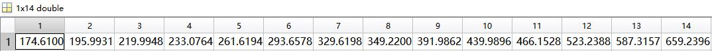

听起来音调与东方红原曲音调完全一样，但是相邻的两个乐音之间会有类似轻微爆破的“啪”的声音。

##### 2. 你一定注意到 1 的乐曲中相邻乐音之间有“啪”的杂声，这是由于相位不连续产生了高频分量。这种噪声严重影响合成音乐的质量，丧失真实感。为了消除它，我们可以用图1.5所示包络修正每个乐音，以保证在乐音的邻接处信号幅度为零。此外建议用指数衰减的包络来表示。

答：源代码如下：

```MATLAB
%dongfanghong_gai.m
clear all; close all; clc;
load mywork.mat;
%frequency_step 是频率参考矩阵
%t1是每个音符的采样时间
%y1是音乐信号
%Fs是采样率

%linear_envelope_eight是八分音符的包络
%linear_envelope_four是四分音符的包络
%linear_envelop_two是二分音符的包络

length_eight=Fs/4;
length_four=Fs/2;
length_two=Fs;
linear_envelope_eight(1:length_eight/8)
	=linspace(0,1,length_eight/8);
linear_envelope_eight(length_eight/8+1:length_eight/4)
	=linspace(1,0.8,length_eight/8);
linear_envelope_eight(length_eight/4+1:length_eight*7/8)
	=linspace(0.8,0.8,length_eight*5/8);
linear_envelope_eight(length_eight*7/8+1:length_eight)
	=linspace(0.8,0,length_eight*1/8);

linear_envelope_four(1:length_four/8)
	=linspace(0,1,length_four/8);
linear_envelope_four(length_four/8+1:length_four/4)
	=linspace(1,0.8,length_four/8);
linear_envelope_four(length_four/4+1:length_four*7/8)
	=linspace(0.8,0.8,length_four*5/8);
linear_envelope_four(length_four*7/8+1:length_four)
	=linspace(0.8,0,length_four*1/8);

linear_envelope_two(1:length_two/8)
	=linspace(0,1,length_two/8);
linear_envelope_two(length_two/8+1:length_two/4)
	=linspace(1,0.8,length_two/8);
linear_envelope_two(length_two/4+1:length_two*7/8)
	=linspace(0.8,0.8,length_two*5/8);
linear_envelope_two(length_two*7/8+1:length_two)
	=linspace(0.8,0,length_two*1/8);

exp_envelope_eight=linear_envelope_eight.*
	exp(-2*((1:length_eight)./length_eight));
exp_envelope_four=linear_envelope_four.*
	exp(-2*((1:length_four))./length_four);
exp_envelope_two=linear_envelope_two.*
	exp(-2*((1:length_two))./length_two);

y1(1:Fs/2)=y1(1:Fs/2)
	.*linear_envelope_four;
y1(Fs/2+1:Fs*3/4)=y1(Fs/2+1:Fs*3/4)
	.*linear_envelope_eight;
y1(Fs*3/4+1:Fs)=y1(Fs*3/4+1:Fs)
	.*linear_envelope_eight;
y1(Fs+1:2*Fs)=y1(Fs+1:2*Fs)
	.*linear_envelope_two;

y1(2*Fs+1:2*Fs+Fs/2)
	=y1(2*Fs+1:2*Fs+Fs/2).*linear_envelope_four;
y1(2*Fs+Fs/2+1:2*Fs+Fs*3/4)
	=y1(2*Fs+Fs/2+1:2*Fs+Fs*3/4).*linear_envelope_eight;
y1(2*Fs+Fs*3/4+1:2*Fs+Fs)
	=y1(2*Fs+Fs*3/4+1:2*Fs+Fs).*linear_envelope_eight;
y1(2*Fs+Fs+1:2*Fs+2*Fs)
	=y1(2*Fs+Fs+1:2*Fs+2*Fs).*linear_envelope_two;

%y1(1:Fs/2)=y1(1:Fs/2)
%	.*exp_envelope_four;
%y1(Fs/2+1:Fs*3/4)=y1(Fs/2+1:Fs*3/4)
%	.*exp_envelope_eight;
%y1(Fs*3/4+1:Fs)=y1(Fs*3/4+1:Fs)
%	.*exp_envelope_eight;
%y1(Fs+1:2*Fs)=y1(Fs+1:2*Fs)
%	.*exp_envelope_two;
%
%y1(2*Fs+1:2*Fs+Fs/2)
%	=y1(2*Fs+1:2*Fs+Fs/2).*exp_envelope_four;
%y1(2*Fs+Fs/2+1:2*Fs+Fs*3/4)
%	=y1(2*Fs+Fs/2+1:2*Fs+Fs*3/4).*exp_envelope_eight;
%y1(2*Fs+Fs*3/4+1:2*Fs+Fs)
%	=y1(2*Fs+Fs*3/4+1:2*Fs+Fs).*exp_envelope_eight;
%y1(2*Fs+Fs+1:2*Fs+2*Fs)
%	=y1(2*Fs+Fs+1:2*Fs+2*Fs).*exp_envelope_two;

plot(1:4*Fs,y1);
sound(y1,Fs);
save dongfanghong_gai.mat;
```
经过线性包络处理之后，音乐信号y1的波形如下：
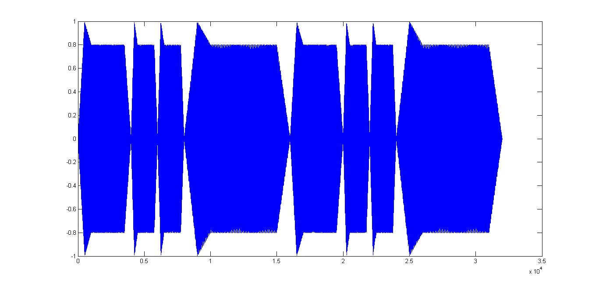
经过指数包络处理之后，音乐信号y1的波形如下：
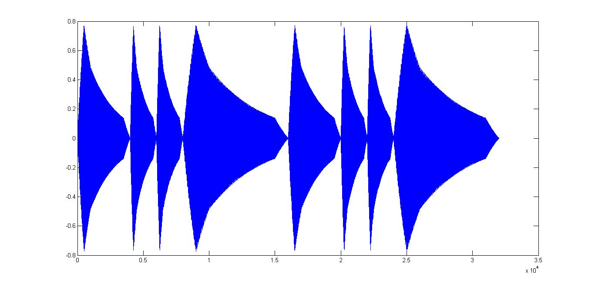
经过线性包络处理之后，相邻乐音之间的杂音消失了，但是声音听上去还是略显生硬。经过指数包络处理之后的音乐听起来比之前圆润了很多。

##### 3.请用最简单的方法将 2 中的音乐分别升高和降低一个八度。（提示：音乐播放的时间可以变化）再难一些，请用resample 函数（也可以用interp 和decimate 函数）将上述音乐升高半个音阶。（提示：视计算复杂度，不必特别精确）

答：若要将原音乐提高一个八度，只需将```sound(y1 , Fs)```改为```sound(y1 , Fs * 2)```;若要将原音乐降低一个八度，只需将```sound(y1 , Fs)```改为```sound(y1 , Fs/2)```。

使用 resample 函数使音乐升高半个音阶，需要在原音乐的基础上将采样率提高到原来的 2^(1/12)=1.059 倍，由此可以得出 resample 函数的参数：```y2 = resample(y1 , 1000 , 1059)```

##### 4.试着在 2 的音乐中增加一些谐波分量，听一听音乐是否更有“厚度”了？注意谐波分量的能量要小，否则掩盖住基音反而听不清音调了。（如果选择基波幅度为1 ，二次谐波幅度0.2 ，三次谐波幅度0.3 ，听起来像不像象风琴？）

答：源代码如下：
```MATLAB
%dongfanghong_xiebo.m
clear all;close all; clc;
load dongfanghong_gai.mat;

%y1_2是二次谐波分量
%y1_3是三次谐波分量
%parameter是各次谐波分量的大小
parameter=[1;0.2;0.3];

y1_2(1:Fs/2)
	=sin(2*2*2*pi*frequency_step(dfh(1))*t1(1:Fs/2));
y1_2(Fs/2+1:Fs*3/4)
	=sin(2*2*pi*frequency_step(dfh(3))*t1(Fs/2+1:Fs*3/4));
y1_2(Fs*3/4+1:Fs)
	=sin(2*2*pi*frequency_step(dfh(4))*t1(Fs*3/4+1:Fs));
y1_2(Fs+1:2*Fs)
	=sin(2*4*2*pi*frequency_step(dfh(5))*t1(Fs+1:2*Fs));

y1_2(2*Fs+1:2*Fs+Fs/2)
	=sin(2*2*2*pi*frequency_step(dfh(9))
		*t1(2*Fs+1:2*Fs+Fs/2));
y1_2(2*Fs+Fs/2+1:2*Fs+Fs*3/4)
	=sin(2*2*pi*frequency_step(dfh(11))
		*t1(2*Fs+Fs/2+1:2*Fs+Fs*3/4));
y1_2(2*Fs+Fs*3/4+1:2*Fs+Fs)
	=sin(2*2*pi*frequency_step(dfh(12))
		*t1(2*Fs+Fs*3/4+1:2*Fs+Fs));
y1_2(2*Fs+Fs+1:2*Fs+2*Fs)
	=sin(2*4*2*pi*frequency_step(dfh(13))
		*t1(2*Fs+Fs+1:2*Fs+2*Fs));

y1_3(1:Fs/2)
	=sin(3*2*2*pi*frequency_step(dfh(1))*t1(1:Fs/2));
y1_3(Fs/2+1:Fs*3/4)
	=sin(3*2*pi*frequency_step(dfh(3))*t1(Fs/2+1:Fs*3/4));
y1_3(Fs*3/4+1:Fs)
	=sin(3*2*pi*frequency_step(dfh(4))*t1(Fs*3/4+1:Fs));
y1_3(Fs+1:2*Fs)
	=sin(3*4*2*pi*frequency_step(dfh(5))*t1(Fs+1:2*Fs));

y1_3(2*Fs+1:2*Fs+Fs/2)
	=sin(3*2*2*pi*frequency_step(dfh(9))
		*t1(2*Fs+1:2*Fs+Fs/2));
y1_3(2*Fs+Fs/2+1:2*Fs+Fs*3/4)
	=sin(3*2*pi*frequency_step(dfh(11))
		*t1(2*Fs+Fs/2+1:2*Fs+Fs*3/4));
y1_3(2*Fs+Fs*3/4+1:2*Fs+Fs)
	=sin(3*2*pi*frequency_step(dfh(12))
		*t1(2*Fs+Fs*3/4+1:2*Fs+Fs));
y1_3(2*Fs+Fs+1:2*Fs+2*Fs)
	=sin(3*4*2*pi*frequency_step(dfh(13))
		*t1(2*Fs+Fs+1:2*Fs+2*Fs));

y1_2(1:Fs/2)
	=y1_2(1:Fs/2).*exp_envelope_four;
y1_2(Fs/2+1:Fs*3/4)
	=y1_2(Fs/2+1:Fs*3/4).*exp_envelope_eight;
y1_2(Fs*3/4+1:Fs)
	=y1_2(Fs*3/4+1:Fs).*exp_envelope_eight;
y1_2(Fs+1:2*Fs)
	=y1_2(Fs+1:2*Fs).*exp_envelope_two;

y1_2(2*Fs+1:2*Fs+Fs/2)
	=y1_2(2*Fs+1:2*Fs+Fs/2).*exp_envelope_four;
y1_2(2*Fs+Fs/2+1:2*Fs+Fs*3/4)
	=y1_2(2*Fs+Fs/2+1:2*Fs+Fs*3/4).*exp_envelope_eight;
y1_2(2*Fs+Fs*3/4+1:2*Fs+Fs)
	=y1_2(2*Fs+Fs*3/4+1:2*Fs+Fs).*exp_envelope_eight;
y1_2(2*Fs+Fs+1:2*Fs+2*Fs)
	=y1_2(2*Fs+Fs+1:2*Fs+2*Fs).*exp_envelope_two;

y1_3(1:Fs/2)=y1_3(1:Fs/2)
	.*exp_envelope_four;
y1_3(Fs/2+1:Fs*3/4)=y1_3(Fs/2+1:Fs*3/4)
	.*exp_envelope_eight;
y1_3(Fs*3/4+1:Fs)=y1_3(Fs*3/4+1:Fs)
	.*exp_envelope_eight;
y1_3(Fs+1:2*Fs)=y1_3(Fs+1:2*Fs)
	.*exp_envelope_two;

y1_3(2*Fs+1:2*Fs+Fs/2)
	=y1_3(2*Fs+1:2*Fs+Fs/2).*exp_envelope_four;
y1_3(2*Fs+Fs/2+1:2*Fs+Fs*3/4)
	=y1_3(2*Fs+Fs/2+1:2*Fs+Fs*3/4).*exp_envelope_eight;
y1_3(2*Fs+Fs*3/4+1:2*Fs+Fs)
	=y1_3(2*Fs+Fs*3/4+1:2*Fs+Fs).*exp_envelope_eight;
y1_3(2*Fs+Fs+1:2*Fs+2*Fs)
	=y1_3(2*Fs+Fs+1:2*Fs+2*Fs).*exp_envelope_two;

y=y1+0.2*y1_2+0.3*y1_3;
sound(y,Fs);
```

加入谐波之后，音乐听起来更有层次感，也更加动听。由于听觉效果上线性包络不如指数包络效果好，所以此处我只对指数包络的音乐进行了处理。当基波/二次谐波/三次谐波的系数分别取 1/0.2/0.3 时，合成效果十分动听，和风琴比较像。

注：此处由于需要合成的谐波不多，而且音乐的长度也不是特别长，所以采用了直接合成多次谐波相加的方式。但是这种方式的运算效率不高，不如采用系数矩阵与时间矩阵相乘的运算方法效率高。

##### 5.自选其他音乐合成，例如贝多芬第五交响乐的开头两小节。

我选取的音乐是清华大学校歌前四小节。源代码如下：
```MATLAB
%xiaoge.m
clear all;close all;clc;
load envelope.mat;
load frequency.mat;

%合成乐曲为清华校歌前四小节
%从F大调改为Eb大调

frequency_step=frequency_step/K^2;
length=32;
xg=[8,8,8,10,12,12,12,12,13,13,8,13,12,12,12,12,
	10,10,10,10,12,10,8,8,6,6,8,10,12,12,12,12];
parameter=[1,0.2,0.3];
f=[1;2;3];
t1_xg=1:length*Fs/4;
%第一小节
t1_xg(1:Fs/2)=(1:Fs/2)*2/Fs;
t1_xg(Fs/2+1:Fs*3/4)=(1:Fs/4)*4/Fs;
t1_xg(Fs*3/4+1:Fs)=(1:Fs/4)*4/Fs;
t1_xg(Fs+1:Fs*3/2)=(1:Fs/2)*2/Fs;
t1_xg(Fs*3/2+1:2*Fs)=(1:Fs/2)*2/Fs;
%第二小节
t1_xg(2*Fs+1:2*Fs+Fs/2)=(1:Fs/2)*2/Fs;
t1_xg(2*Fs+Fs/2+1:2*Fs+Fs*3/4)=(1:Fs/4)*4/Fs;
t1_xg(2*Fs+Fs*3/4+1:3*Fs)=(1:Fs/4)*4/Fs;
t1_xg(3*Fs+1:3*Fs+Fs/2)=(1:Fs/2)*2/Fs;
t1_xg(3*Fs+Fs/2+1:4*Fs)=(1:Fs/2)*2/Fs;
%第三小节
t1_xg(4*Fs+1:4*Fs+Fs/2)=(1:Fs/2)*2/Fs;
t1_xg(4*Fs+Fs/2+1:5*Fs)=(1:Fs/2)*2/Fs;
t1_xg(5*Fs+1:5*Fs+Fs*1/4)=(1:Fs/4)*4/Fs;
t1_xg(5*Fs+Fs*1/4+1:5*Fs+Fs/2)=(1:Fs/4)*4/Fs;
t1_xg(5*Fs+Fs/2+1:6*Fs)=(1:Fs/2)*2/Fs;
%第四小节
t1_xg(6*Fs+1:6*Fs+Fs/2)=(1:Fs/2)*2/Fs;
t1_xg(6*Fs+Fs/2+1:6*Fs+Fs*3/4)=(1:Fs/4)*4/Fs;
t1_xg(6*Fs+Fs*3/4+1:7*Fs)=(1:Fs/4)*4/Fs;
t1_xg(7*Fs+1:8*Fs)=(1:Fs)*1/Fs;
%第一小节
y1_xg(1:Fs/2)
	=parameter*sin(2*2*pi*frequency_step(xg(1))*f*t1_xg(1:Fs/2));
y1_xg(Fs/2+1:Fs*3/4)
	=parameter*sin(2*pi*frequency_step(xg(3))*f*t1_xg(Fs/2+1:Fs*3/4));
y1_xg(Fs*3/4+1:Fs)
	=parameter*sin(2*pi*frequency_step(xg(4))*f*t1_xg(Fs*3/4+1:Fs));
y1_xg(Fs+1:Fs*3/2)
	=parameter*sin(2*2*pi*frequency_step(xg(5))*f*t1_xg(Fs+1:Fs*3/2));
y1_xg(Fs*3/2+1:2*Fs)
	=parameter*sin(2*2*pi*frequency_step(xg(5))*f*t1_xg(Fs*3/2+1:2*Fs));
%第二小节
y1_xg(2*Fs+1:2*Fs+Fs/2)
	=parameter*sin(2*2*pi*frequency_step(xg(9))*f*t1_xg(2*Fs+1:2*Fs+Fs/2));
y1_xg(2*Fs+Fs/2+1:2*Fs+Fs*3/4)
	=parameter*sin(2*pi*(2*frequency_step(8))*f*t1_xg(2*Fs+Fs/2+1:2*Fs+Fs*3/4));
y1_xg(2*Fs+Fs*3/4+1:3*Fs)
	=parameter*sin(2*pi*frequency_step(xg(12))*f*t1_xg(2*Fs+Fs*3/4+1:3*Fs));
y1_xg(3*Fs+1:4*Fs)
	=parameter*sin(2*2*pi*frequency_step(xg(13))*f*t1_xg(3*Fs+1:4*Fs));
%第三小节
y1_xg(4*Fs+1:5*Fs)
	=parameter*sin(2*2*pi*frequency_step(xg(17))*f*t1_xg(4*Fs+1:5*Fs));
y1_xg(5*Fs+1:5*Fs+Fs*1/4)
	=parameter*sin(2*pi*frequency_step(xg(21))*f*t1_xg(5*Fs+1:5*Fs+Fs*1/4));
y1_xg(5*Fs+Fs*1/4+1:5*Fs+Fs/2)
	=parameter*sin(2*pi*frequency_step(xg(22))*f*t1_xg(5*Fs+Fs*1/4+1:5*Fs+Fs/2));
y1_xg(5*Fs+Fs/2+1:6*Fs)
	=parameter*sin(2*2*pi*frequency_step(xg(23))*f*t1_xg(5*Fs+Fs/2+1:6*Fs));
%第四小节
y1_xg(6*Fs+1:6*Fs+Fs/2)
	=parameter*sin(2*2*pi*frequency_step(xg(25))*f*t1_xg(6*Fs+1:6*Fs+Fs/2));
y1_xg(6*Fs+Fs/2+1:6*Fs+Fs*3/4)
	=parameter*sin(2*pi*frequency_step(xg(27))*f*t1_xg(6*Fs+Fs/2+1:6*Fs+Fs*3/4));
y1_xg(6*Fs+Fs*3/4:7*Fs)
	=parameter*sin(2*pi*frequency_step(xg(28))*f*t1_xg(6*Fs+Fs*3/4:7*Fs));
y1_xg(7*Fs+1:8*Fs)
	=parameter*sin(4*2*pi*frequency_step(xg(29))*f*t1_xg(7*Fs+1:8*Fs));
%第一小节
y1_xg(1:Fs/2)
	=y1_xg(1:Fs/2).*exp_envelope_four;
y1_xg(Fs/2+1:Fs*3/4)
	=y1_xg(Fs/2+1:Fs*3/4).*exp_envelope_eight;
y1_xg(Fs*3/4+1:Fs)
	=y1_xg(Fs*3/4+1:Fs).*exp_envelope_eight;
y1_xg(Fs+1:Fs*3/2)
	=y1_xg(Fs+1:Fs*3/2).*exp_envelope_four;
y1_xg(Fs*3/2+1:2*Fs)
	=y1_xg(Fs*3/2+1:2*Fs).*exp_envelope_four;
%第二小节
y1_xg(2*Fs+1:2*Fs+Fs/2)
	=y1_xg(2*Fs+1:2*Fs+Fs/2).*exp_envelope_four;
y1_xg(2*Fs+Fs/2+1:2*Fs+Fs*3/4)
	=y1_xg(2*Fs+Fs/2+1:2*Fs+Fs*3/4).*exp_envelope_eight;
y1_xg(2*Fs+Fs*3/4+1:3*Fs)
	=y1_xg(2*Fs+Fs*3/4+1:3*Fs).*exp_envelope_eight;
y1_xg(3*Fs+1:3*Fs+Fs/2)
	=y1_xg(3*Fs+1:3*Fs+Fs/2).*exp_envelope_four;
y1_xg(3*Fs+Fs/2+1:4*Fs)
	=y1_xg(3*Fs+Fs/2+1:4*Fs).*exp_envelope_four;
%第三小节
y1_xg(4*Fs+1:4*Fs+Fs/2)
	=y1_xg(4*Fs+1:4*Fs+Fs/2).*exp_envelope_four;
y1_xg(4*Fs+Fs/2+1:5*Fs)
	=y1_xg(4*Fs+Fs/2+1:5*Fs).*exp_envelope_four;
y1_xg(5*Fs+1:5*Fs+Fs*1/4)
	=y1_xg(5*Fs+1:5*Fs+Fs*1/4).*exp_envelope_eight;
y1_xg(5*Fs+Fs*1/4+1:5*Fs+Fs/2)
	=y1_xg(5*Fs+Fs*1/4+1:5*Fs+Fs/2).*exp_envelope_eight;
y1_xg(5*Fs+Fs/2+1:6*Fs)
	=y1_xg(5*Fs+Fs/2+1:6*Fs).*exp_envelope_four;
%第四小节
y1_xg(6*Fs+1:6*Fs+Fs/2)
	=y1_xg(6*Fs+1:6*Fs+Fs/2).*exp_envelope_four;
y1_xg(6*Fs+Fs/2+1:6*Fs+Fs*3/4)
	=y1_xg(6*Fs+Fs/2+1:6*Fs+Fs*3/4).*exp_envelope_eight;
y1_xg(6*Fs+Fs*3/4+1:7*Fs)
	=y1_xg(6*Fs+Fs*3/4+1:7*Fs).*exp_envelope_eight;
y1_xg(7*Fs+1:8*Fs)
	=y1_xg(7*Fs+1:8*Fs).*exp_envelope_two;
%合成音乐
plot(1:length*Fs/4,y1_xg);
sound(y1_xg,Fs);
```

注：此题中谐波分量合成的部分较第四问进行了一定的优化，将原有的单独计算高次谐波分量的方法改为通过频率矩阵和系数矩阵相乘的方法。由于这种方法是矩阵相乘运算，所以效率较之前相加的方式高。

合成出的音乐信号y1_xg波形如下：
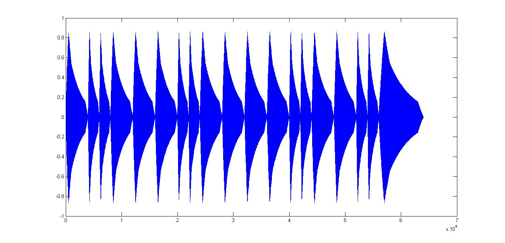
## 二. 用傅里叶级数分析音乐
现在我们开始要处理真实的音乐信号了！请用load 命令载入附件光盘中的数据文件\guitar.mat"，工作区会出现两个新的变量realwave 和wave2proc （可以用who 查看变量名），如图1.6 和1.7 所示。其中前者是从一段吉他乐曲（附件光盘上的\fmt.wav"）中截取下来的真实信号，后者是用信号处理方法得到的这段信号的理论值，它们的抽样率都是8kHz。
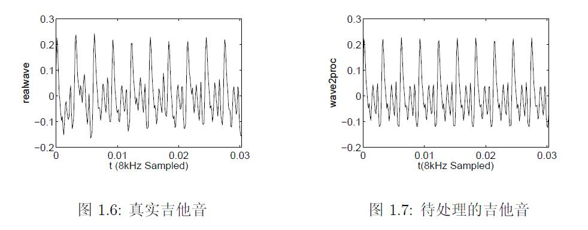
##### 6. 先用 wavread 函数载入光盘中的 fmt.wav 文件，播放出来听听效果如何？是否比刚才的合成音乐真实多了？

源代码如下：
```MATLAB
%load_music.m
clear all; close all; clc;
load guitar.mat;
y=wavread('fmt.wav');
plot(1:length(realwave),realwave);
plot(1:length(wave2proc),wave2proc);
sound(y);
```

播放出来效果非常真实，比合成音乐的真实性强很多，听起来就像是真的乐器在演奏。画出的两个波形与图1.6和图1.7一样。

##### 7. 你知道待处理的 wave2proc 是如何从真实值 realwave 中得到的么？这个预处理过程可以去除真实乐曲中的非线性谐波和噪声，对于正确分析音调是非常重要的。提示：从时域做，可以继续使用 resample 函数。

考虑到噪声具有一定的均值，所以采用取平均的方法来消除非线性谐波和噪声的影响。容易看出， guitar.mat 中给出的 realwave 波形中有十个周期的波形，所以用 resample 函数将 realwave 的长度变为原来的十倍（temp），然后对每个周期采样（average）求和之后取平均值（temp2）得到一个周期的波形。之后将得到的一个周期的波形重复十次（temp3），再用 resample 函数恢复长度得到 temp4 。

源代码如下：

```MATLAB
%pre_process.m
clear all; close all; clc;
load guitar.mat;
temp=resample(realwave,10,1);
average=zeros(243,10);
for i=1:10
    average(:,i)=temp((i-1)*243+1:i*243);
end
temp2=zeros(243,1);
for i=1:243
    temp2(i,1)=sum(average(i,:))/10;
end
temp3=zeros(2430,1);
for i=1:10
    temp3((i-1)*243+1:i*243)=temp2;
end
temp4=resample(temp3,1,10);
figure;
subplot(2,1,1);
plot(temp4);
subplot(2,1,2);
plot(wave2proc);
```

得到的图形如下：

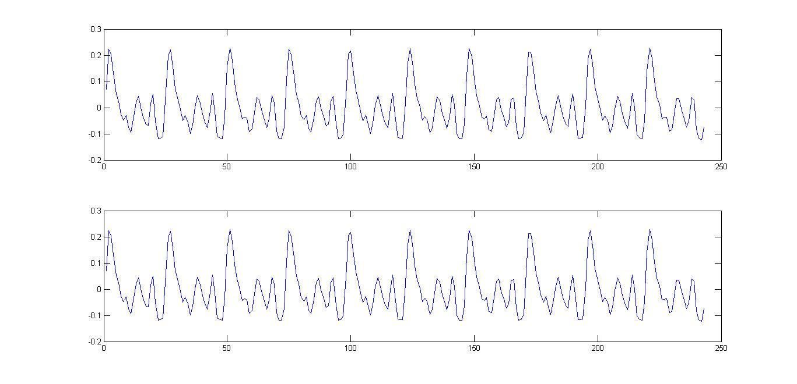

上面的波形是经过处理之后得到的temp4的波形，下面的波形是wave2proc的波形。可以看出两者几乎一模一样。

##### 8. 这段音乐的基频是多少？是哪个音调？请用傅里叶级数或者变换的方法分析它的谐波分量分别是什么。提示：简单的方法是近似取出一个周期求傅里叶级数但这样明显不准确，因为你应该已经发现基音周期不是整数（这里不允许使用resample 函数）。复杂些的方法是对整个信号求傅里叶变换（回忆周期性信号的傅里叶变换），但你可能发现无论你如何提高频域的分辨率，也得不到精确的包络（应该近似于冲激函数而不是sinc 函数），可选的方法是增加时域的数据量，即再把时域信号重复若干次，看看这样是否效果好多了？请解释之。

先对wave2proc直接做傅里叶变换，源代码如下：
```MATLAB
%fourier_analysis.m
clear all;close all;clc;
load guitar.mat;
Fs=8000;
T=1/Fs;
temp=wave2proc;
length=length(temp);
t=(0:length-1)*T;
NFFT=2^nextpow2(length);
F=fft(temp,NFFT)/length;
f=Fs/2*linspace(0,1,NFFT/2+1);
plot(f,2*abs(F(1:NFFT/2+1)));
```
注：此处使用了 nextpow2 函数来寻找比信号长度最大的2的整数次幂，是为了提高FFT的速度。（此部分参考了MATLAB中 fft 函数的帮助文档）
得到信号的频谱如下：
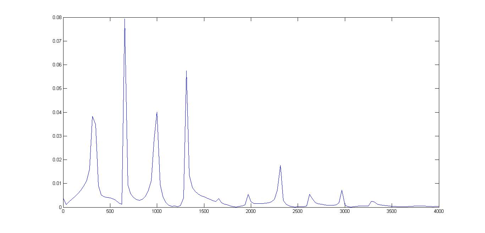
此处可以大概看出 wave2proc 中基频分量和各次谐波分量的相对大小。但是由于时域信号的容量较小，得到的频谱不够精确，无法得到具体的基频分量的数值。为了改善这种情况，考虑对时域信号做周期延拓。此处取延拓次数为100次。延拓之后得到的频谱如下：
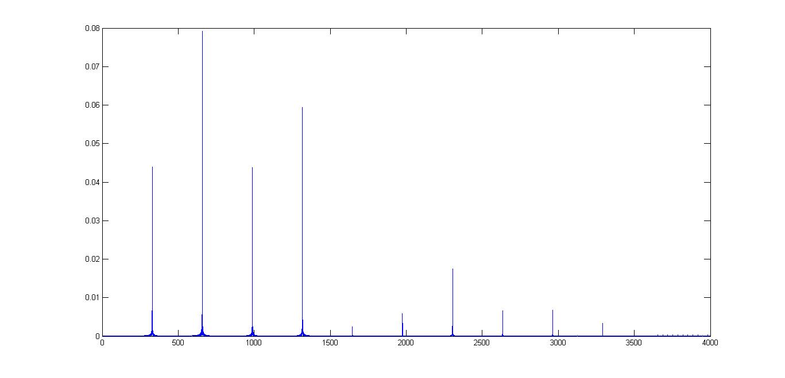
可以看出在对信号做周期延拓之后频谱的质量明显改善，这是因为对于周期信号的傅里叶变换，时域信号的容量越大，频域的采样间隔越小，得到的频谱就越精确。由上述频谱容易得到基频分量为329.1Hz。各次谐波的系数分别为：

|   1   |   2   |   3   |   4   |   5   |   6   |   7   |   8   |   9   |  10   |
| :---: | :---: | :---: | :---: | :---: | :---: | :---: | :---: | :---: | :---: |
| 1.000 | 1.802 | 0.997 | 1.353 | 0.056 | 0.134 | 0.399 | 0.149 | 0.154 | 0.076 |

##### 9. 再次载入fmt.wav ，现在要求你写一段程序，自动分析出这段乐曲的音调和节拍！如果你觉得太难就允许手工标定出每个音调的起止时间，再不行你就把每个音调的数据都单独保存成一个文件，然后让MATLAB对这些文件进行批处理。注意：不允许逐一地手工分析音调。编辑音乐文件，推荐使用"CoolEdit" 编辑软件。

为了分析乐曲的音调和节拍，首先需要将原音乐中的所有音符分开。为了了解不同音符之间交界处的特性，我将原音乐的波形画了出来，波形如下：

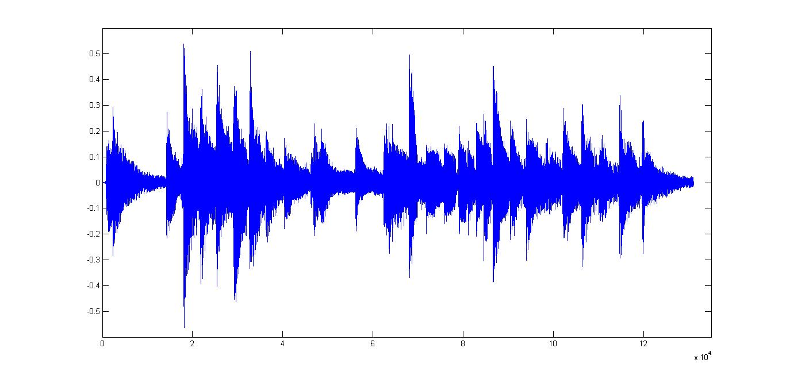

通过观察可以得出，每个音符最开始的时刻对应的波形幅度都比较大。根据这个思路，我编写了如下代码：

```MATLAB
clear all;close all;clc;
Fs=8000;
y=wavread('fmt.wav');
length=length(y);
wave_temp=abs(y);
average=sum(wave_temp)/length;
position=1;
for i=1:50:length
    if wave_temp(i)>2*average
        position=[position;i]
    end
end
plot(y);
hold on;
plot([position(:) position(:)],[-0.6 0.6],'red');
axis([0,14e4,-0.6,0.6]);
```
计算之后得到的分割标记如图：

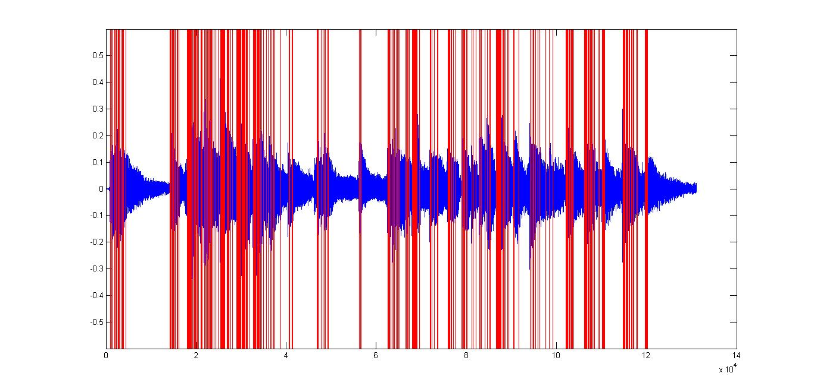

用此种方法得到的效果并不理想，经观察后发现有很多标记之间间隔非常近，而在实际的音乐中两个音符之间的间隔不会这么小，每个音符一定有一个最短的持续时间。根据这个思路并反复调节参数，我对代码做了如下修改：

```MATLAB
clear all;close all;clc;
Fs=8000;
y=wavread('fmt.wav');
length=length(y);
wave_temp=abs(y);
average=sum(wave_temp)/length;
position=1;
for i=1:40:length
    if (wave_temp(i)>1.5*average)&&(i>position(end)+500)
        position=[position;i]
    end
end
plot(y);
hold on;
plot([position(:) position(:)],[-0.6 0.6],'red');
axis([0,14e4,-0.6,0.6]);
```

此时得到的标记如下图：

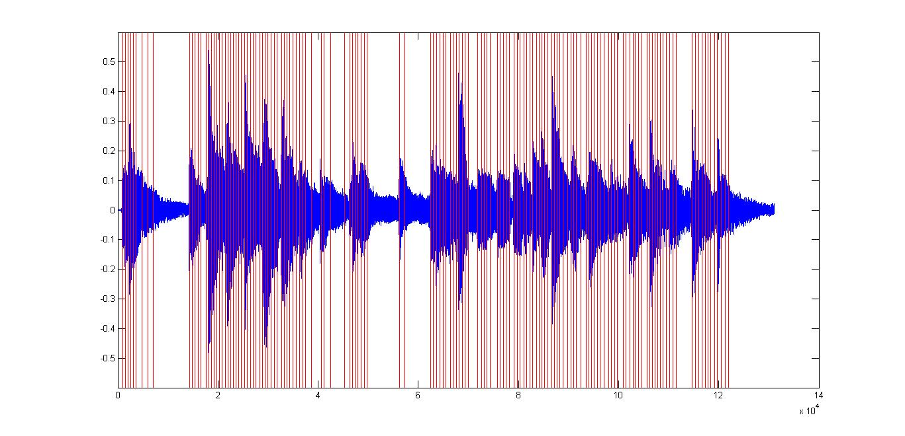

此时标记的筛选稍有改观，但是还是有很多冗余的标记。由观察可知，在已经找到正确的标记之后，有很多比正确标记处幅度更小的位置由于非常靠近正确标记，满足了判断条件从而被错误地当做了音符的分割标记。所以，为了避免这种情况，在找到满足标记的条件之后，应该再向前回溯一段距离，如果回溯的距离之内没有比当前标记更大幅度的点，则该点被视为正确标记。根据以上思路并反复调节参数，我对代码做了如下修改：

```MATLAB
clear all;close all;clc;
Fs=8000;
y=wavread('fmt.wav');
Length=length(y);
wave_temp=abs(y);
average=sum(wave_temp)/Length;
position=0;
for i=1:Length
    if (wave_temp(i)>1.5*average)&&(i>position(end)+300)
        position=[position;i];
    end
end
position(1)=[];
i=1;
while(i<=length(position))
    if(position(i)<302)
        back=1;
    else
        back=position(i)-301;
    end
    Max=max(wave_temp(back:position(i)-1));
    if wave_temp(position(i))<Max
        position(i)=[];
    else
        i=i+1;
    end
end
plot(y);
hold on;
plot([position(:) position(:)],[-0.6 0.6],'red');
axis([0,14e4,-0.6,0.6]);
```

运行之后得到的结果如下图：

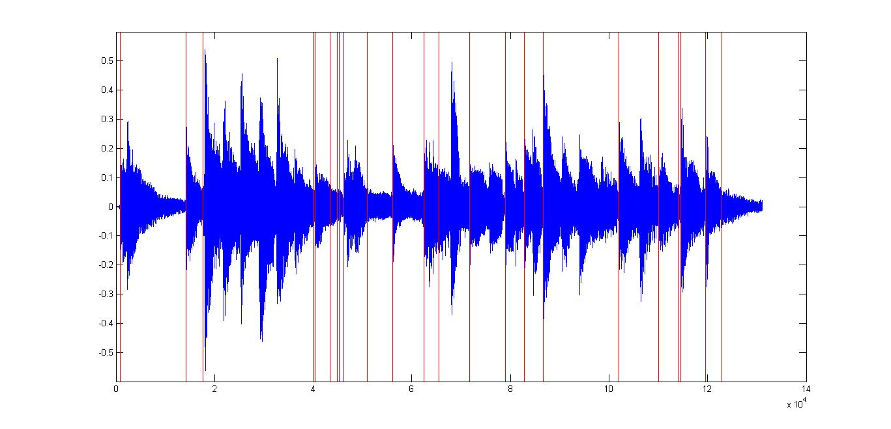

得到的分割结果虽然优于之前的结果，但是效果并不好。为了改善分音效果，我增加了从某一点向前找最大值的过程。根据这个思路我对代码做了如下修改：
```MATLAB
clear all;close all;clc;
Fs=8000;
y=wavread('fmt.wav');
Length=length(y);
wave_temp=abs(y);
average=sum(wave_temp)/Length;
position=1;
for i=1:Length
    if i<232
        back=1;
    else
        back=i-231;
    end
    if i>Length-100
        form=Length;
    else
        form=i+100;
    end
    max_back=max(wave_temp(back:i));
    max_form=max(wave_temp(i:form));
    if (max_back*1.5<max_form)&&(wave_temp(i)>1.5*average)
		&&(i>position(end)+900)
        position=[position;i];
    end
end
position(1)=[];
plot(y);
hold on;
plot([position(:) position(:)],[-0.6 0.6],'red');
axis([0,14e4,-0.6,0.6]);
```

得到的结果如下图：

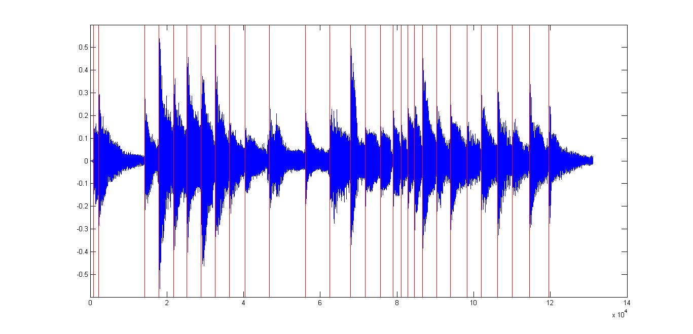

此时得到的分音结果基本正确。下面开始分析每一段的音调和节拍。首先分析节拍。为了简化分析，在分析节拍时只考虑二分音符、四分音符、八分音符、二分音符+四分音符，四分音符+八分音符这五种情况，对应的时间长度分别为 1s，0.5s，0.25s，1.5s，0.75s，在8kHz采样率下对应长度分别为8000，4000，2000，12000，6000。利用分割音符的结果，将每个音符的长度找出，之后判断每个音符的长度与哪个标准长度音符最接近，则该音符对应的节拍即为对应的标准节拍。根据以上思路，我编写了如下代码：

```MATLAB
rhythm=zeros(length(position),1);
rhythm_length=zeros(length(position),1);
for i=1:length(position)
    if(i~=length(position))
    temp=y(position(i):position(i+1));
    else 
        temp=y(position(end):Length);
    end
    rhythm_length(i)=length(temp);
end
standard_length=[8000,4000,2000,12000,6000];
standard_pat=['2  ';'4  ';'8  ';'2+4';'4+8'];
error=abs(rhythm_length(:,ones(1,5))
	-standard_length(ones(length(position),1),:));
error_min=min(error,[],2);
min_error_pos=zeros(length(position),1);
for i=1:length(position)
    min_error_pos(i)=find(error(i,:)==error_min(i));
end
pat=zeros(length(position),3);
pat(1:length(position),:)
	=standard_pat(min_error_pos(1:length(position)),:);
disp(char(pat));
```

得到的结果为：

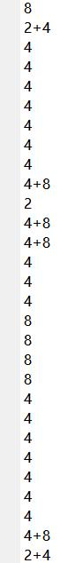

节拍已经分析完毕，下面开始分析音调。为了提高运算速度，取每个音符中一定数目的点作为分析样本即可。为了保证频谱的质量同时保证运行速度，此处取前400个点作为分析样本。类似第八问的方法，对每个音符的样本的幅度归一化之后做FFT可以得到该段音乐的频率分量。得到的所有音符的频谱如下：
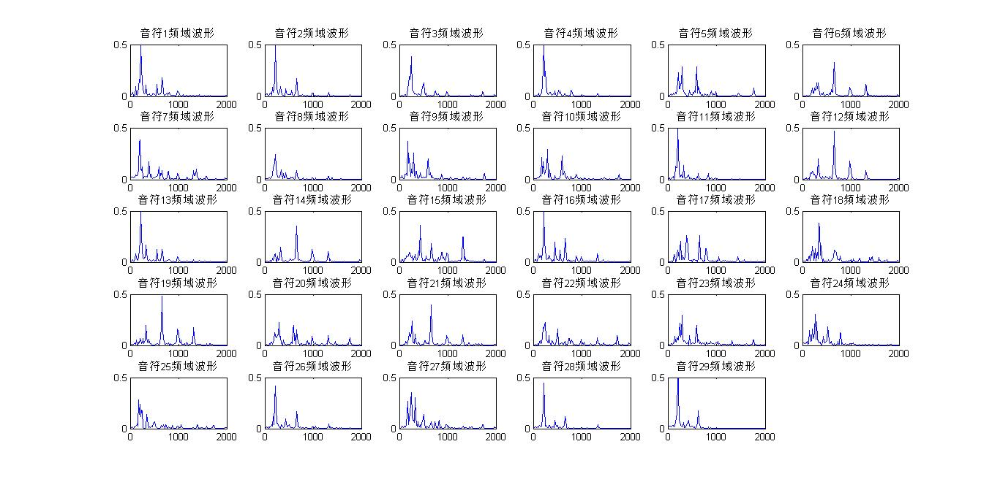

可以看出，每个频谱中都有一个非常明显的最大值，这个最大值即代表了该音符中能量最大的频率分量。也就是说，可以认为这段音乐对应的音调即为频谱中最大值对应的横坐标。得到最大能量的频率分量之后，就可以根据与分析节拍时相同的判断方法来判断该段音符的频率。此处以中央C频率（261.63Hz）作为正常音调的其实频率，低一个八度则为低音，高一个八度则为高音。频率分析代码如下：

```MATLAB
analysis_sample=zeros(400,length(position));
fre_max=zeros(length(position),1);
for i=1:length(position)
    temp=y(position(i)+1:position(i)+400);
    analysis_sample(:,i)=temp(:)/max(temp(:));
    %     if mod(i,4)==1
    %         figure;
    %     end
    if mod(i,4)==0
        draw=4;
    else
        draw=mod(i,4);
    end
    t=(0:length(temp)-1)*T;
    NFFT=2^nextpow2(length(temp));
    F=fft(analysis_sample(:,i),NFFT)/length(temp);
    f=Fs/2*linspace(0,1,NFFT/2+1);
    fre_max(i)=find(2*abs(F(1:NFFT/2+1))==max(2*abs(F(1:NFFT/2+1))));
    fre_max(i)=fre_max(i)/(NFFT/2+1)*Fs/2;
    %     subplot(2,4,draw);
    %     plot(t,analysis_sample(:,i));
    %     axis([0,0.05,-1,1]);
    %     title(['音符',num2str(i),'时域波形']);
    %     subplot(2,4,draw+4);
    %     plot(f,2*abs(F(1:NFFT/2+1)));
    %     axis([0,2000,0,0.5]);
    %     title(['音符',num2str(i),'频域波形']);
end
temp_fre=[261.63,277.18,293.66,311.13,329.63,349.23,369.99,392,415.30,440,466.16,493.88];
standard_fre=zeros(1,36);
standard_tune=['C- ';'Db-';'D- ';'Eb-';'E- ';'F- ';'Gb-';'G- ';'Ab-';'A- ';'Bb-';'B- ';
			   'C  ';'Db ';'D  ';'Eb ';'E  ';'F  ';'Gb ';'G  ';'Ab ';'A  ';'Bb ';'B  ';
			   'C+ ';'Db+';'D+ ';'Eb+';'E+ ';'F+ ';'Gb+';'G+ ';'Ab+';'A+ ';'Bb+';'B+ '];
for i=1:3;
    standard_fre((i-1)*12+1:i*12)=temp_fre(:)*(2.^(i-2));
end
error2=abs(standard_fre(ones(length(position),1),:)-fre_max(:,ones(1,length(standard_fre))));
error2_min=min(error2,[],2);
min_error2_pos=zeros(length(position),1);
for i=1:length(position)
    min_error2_pos(i)=find(error2(i,:)==error2_min(i));
end
tune=zeros(length(position),3);
tune(1:length(position),:)=standard_tune(min_error2_pos(1:length(position)),:);
tune_fre=zeros(length(position),1);
tune_fre(1:length(position))=standard_fre(min_error2_pos(1:length(position)));
disp(char(tune));
save auto_data.mat tune_fre pat_length y position;
```

分析得到音调结果如下：

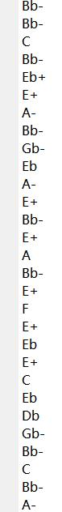

但是，同时观察频谱图和能量最大频率很容易发现，在某些音符的频谱中，能量最大的频率并不是基频频率，而是基频的高次谐波分量。为了确定决定音调的频率到底是基频还是功率最大频率，我修改了之前合成《东方红》时各次谐波的系数。原系数为1,0.2,0.3，修改为0.2,1,0.3和0.2,0.2,1再听，发现听到的音调发生的变化并不明显，只有音色发生了明显的改变。为了确定到底是基频还是功率最大频率决定音符的音调，我编写了一段测试代码，用来比较通过筛选功率最大频率得到的音调信息与原音乐的相似程度。测试代码如下：

```MATLAB
%auto_analysis_test.m
clear all;close all;clc;
load auto_data.mat;
Fs=8000;
test_sound=0;
for i=1:length(tune_fre)
    t=zeros(1,pat_length(i));
    t=(1:pat_length(i))/pat_length(i);
    temp=zeros(1,pat_length(i));
    temp=sin(2*pi*tune_fre(i)*t*(pat_length(i)/8000));
    test_sound=[test_sound,temp];
    if i==length(tune_fre)
        finish=length(y);
    else
        finish=position(i+1);
    end
    sound([y(position(i):finish);temp'],Fs);
end
sound(test_sound,Fs);
```

用测试代码测出来的结果中有两个问题：

一是有很多音符出现了测试音调和实际音调相差半个音阶的情况，说明直接用原信号做傅里叶变换得到的精准度不够。为了提高音调分析的精准度，将原信号做100次周期延拓，得到的频谱图如下：

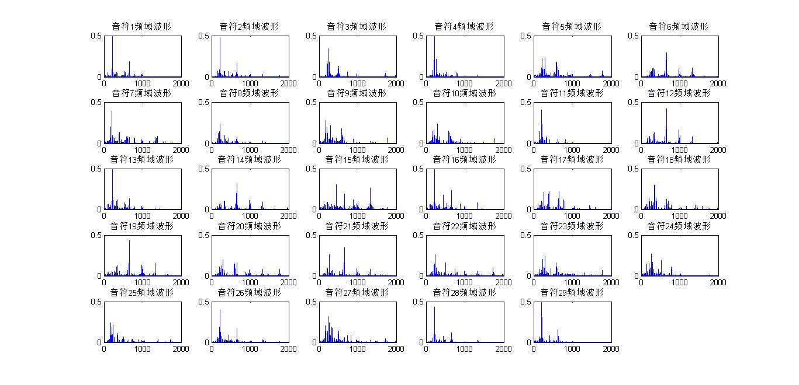

很明显，频谱的质量较之前有很大提高，通过测试代码测试之后听上去也和原音调更加接近。

二是有几个音符的音调和原音乐相比明显偏高，这几个音符是：6、12、14、19、21。观察这几个音符的频谱图很容易发现，这几个音符的频谱中功率最大的点并不是该段音符的基频，而是二次谐波。所以说决定一段音乐的音调的并不是功率最大频率，而是基频频率。所以说目前的音调分析算法缺少寻找基频的部分。根据这个思路，我对代码做了如下修改：

```MATLAB
analysis_sample=zeros(400,length(position));
fre_max=zeros(length(position),1);
for i=1:length(position)
    temp=y(position(i)+1:position(i)+400);
    analysis_sample(:,i)=temp(:)/max(temp(:));
    temp_100=zeros(40000,1);
    for j=1:100
        temp_100((j-1)*400+1:j*400)=analysis_sample(:,i);
    end
    t=(0:length(temp_100)-1)*T;
    NFFT1=2^nextpow2(length(temp_100));
    F1=fft(temp_100,NFFT1)/length(temp_100);
    f1=Fs/2*linspace(0,1,NFFT1/2+1);
    fre_max(i)=find(2*abs(F1(1:NFFT1/2+1))==max(2*abs(F1(1:NFFT1/2+1))));
    fre_max(i)=fre_max(i)/(NFFT1/2+1)*Fs/2;
    if fre_max(i)>600
        tempfre1=round(fre_max(i)/2);
        tempfre2=round(fre_max(i)/3);
        if 2*abs(F1(tempfre1))>2*abs(F1(tempfre2))
            fre_max(i)=tempfre1;
        else
            fre_max(i)=tempfre2;
        end
    end
    subplot(5,6,i);
    plot(f1,2*abs(F1(1:NFFT1/2+1)));
    axis([0,2000,0,0.5]);
    title(['音符',num2str(i),'频域波形']);
    hold on;
    plot([fre_max(i) fre_max(i)],[0,0.7],'red');
end
%sound(y,Fs);
temp_fre=[261.63,277.18,293.66,311.13,329.63,349.23,369.99,392,415.30,440,466.16,493.88];
standard_fre=zeros(1,36);
standard_tune=['C- ';'Db-';'D- ';'Eb-';'E- ';'F- ';'Gb-';'G- ';'Ab-';'A- ';'Bb-';'B- ';
			   'C  ';'Db ';'D  ';'Eb ';'E  ';'F  ';'Gb ';'G  ';'Ab ';'A  ';'Bb ';'B  ';
			   'C+ ';'Db+';'D+ ';'Eb+';'E+ ';'F+ ';'Gb+';'G+ ';'Ab+';'A+ ';'Bb+';'B+ '];
for i=1:3;
    standard_fre((i-1)*12+1:i*12)=temp_fre(:)*(2.^(i-2));
end
error2=abs(standard_fre(ones(length(position),1),:)-fre_max(:,ones(1,length(standard_fre))));
error2_min=min(error2,[],2);
min_error2_pos=zeros(length(position),1);
for i=1:length(position)
    min_error2_pos(i)=find(error2(i,:)==error2_min(i));
end
tune=zeros(length(position),3);
tune(1:length(position),:)=standard_tune(min_error2_pos(1:length(position)),:);
tune_fre=zeros(length(position),1);
tune_fre(1:length(position))=standard_fre(min_error2_pos(1:length(position)));
```

经过基频矫正之后的结果经过测试代码测试之后，音调高于原音乐的现象已经完全消除，整体的合成音乐听上去也与原音乐更加接近，已经能听出基本是原音乐的音调。至此分析音调和节拍的代码已经全部完成，下面是完整代码和运行结果：

```MATLAB
%auto_analysis.m
clear all;close all;clc;
Fs=8000;
T=1/Fs;
y=wavread('fmt.wav');
Length=length(y);
wave_temp=abs(y);
average=sum(wave_temp)/Length;
position=1;
for i=1:Length
    if i<232
        back=1;
    else
        back=i-231;
    end
    if i>Length-100
        form=Length;
    else
        form=i+100;
    end
    max_back=max(wave_temp(back:i));
    max_form=max(wave_temp(i:form));
    if (max_back*1.5<max_form)&&(wave_temp(i)>1.5*average)&&(i>position(end)+900)
        position=[position;i];
    end
end
position(1)=[];
% plot(y);
% hold on;
% plot([position(:) position(:)],[-0.6 0.6],'red');
% axis([0,14e4,-0.6,0.6]);

%分析节拍
rhythm=zeros(length(position),1);
rhythm_length=zeros(length(position),1);
for i=1:length(position)
    if(i~=length(position))
        temp=y(position(i):position(i+1));
    else
        temp=y(position(end):Length);
    end
    rhythm_length(i)=length(temp);
end
standard_length=[8000,4000,2000,12000,6000];
standard_pat=['2  ';'4  ';'8  ';'2+4';'4+8'];
error=abs(rhythm_length(:,ones(1,5))-standard_length(ones(length(position),1),:));
error_min=min(error,[],2);
min_error_pos=zeros(length(position),1);
for i=1:length(position)
    min_error_pos(i)=find(error(i,:)==error_min(i));
end
pat=zeros(length(position),3);
pat(1:length(position),:)=standard_pat(min_error_pos(1:length(position)),:);
pat_length=zeros(length(position),1);
pat_length(1:length(position))=standard_length(min_error_pos(1:length(position)));
%disp(char(pat));
%分析音调
analysis_sample=zeros(400,length(position));
fre_max=zeros(length(position),1);
for i=1:length(position)
    temp=y(position(i)+1:position(i)+400);
    analysis_sample(:,i)=temp(:)/max(temp(:));
    temp_100=zeros(40000,1);
    for j=1:100
        temp_100((j-1)*400+1:j*400)=analysis_sample(:,i);
    end
    t=(0:length(temp_100)-1)*T;
    NFFT1=2^nextpow2(length(temp_100));
    F1=fft(temp_100,NFFT1)/length(temp_100);
    f1=Fs/2*linspace(0,1,NFFT1/2+1);
    fre_max(i)=find(2*abs(F1(1:NFFT1/2+1))==max(2*abs(F1(1:NFFT1/2+1))));
    fre_max(i)=fre_max(i)/(NFFT1/2+1)*Fs/2;
    if fre_max(i)>600
        tempfre1=round(fre_max(i)/2);
        tempfre2=round(fre_max(i)/3);
        if 2*abs(F1(tempfre1))>2*abs(F1(tempfre2))
            fre_max(i)=tempfre1;
        else
            fre_max(i)=tempfre2;
        end
    end
    subplot(5,6,i);
    plot(f1,2*abs(F1(1:NFFT1/2+1)));
    axis([0,2000,0,0.5]);
    title(['音符',num2str(i),'频域波形']);
    hold on;
    plot([fre_max(i) fre_max(i)],[0,0.7],'red');
end
%sound(y,Fs);
temp_fre=[261.63,277.18,293.66,311.13,329.63,349.23,369.99,392,415.30,440,466.16,493.88];
standard_fre=zeros(1,36);
standard_tune=['C- ';'Db-';'D- ';'Eb-';'E- ';'F- ';'Gb-';'G- ';'Ab-';'A- ';'Bb-';'B- ';
			   'C  ';'Db ';'D  ';'Eb ';'E  ';'F  ';'Gb ';'G  ';'Ab ';'A  ';'Bb ';'B  ';
			   'C+ ';'Db+';'D+ ';'Eb+';'E+ ';'F+ ';'Gb+';'G+ ';'Ab+';'A+ ';'Bb+';'B+ '];
for i=1:3;
    standard_fre((i-1)*12+1:i*12)=temp_fre(:)*(2.^(i-2));
end
error2=abs(standard_fre(ones(length(position),1),:)-fre_max(:,ones(1,length(standard_fre))));
error2_min=min(error2,[],2);
min_error2_pos=zeros(length(position),1);
for i=1:length(position)
    min_error2_pos(i)=find(error2(i,:)==error2_min(i));
end
tune=zeros(length(position),3);
tune(1:length(position),:)=standard_tune(min_error2_pos(1:length(position)),:);
tune_fre=zeros(length(position),1);
tune_fre(1:length(position))=standard_fre(min_error2_pos(1:length(position)));
num=zeros(length(position),1);
num(1:length(position))=1:length(position);
dis=cell(1,1);
% for i=1:length(position)
%     dis={num(i),char(tune(i,:)),char(pat(i,:))};
%     disp(dis);
% end
save auto_data.mat tune_fre pat_length y position;
```
运行结果：（第二列中+代表高音，-代表低音，b与乐理字母中左上标b含义相同）
```
    [1]    'A- '    '8  '

    [2]    'A- '    '2+4'

    [3]    'B- '    '4  '

    [4]    'A- '    '4  '

    [5]    'D  '    '4  '

    [6]    'E  '    '4  '

    [7]    'G- '    '4  '

    [8]    'A- '    '4  '

    [9]    'Gb-'    '4  '

    [10]    'D  '    '4+8'

    [11]    'G- '    '2  '

    [12]    'E  '    '4+8'

    [13]    'A- '    '4+8'

    [14]    'E  '    '4  '

    [15]    'A  '    '4  '

    [16]    'A- '    '4  '

    [17]    'G  '    '8  '

    [18]    'Gb '    '8  '

    [19]    'E  '    '8  '

    [20]    'D  '    '8  '

    [21]    'E  '    '4  '

    [22]    'B- '    '4  '

    [23]    'D  '    '4  '

    [24]    'C  '    '4  '

    [25]    'Gb-'    '4  '

    [26]    'A- '    '4  '

    [27]    'B- '    '4  '

    [28]    'A- '    '4+8'

    [29]    'G- '    '2+4'
```

通过运行测试程序可以知道，最后的结果与原音乐的音调和节拍都比较接近，但是有极个别音符的音调和真实的音乐相比偏低，经过思考和查阅资料之后发现真正的吉他在演奏的时候存在很多和弦，即一个音符是由很多音调合成出来的效果。和弦的存在使得分析吉他演奏的音调的难度加大了很多，因为不同的频率的谐波频率很有可能非常接近，导致了难以区分两种频率的存在。想要真正准确的分析出吉他演奏的音调，还需要考虑和弦的因素。

## 三. 基于傅里叶级数的合成音乐

现在进入了合成音乐的高级境界，我们要用演奏 fmt.wav 的吉他合成出一段《东方红》。

##### 10. 用 7 计算出来的傅里叶级数再次完成第 4 题，听一听是否像演奏 fmt.wav 的吉他演奏出来的？

前面已经计算出，在吉他的演奏音乐中，谐波分量的系数如下：

|   1   |   2   |   3   |   4   |   5   |   6   |   7   |   8   |   9   |  10   |
| :---: | :---: | :---: | :---: | :---: | :---: | :---: | :---: | :---: | :---: |
| 1.000 | 1.802 | 0.997 | 1.353 | 0.056 | 0.134 | 0.399 | 0.149 | 0.154 | 0.076 |

容易观察出，某些频率分量能量几乎可以忽略。所以，为了简化问题，只采用前四个和第六至九个系数作为合成东方红的系数。基本原理与之前相同，唯一的区别在于更改系数矩阵和频率矩阵，此处只给出源代码：

```MATLAB
%dongfanghong_guitar.m
close all;clear all;clc;
load envelope.mat;
%%prepare process
%the basic frequency is f_low_do
f_low_do=174.61;
%K is the step parameter between two frequencies
K=2^(1/12);
%Fs is potrate
Fs=8000;
parameter=[1.0,1.802,0.997,1.353,0.134,0.399,0.149,0.154];
f=[1;2;3;4;6;7;8;9];
frequency=zeros(2,12);
frequency(1,1)=f_low_do;
for i=2:12
frequency(1,i)=frequency(1,i-1)*K;
end
i=1:12;
frequency(2,i)=frequency(1,i)*2;

f_basic=frequency(2,1);
frequency_step=zeros(1,14);
for j=1:2
i=1:3;
frequency_step(1,i+7*(j-1))=frequency(j,2*i-1);
frequency_step(1,4+7*(j-1))=frequency(j,6);
i=5:7;
frequency_step(1,i+7*(j-1))=frequency(j,2*i-2);
end
%下面代表音调的矩阵中每一个元素代表一个八分音符
length=16;
dfh=[12,12,12,13,9,9,9,9,8,8,8,6,9,9,9,9];
t1=1:length*Fs/4;
t1(1:Fs/2)=(1:Fs/2).*2/Fs;
t1(Fs/2+1:Fs*3/4)=(1:Fs/4).*4/Fs;
t1(Fs*3/4+1:Fs)=(1:Fs/4).*4/Fs;
t1(Fs+1:2*Fs)=(1:Fs).*1/Fs;
t1(2*Fs+1:2*Fs+Fs/2)=(1:Fs/2).*2/Fs;
t1(2*Fs+Fs/2+1:2*Fs+Fs*3/4)=(1:Fs/4).*4/Fs;
t1(2*Fs+Fs*3/4+1:2*Fs+Fs)=(1:Fs/4).*4/Fs;
t1(2*Fs+Fs+1:2*Fs+2*Fs)=(1:Fs).*1/Fs;
y1(1:Fs/2)=parameter*
	sin(2*0.5*f*pi*frequency_step(dfh(1))*t1(1:Fs/2)).*exp_envelope_four;
y1(Fs/2+1:Fs*3/4)=parameter*
	sin(2*0.25*f*pi*frequency_step(dfh(3))*t1(Fs/2+1:Fs*3/4)).*exp_envelope_eight;
y1(Fs*3/4+1:Fs)=parameter*
	sin(2*0.25*f*pi*frequency_step(dfh(4))*t1(Fs*3/4+1:Fs)).*exp_envelope_eight;
y1(Fs+1:2*Fs)=parameter*	
	sin(2*f*pi*frequency_step(dfh(5))*t1(Fs+1:2*Fs)).*exp_envelope_two;

y1(2*Fs+1:2*Fs+Fs/2)=parameter*
	sin(2*0.5*f*pi*frequency_step(dfh(9))*t1(2*Fs+1:2*Fs+Fs/2)).*exp_envelope_four;
y1(2*Fs+Fs/2+1:2*Fs+Fs*3/4)=parameter*
	sin(2*0.25*f*pi*frequency_step(dfh(11))*t1(2*Fs+Fs/2+1:2*Fs+Fs*3/4)).*exp_envelope_eight;
y1(2*Fs+Fs*3/4+1:2*Fs+Fs)=parameter*
	sin(2*0.25*f*pi*frequency_step(dfh(12))*t1(2*Fs+Fs*3/4+1:2*Fs+Fs)).*exp_envelope_eight;
y1(2*Fs+Fs+1:2*Fs+2*Fs)=parameter*
	sin(2*f*pi*frequency_step(dfh(13))*t1(2*Fs+Fs+1:2*Fs+2*Fs)).*exp_envelope_two;
plot(y1);
sound(y1,Fs);
```

改变了各次谐波的系数之后，音色比较接近带弦乐器弹奏出来的声音。由于每个音调都使用了相同的谐波系数，但是从第9题的结果可以看出来，每个音调的谐波系数和其他音调的谐波系数都不一样，所以用上述谐波系数合成出来的音乐和真实吉他演奏的音乐还是有一定差距。

##### 11. 也许 10 还不是很像，因为对于一把泛音丰富的吉他而言，不可能每个音调对应的泛音数量和幅度都相同。但是通过完成第 9 题，你已经提取出 fmt.wav 中的很多音调，或者说，掌握了每个音调对应的傅里叶级数，大致了解了这把吉他的特征。现在就来演奏一曲《东方红》吧。提示：如果还是音调信息不够，那就利用相邻音调的信息近似好了，毕竟可以假设吉他的频响是连续变化的。

这一步的要求恰好解决了上一步每个音调谐波系数完全相同带来的问题。对照分析出来的音符频率和频谱图（下图）可以得到各个音调的谐波系数。


《东方红》前两小节中一共包含了五个频率（音调）：293.66Hz, 349.22Hz, 392Hz, 523.23Hz, 587.32Hz。然而第九问中分析出来的音调范围比较窄。所以考虑将《东方红》中的各个音调做降调处理使其频率范围与第九问的频率范围基本重合，找到对应的谐波系数之后，合成时不改变《东方红》原曲的音调，采用降调之后对应的谐波系数。经过上述处理之后，可以得到以下对应关系：

|      |   原频率    |  降频后频率   |        对应音符         | 最终选定音符 |
| :--: | :------: | :------: | :-----------------: | :----: |
|  1   | 293.66Hz | 184.99Hz |        9/25         |   7    |
|  2   | 349.22Hz |  220Hz   | 1/2/4/8/13/16/26/28 |   2    |
|  3   |  392Hz   | 246.94Hz |       3/22/27       |   3    |
|  4   | 523.23Hz | 329.61Hz |    6/12/14/19/21    |   6    |
|  5   | 587.32Hz | 369.99Hz |         18          |   18   |

###### *注：9和25音符的频谱峰值实际上为180.1Hz，而且谐波较为混乱，查询资料并询问熟悉吉他演奏的同学之后认为这两个音符有可能是吉他中的特殊指法产生的音符，不适宜用来做谐波分析，所以采用了第7个音符，对应频率为196Hz，与184.99Hz相邻。

选定的五个音符对应的谐波系数（谐波幅度小于基频幅度*0.1则视为0）为：

- 音符7（293.66Hz）

|   1    |   2    |   3    |   4    |   5    |   6    |   7    |
| :----: | :----: | :----: | :----: | :----: | :----: | :----: |
| 1.0000 | 0.3514 | 0.2202 | 0.1707 | 0.1235 | 0.0000 | 0.2287 |

- 音符2（349.22Hz）

|   1    |   2    |   3    |   4    |   5    |   6    |   7    |
| :----: | :----: | :----: | :----: | :----: | :----: | :----: |
| 1.0000 | 0.1403 | 0.3535 | 0.0000 | 0.0000 | 0.0000 | 0.0000 |

- 音符3（392Hz）

|   1    |   2    |   3    |   4    |   5    |   6    |   7    |
| :----: | :----: | :----: | :----: | :----: | :----: | :----: |
| 1.0000 | 0.3920 | 0.0000 | 0.1093 | 0.0000 | 0.0000 | 0.1408 |

- 音符6（523.23Hz）

|   1    |   2    |   3    |   4    |   5    |   6    |   7    |
| :----: | :----: | :----: | :----: | :----: | :----: | :----: |
| 1.0000 | 2.6253 | 0.7736 | 0.9474 | 0.0000 | 0.1064 | 0.0000 |

- 音符18（587.32Hz）

|   1    |   2    |   3    |   4    |   5    |   6    |   7    |
| :----: | :----: | :----: | :----: | :----: | :----: | :----: |
| 1.0000 | 0.4217 | 0.0000 | 0.1687 | 0.0000 | 0.0000 | 0.0000 |

原理与上一问相同，区别在于系数矩阵和频率矩阵有所不同。原理不再赘述，源代码如下：

```MATLAB
%dongfanghong_guitar_gai.m
close all;clear all;clc;
load envelope.mat;
%%prepare process
%the basic frequency is f_low_do
f_low_do=174.61;
%K is the step parameter between two frequencies
K=2^(1/12);
%Fs is potrate
Fs=8000;
frequency=zeros(2,12);
frequency(1,1)=f_low_do;
for i=2:12
frequency(1,i)=frequency(1,i-1)*K;
end
i=1:12;
frequency(2,i)=frequency(1,i)*2;

f_basic=frequency(2,1);
frequency_step=zeros(1,14);
for j=1:2
i=1:3;
frequency_step(1,i+7*(j-1))=frequency(j,2*i-1);
frequency_step(1,4+7*(j-1))=frequency(j,6);
i=5:7;
frequency_step(1,i+7*(j-1))=frequency(j,2*i-2);
end
%下面代表音调的矩阵中每一个元素代表一个八分音符
length=16;
dfh=[12,12,12,13,9,9,9,9,8,8,8,6,9,9,9,9];

parameter6=[1,0.3514,0.2202,0.1707,0.1235,0,0.2287];
parameter8=[1,0.1403,0.3535,0,0,0,0];
parameter9=[1,0.3920,0,0.1093,0,0,0.1408];
parameter12=[1,2.6253,0.7736,0.9474,0,0.1064,0];
parameter13=[1,0.4217,0,0.1687,0,0,0];
f=[1;2;3;4;5;6;7];

t1=1:length*Fs/4;
t1(1:Fs/2)=(1:Fs/2).*2/Fs;
t1(Fs/2+1:Fs*3/4)=(1:Fs/4).*4/Fs;
t1(Fs*3/4+1:Fs)=(1:Fs/4).*4/Fs;
t1(Fs+1:2*Fs)=(1:Fs).*1/Fs;
t1(2*Fs+1:2*Fs+Fs/2)=(1:Fs/2).*2/Fs;
t1(2*Fs+Fs/2+1:2*Fs+Fs*3/4)=(1:Fs/4).*4/Fs;
t1(2*Fs+Fs*3/4+1:2*Fs+Fs)=(1:Fs/4).*4/Fs;
t1(2*Fs+Fs+1:2*Fs+2*Fs)=(1:Fs).*1/Fs;
y1(1:Fs/2)=parameter12*sin(2*0.5*f*pi*frequency_step(12)*t1(1:Fs/2)).*exp_envelope_four;
y1(Fs/2+1:Fs*3/4)=parameter12*sin(2*0.25*f*pi*frequency_step(12)*t1(Fs/2+1:Fs*3/4)).*exp_envelope_eight;
y1(Fs*3/4+1:Fs)=parameter13*sin(2*0.25*f*pi*frequency_step(13)*t1(Fs*3/4+1:Fs)).*exp_envelope_eight;
y1(Fs+1:2*Fs)=parameter9*sin(2*f*pi*frequency_step(9)*t1(Fs+1:2*Fs)).*exp_envelope_two;

y1(2*Fs+1:2*Fs+Fs/2)=parameter8*sin(2*0.5*f*pi*frequency_step(8)*t1(2*Fs+1:2*Fs+Fs/2)).*exp_envelope_four;
y1(2*Fs+Fs/2+1:2*Fs+Fs*3/4)=parameter8*sin(2*0.25*f*pi*frequency_step(8)*t1(2*Fs+Fs/2+1:2*Fs+Fs*3/4)).*exp_envelope_eight;
y1(2*Fs+Fs*3/4+1:2*Fs+Fs)=parameter6*sin(2*0.25*f*pi*frequency_step(6)*t1(2*Fs+Fs*3/4+1:2*Fs+Fs)).*exp_envelope_eight;
y1(2*Fs+Fs+1:2*Fs+2*Fs)=parameter9*sin(2*f*pi*frequency_step(9)*t1(2*Fs+Fs+1:2*Fs+2*Fs)).*exp_envelope_two;
plot(y1);
sound(y1,Fs);
```

##### 12. 现在只要你掌握了某乐器足够多的演奏资料，就可以合成出该乐器演奏的任何音乐，在学完本书后面内容之后，试着做一个图形界面把上述功能封装起来。

此问没有新的内容，但是封装代码有一部分和原代码不尽相同，而且在gui程序中还涉及到非法操作的异常处理，所以此处只给出源代码：

```	MATLAB
function varargout = gui(varargin)
% GUI MATLAB code for gui.fig
%      GUI, by itself, creates a new GUI or raises the existing
%      singleton*.
%
%      H = GUI returns the handle to a new GUI or the handle to
%      the existing singleton*.
%
%      GUI('CALLBACK',hObject,eventData,handles,...) calls the local
%      function named CALLBACK in GUI.M with the given input arguments.
%
%      GUI('Property','Value',...) creates a new GUI or raises the
%      existing singleton*.  Starting from the left, property value pairs are
%      applied to the GUI before gui_OpeningFcn gets called.  An
%      unrecognized property name or invalid value makes property application
%      stop.  All inputs are passed to gui_OpeningFcn via varargin.
%
%      *See GUI Options on GUIDE's Tools menu.  Choose "GUI allows only one
%      instance to run (singleton)".
%
% See also: GUIDE, GUIDATA, GUIHANDLES

% Edit the above text to modify the response to help gui

% Last Modified by GUIDE v2.5 19-Jul-2016 21:00:02

% Begin initialization code - DO NOT EDIT
gui_Singleton = 1;
gui_State = struct('gui_Name',       mfilename, ...
    'gui_Singleton',  gui_Singleton, ...
    'gui_OpeningFcn', @gui_OpeningFcn, ...
    'gui_OutputFcn',  @gui_OutputFcn, ...
    'gui_LayoutFcn',  [] , ...
    'gui_Callback',   []);
if nargin && ischar(varargin{1})
    gui_State.gui_Callback = str2func(varargin{1});
end

if nargout
    [varargout{1:nargout}] = gui_mainfcn(gui_State, varargin{:});
else
    gui_mainfcn(gui_State, varargin{:});
end
% End initialization code - DO NOT EDIT


% --- Executes just before gui is made visible.
function gui_OpeningFcn(hObject, eventdata, handles, varargin)
% This function has no output args, see OutputFcn.
% hObject    handle to figure
% eventdata  reserved - to be defined in a future version of MATLAB
% handles    structure with handles and user data (see GUIDATA)
% varargin   command line arguments to gui (see VARARGIN)

% Choose default command line output for gui
handles.output = hObject;

% Update handles structure
guidata(hObject, handles);

% UIWAIT makes gui wait for user response (see UIRESUME)
% uiwait(handles.figure1);


% --- Outputs from this function are returned to the command line.
function varargout = gui_OutputFcn(hObject, eventdata, handles)
% varargout  cell array for returning output args (see VARARGOUT);
% hObject    handle to figure
% eventdata  reserved - to be defined in a future version of MATLAB
% handles    structure with handles and user data (see GUIDATA)

% Get default command line output from handles structure
varargout{1} = handles.output;


% --- Executes on button press in pushbutton2.
function pushbutton2_Callback(hObject, eventdata, handles)
% hObject    handle to pushbutton2 (see GCBO)
% eventdata  reserved - to be defined in a future version of MATLAB
% handles    structure with handles and user data (see GUIDATA)
temp_fmt=getappdata(handles.axes1,'fmt_src');
if ~isempty(temp_fmt)
    sound(temp_fmt,8000);
else
    h=errordlg('没有读入文件！');
end


% --- Executes on button press in pushbutton1.
function pushbutton1_Callback(hObject, eventdata, handles)
% hObject    handle to pushbutton1 (see GCBO)
% eventdata  reserved - to be defined in a future version of MATLAB
% handles    structure with handles and user data (see GUIDATA)
axes(handles.axes1);
h=inputdlg('请输入文件名：');
if ~isempty(h)&&isempty(h{1})
    h2=errordlg('输入不能为空！');
else
    if ~isempty(h)&&~isempty(h{1})
        fmt=wavread(char(h));
        fmt_src=getappdata(handles.pushbutton1,'fmt_src');
        plot((1:length(fmt)),fmt);
        axis([0,14e4,-0.6,0.6]);
        setappdata(handles.axes1,'fmt_src',fmt);
    end
end


% --- Executes on button press in pushbutton3.
function pushbutton3_Callback(hObject, eventdata, handles)
% hObject    handle to pushbutton3 (see GCBO)
% eventdata  reserved - to be defined in a future version of MATLAB
% handles    structure with handles and user data (see GUIDATA)
fmt=getappdata(handles.axes1,'fmt_src');
if ~isempty(fmt)
    Fs=8000;
    Length=length(fmt);
    wave_temp=abs(fmt);
    average=sum(wave_temp)/Length;
    position=1;
    for i=1:Length
        if i<232
            back=1;
        else
            back=i-231;
        end
        if i>Length-100
            form=Length;
        else
            form=i+100;
        end
        max_back=max(wave_temp(back:i));
        max_form=max(wave_temp(i:form));
        if (max_back*1.5<max_form)&&(wave_temp(i)>1.5*average)&&(i>position(end)+900)
            position=[position;i];
        end
    end
    position(1)=[];
    position=[position;length(fmt)];
    axes(handles.axes2);
    plot(fmt);
    hold on;
    plot([position(:) position(:)],[-1 1],'red');
    axis([0,14e4,-0.6,0.6]);
    setappdata(handles.pushbutton3,'position',position);
else
    h=errordlg('没有读入文件！');
end


% --- Executes on button press in pushbutton4.
function pushbutton4_Callback(hObject, eventdata, handles)
% hObject    handle to pushbutton4 (see GCBO)
% eventdata  reserved - to be defined in a future version of MATLAB
% handles    structure with handles and user data (see GUIDATA)
Fs=8000;
fmt=getappdata(handles.axes1,'fmt_src');
if ~isempty(fmt)
    position=getappdata(handles.pushbutton3,'position');
    if ~isempty(position)
        num=getappdata(handles.edit1,'num');
        if ~isempty(num)&&~isnan(num)
            if(num>length(position)-1||num<1)
                h=errordlg(['输入编号不合法,请输入1-',num2str(length(position)-1)
                	,' 的整数'],'错误');
            else
                NFFT1=2^nextpow2(40000);
                f1=Fs/2*linspace(0,1,NFFT1/2+1);
                temp=fmt(position(num)+1:position(num)+400);
                analysis_sample=temp(:)/max(temp(:));
                temp_100=zeros(40000,1);
                for j=1:100
                    temp_100((j-1)*400+1:j*400)=analysis_sample;
                end
                F1=fft(temp_100,NFFT1)/length(temp_100);
                axes(handles.axes3);
                plot(f1,2*abs(F1(1:NFFT1/2+1)));
                axis([0,2000,0,0.5]);
            end
        else
            h=errordlg('没有输入编号！');
        end
    else
        h=errordlg('没有分割音符！');
    end
else
    h=errordlg('没有读入文件！');
end


function edit1_Callback(hObject, eventdata, handles)
% hObject    handle to edit1 (see GCBO)
% eventdata  reserved - to be defined in a future version of MATLAB
% handles    structure with handles and user data (see GUIDATA)

% Hints: get(hObject,'String') returns contents of edit1 as text
%        str2double(get(hObject,'String')) returns contents of edit1 as a double
num=str2double(get(handles.edit1,'String'));
position=getappdata(handles.pushbutton3,'position');
if ~isempty(position)
    if(num>length(position)-1||num<1)
        h=errordlg(['输入编号不合法,请输入1-',num2str(length(position)-1),
        	' 的整数'],'错误');
    end
    setappdata(handles.edit1,'num',num);
else
    h=errordlg('没有分割音符！');
end


% --- Executes during object creation, after setting all properties.
function edit1_CreateFcn(hObject, eventdata, handles)
% hObject    handle to edit1 (see GCBO)
% eventdata  reserved - to be defined in a future version of MATLAB
% handles    empty - handles not created until after all CreateFcns called

% Hint: edit controls usually have a white background on Windows.
%       See ISPC and COMPUTER.
if ispc && isequal(get(hObject,'BackgroundColor'), get(0,'defaultUicontrolBackgroundColor'))
    set(hObject,'BackgroundColor','white');
end


% --- Executes on button press in pushbutton5.
function pushbutton5_Callback(hObject, eventdata, handles)
% hObject    handle to pushbutton5 (see GCBO)
% eventdata  reserved - to be defined in a future version of MATLAB
% handles    structure with handles and user data (see GUIDATA)
y=getappdata(handles.axes1,'fmt_src');
if ~isempty(y)
    position=getappdata(handles.pushbutton3,'position');
    if ~isempty(position)
        position(end)=[];
        Fs=8000;
        Length=length(y);
        rhythm=zeros(length(position),1);
        rhythm_length=zeros(length(position),1);
        for i=1:length(position)
            if(i~=length(position))
                temp=y(position(i):position(i+1));
            else
                temp=y(position(end):Length);
            end
            rhythm_length(i)=length(temp);
        end
        standard_length=[8000,4000,2000,12000,6000];
        standard_pat=['2  ';'4  ';'8  ';'2+4';'4+8'];
        error=abs(rhythm_length(:,ones(1,5))-standard_length(ones(length(position),1),:));
        error_min=min(error,[],2);
        min_error_pos=zeros(length(position),1);
        for i=1:length(position)
            min_error_pos(i)=find(error(i,:)==error_min(i));
        end
        pat=zeros(length(position),3);
        pat(1:length(position),:)=standard_pat(min_error_pos(1:length(position)),:);
        %分析音调
        analysis_sample=zeros(400,length(position));
        fre_max=zeros(length(position),1);
        for i=1:length(position)
            temp=y(position(i)+1:position(i)+400);
            analysis_sample(:,i)=temp(:)/max(temp(:));
            temp_100=zeros(40000,1);
            for j=1:100
                temp_100((j-1)*400+1:j*400)=analysis_sample(:,i);
            end
            NFFT1=2^nextpow2(length(temp_100));
            F1=fft(temp_100,NFFT1)/length(temp_100);
            fre_max(i)=find(2*abs(F1(1:NFFT1/2+1))==max(2*abs(F1(1:NFFT1/2+1))));
            fre_max(i)=fre_max(i)/(NFFT1/2+1)*Fs/2;
            if fre_max(i)>600
                tempfre1=round(fre_max(i)/2);
                tempfre2=round(fre_max(i)/3);
                if 2*abs(F1(tempfre1))>2*abs(F1(tempfre2))
                    fre_max(i)=tempfre1;
                else
                    fre_max(i)=tempfre2;
                end
            end
        end
        temp_fre=[261.63,277.18,293.66,311.13,329.63,349.23,369.99,392,415.30,440,466.16,493.88];
        standard_fre=zeros(1,36);
        standard_tune=['C- ';'Db-';'D- ';'Eb-';'E- ';'F- ';'Gb-';'G- ';'Ab-';'A- ';'Bb-';'B- ';
        			   'C  ';'Db ';'D  ';'Eb ';'E  ';'F  ';'Gb ';'G  ';'Ab ';'A  ';'Bb ';'B  ';
        			   'C+ ';'Db+';'D+ ';'Eb+';'E+ ';'F+ ';'Gb+';'G+ ';'Ab+';'A+ ';'Bb+';'B+ '];
        for i=1:3;
            standard_fre((i-1)*12+1:i*12)=temp_fre(:)*(2.^(i-2));
        end
        error2=abs(standard_fre(ones(length(position),1),:)
			-fre_max(:,ones(1,length(standard_fre))));
        error2_min=min(error2,[],2);
        min_error2_pos=zeros(length(position),1);
        for i=1:length(position)
            min_error2_pos(i)=find(error2(i,:)==error2_min(i));
        end
        tune=zeros(length(position),3);
        tune(1:length(position),:)=standard_tune(min_error2_pos(1:length(position)),:);
        num=zeros(length(position),2);
        dis=cell(length(position),3);
        for i=1:length(position)
            ten=char(i/10);
            if ten==0
                num(i,:)=[char(48+i),' '];
            else
                num(i,:)=[char(48+ten),char(48+i-ten*10)];
            end
            dis(i,:)={char(num(i,:)),char(tune(i,:)),char(pat(i,:))};
        end
        set(handles.uitable,'Data',dis);
%         set(handles.edit2,'string',char(65));
    else
        h=errordlg('没有分割音符！');
    end
else
    h=errordlg('没有读入文件！');
end

% --- Executes on button press in pushbutton6.
function pushbutton6_Callback(hObject, eventdata, handles)
% hObject    handle to pushbutton6 (see GCBO)
% eventdata  reserved - to be defined in a future version of MATLAB
% handles    structure with handles and user data (see GUIDATA)
load envelope.mat;
f_low_do=174.61;
K=2^(1/12);
Fs=8000;
frequency=zeros(2,12);
frequency(1,1)=f_low_do;
for i=2:12
frequency(1,i)=frequency(1,i-1)*K;
end
i=1:12;
frequency(2,i)=frequency(1,i)*2;
f_basic=frequency(2,1);
frequency_step=zeros(1,14);
for j=1:2
i=1:3;
frequency_step(1,i+7*(j-1))=frequency(j,2*i-1);
frequency_step(1,4+7*(j-1))=frequency(j,6);
i=5:7;
frequency_step(1,i+7*(j-1))=frequency(j,2*i-2);
end
length=16;
dfh=[12,12,12,13,9,9,9,9,8,8,8,6,9,9,9,9];
parameter6=[1,0.3514,0.2202,0.1707,0.1235,0,0.2287];
parameter8=[1,0.1403,0.3535,0,0,0,0];
parameter9=[1,0.3920,0,0.1093,0,0,0.1408];
parameter12=[1,2.6253,0.7736,0.9474,0,0.1064,0];
parameter13=[1,0.4217,0,0.1687,0,0,0];
f=[1;2;3;4;5;6;7];
t1=1:length*Fs/4;
t1(1:Fs/2)=(1:Fs/2).*2/Fs;
t1(Fs/2+1:Fs*3/4)=(1:Fs/4).*4/Fs;
t1(Fs*3/4+1:Fs)=(1:Fs/4).*4/Fs;
t1(Fs+1:2*Fs)=(1:Fs).*1/Fs;
t1(2*Fs+1:2*Fs+Fs/2)=(1:Fs/2).*2/Fs;
t1(2*Fs+Fs/2+1:2*Fs+Fs*3/4)=(1:Fs/4).*4/Fs;
t1(2*Fs+Fs*3/4+1:2*Fs+Fs)=(1:Fs/4).*4/Fs;
t1(2*Fs+Fs+1:2*Fs+2*Fs)=(1:Fs).*1/Fs;
y1(1:Fs/2)=parameter12*
	sin(2*0.5*f*pi*frequency_step(12)*t1(1:Fs/2)).*exp_envelope_four;
y1(Fs/2+1:Fs*3/4)=parameter12*
	sin(2*0.25*f*pi*frequency_step(12)*t1(Fs/2+1:Fs*3/4)).*exp_envelope_eight;
y1(Fs*3/4+1:Fs)=parameter13*
	sin(2*0.25*f*pi*frequency_step(13)*t1(Fs*3/4+1:Fs)).*exp_envelope_eight;
y1(Fs+1:2*Fs)=parameter9*
	sin(2*f*pi*frequency_step(9)*t1(Fs+1:2*Fs)).*exp_envelope_two;
y1(2*Fs+1:2*Fs+Fs/2)=parameter8*
	sin(2*0.5*f*pi*frequency_step(8)*t1(2*Fs+1:2*Fs+Fs/2)).*exp_envelope_four;
y1(2*Fs+Fs/2+1:2*Fs+Fs*3/4)=parameter8*
	sin(2*0.25*f*pi*frequency_step(8)*t1(2*Fs+Fs/2+1:2*Fs+Fs*3/4)).*exp_envelope_eight;
y1(2*Fs+Fs*3/4+1:2*Fs+Fs)=parameter6*
	sin(2*0.25*f*pi*frequency_step(6)*t1(2*Fs+Fs*3/4+1:2*Fs+Fs)).*exp_envelope_eight;
y1(2*Fs+Fs+1:2*Fs+2*Fs)=parameter9*
	sin(2*f*pi*frequency_step(9)*t1(2*Fs+Fs+1:2*Fs+2*Fs)).*exp_envelope_two;
axes(handles.axes4);
plot(y1);
setappdata(handles.axes4,'y1',y1);


% --- If Enable == 'on', executes on mouse press in 5 pixel border.
% --- Otherwise, executes on mouse press in 5 pixel border or over pushbutton1.
function pushbutton1_ButtonDownFcn(hObject, eventdata, handles)
% hObject    handle to pushbutton1 (see GCBO)
% eventdata  reserved - to be defined in a future version of MATLAB
% handles    structure with handles and user data (see GUIDATA)


function edit2_Callback(hObject, eventdata, handles)
% hObject    handle to edit2 (see GCBO)
% eventdata  reserved - to be defined in a future version of MATLAB
% handles    structure with handles and user data (see GUIDATA)

% Hints: get(hObject,'String') returns contents of edit2 as text
%        str2double(get(hObject,'String')) returns contents of edit2 as a double


% --- Executes during object creation, after setting all properties.
function edit2_CreateFcn(hObject, eventdata, handles)
% hObject    handle to edit2 (see GCBO)
% eventdata  reserved - to be defined in a future version of MATLAB
% handles    empty - handles not created until after all CreateFcns called

% Hint: edit controls usually have a white background on Windows.
%       See ISPC and COMPUTER.
if ispc && isequal(get(hObject,'BackgroundColor'), get(0,'defaultUicontrolBackgroundColor'))
    set(hObject,'BackgroundColor','white');
end


% --- Executes on button press in pushbutton7.
function pushbutton7_Callback(hObject, eventdata, handles)
% hObject    handle to pushbutton7 (see GCBO)
% eventdata  reserved - to be defined in a future version of MATLAB
% handles    structure with handles and user data (see GUIDATA)
y1=getappdata(handles.axes4,'y1');
Fs=8000;
sound(y1,Fs);
```

gui程序的运行界面如下：

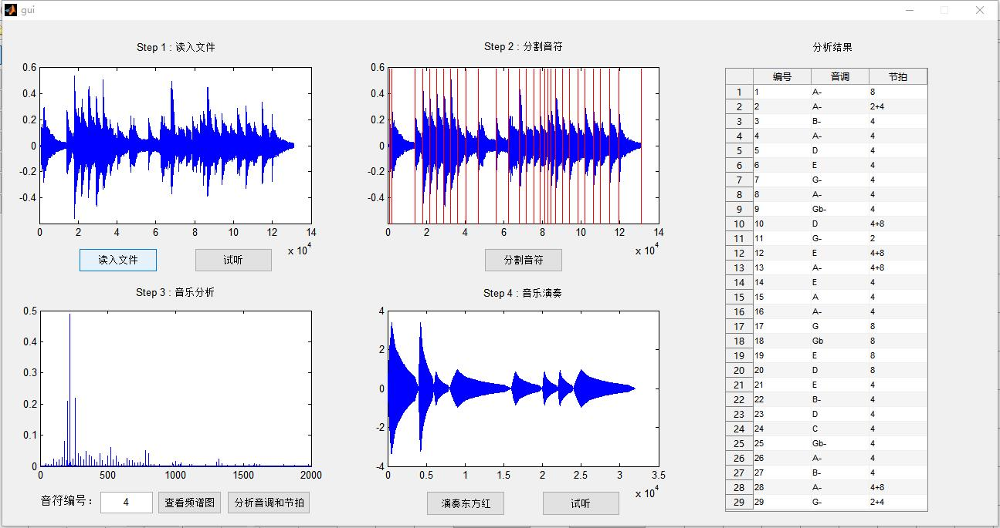

至此gui封装的任务已经完成，音乐合成大作业的所有任务也已经完成。

## 实验感想

该作业是第一个 MATLAB 大作业，由于之前用 MATLAB 做高级编程的次数不多，所以在做作业的过程中有很大一部分时间都用来熟悉 MATLAB 语法和函数。在熟悉了 MATLAB 的语法之后才真正感受到了MATLAB的威力和魅力。第一个实验是有关音乐合成的作业。虽然此前接触高深的乐理并不是很多，但是对于音乐合成还是有很大的兴趣，所以大作业做起来也很有动力。个人认为比较难的是第九问，首先需要不断地优化分割音符的算法来保证下面分析节拍和音调的准确率，其次需要判断决定音调的到底是功率最大的频率还是基频频率，而且还要将信号做周期延拓以保证频谱质量，提高分析准确度。感觉在所有的小问里面，收货最大的是第九问和第十二问。第九问让我非常透彻的理解了音调的本质，而第十二问则帮助我学习了 MATLAB 的 GUI 编程基础。之前对于 GUI 程序接触不少，曾经用 Qt 和 Visual Basic 编写过小的 GUI 程序，但是 MATLAB 中的 GUI 程序和这两者还是有很大区别，感觉 MATLAB 的 GUI 编程更加直观，语法也非常简洁，同时配合 GUIDE 使用效率非常高。如果用 Qt 来编写一个一模一样的 GUI 程序，所消耗的时间会长很多。总之，通过这次大作业我熟悉了 MATLAB 的用法，同时学到了很多有关音乐和信号处理的知识。这次作业让我受益匪浅。

